# Code Diagram Guide

## What this document is

This document defines the diagram and table types that may be used to describe code. For each type it says what the type shows, when it is the right choice, when it is the wrong choice, and exactly how to write it.

Use only the types described here. If something does not fit any of them, record it as a file note (described below) rather than inventing a new format.

Two kinds of rule appear in this document. The rules under "Mermaid that parses," the syntax half of the checklist, the fixed meanings of arrows and shapes, and the identifier format are absolute: breaking them loses the diagram or makes it silently wrong. Everything else describes the normal case. Where one of those rules does not fit the code in front of you cleanly, do the closest thing that keeps the diagram accurate and complete, and say in a `%%` comment what you did and why. Accuracy and completeness always win over a size guideline or an ordering preference.

## What you are given and what you produce

You are given a read scope: the files or directories to read, chosen by whoever runs you. When the run is prompted by a change to the code, the scope is normally the area the change touched together with the directories its hidden edges lead into. You may search outside the scope to find the far end of an edge, to count a file's callers, or to confirm that a consumer exists, and you say in a comment when a fact came from outside it. Completeness lines name the read scope, not places searched outside it.

You produce one Markdown document. It contains, in this order: the state diagrams, the sequence diagrams, the edge table, the dependency flowcharts if any were drawn, the entity-relationship diagrams, the class diagrams, the packet diagrams, the glossary table, and the file notes. Each diagram sits in its own `mermaid` fenced block. That document is the input to the Placement Guide, which decides what is written into the repository; nothing you produce is written into the repository directly.

## When a diagram is worth drawing

A diagram is worth drawing when it shows something that cannot be seen by reading one file. Which states an order can be in, when the transitions are scattered across twelve handlers. Who consumes an event, when the emitter and the consumers live in different modules. What happens after a request leaves this process, when the next step runs in a queue worker somewhere else.

A diagram is not worth drawing when it redraws what is already on the screen. The branches inside a single function, the imports at the top of a file, the fields of a class: these are already visible, and drawing them adds nothing. Before drawing anything, ask whether a reader with the file open would learn something from the diagram that they could not learn from the file. If not, do not draw it.

## Written for an AI reader

Every diagram and table in this document is written for an AI to read, not for a person to look at. The reader reads the source text, top to bottom, the same way it reads code. It never sees the rendered picture. These are structured text records that happen to render; write for the reader of the text, never for the picture.

That changes what matters:

- Layout, spacing, color, and arrow styling carry nothing. Only the text carries meaning.
- `%%` comment lines are as visible as any edge. They are the right place for anything that would otherwise be a caption, a caveat, or a note in the margin.
- Names are links. A name that matches the code exactly connects the diagram to the code. A name that does not is a dead end.
- Line order is layout. The order of lines in the source is the order in which the reader builds its picture.
- Nothing is self-evident. What a person would see at a glance, that a node is central or that a transition is missing, must be written down.

Do:

1. Draw only what you read. Every edge, transition, participant, and table row corresponds to something you saw in the code. If you believe something exists but did not see it, a consumer an event surely has, a transition that must live somewhere, write it as a comment beginning `%% suspected:` with the reason, or put it in a file note. Never write it as a line in a diagram or a row in a table. A diagram with a gap is useful; a diagram with an invented edge is worse than none.
2. Use comments for meaning, normally placed on the line before the thing they describe: why an edge exists, which file it comes from, when it applies, what is left out.
3. Write down meaningful absences: a transition not found, a consumer that does not listen, a path that is explicitly blocked. Distinguish what was not found within the inspected scope from what the implementation prevents. Name the searched files for a search result, or the enforcing function or constraint for a prohibition. Describe an absence as intentional, and give its reason, only when a comment or other inspected documentation establishes that intent; cite that source. Record the absences a reader would otherwise assume are present, not every possible gap.
4. Declare what the diagram is complete over. Completeness is always relative to the read scope. The second comment line is `%% complete within:` followed by the read scope's files or directories, meaning everything of this diagram's kind found in them is drawn, or `%% partial within:` followed by the same, then `; left out:` and what was deliberately omitted. Neither form says anything about files not listed. Every diagram in one artifacts document names the same read scope; a diagram never narrows the line to the directories it happened to draw from, because the whole scope was searched for things of its kind.
5. Where the code has a natural flow, order lines to follow it: entry point first; initial state first, terminal states last; edges into the same node next to each other where that does not fight the flow order. Where there is no single entry point or no clear flow, any consistent order is fine; say in a comment which order you chose.
6. Use the full identifier as the name wherever the syntax allows, so that any single line can be read on its own and found in the code.
7. Name the file for each hidden edge, in a comment on that edge. If the other end is outside the repository, name it as `<system name> (outside repository)`; if it could not be found, say so.
8. In a sequence diagram, add a note at each point where a reader following the code would lose the trail: an asynchronous hand-off, a transaction boundary, a step that can fail without undoing earlier steps.
9. In flowcharts and sequence diagrams, an arrow points from the thing that acts to the thing acted on: caller to callee, emitter to consumer, writer to table. In a sequence diagram, return values use the return arrow.
10. Fill every table cell. Write `none` when there is nothing to put there and `unknown` when you could not find out, rather than leaving a cell blank.
11. Keep every diagram readable on its own. Its comment header is its title and scope. Arrow and shape meanings are fixed by this document and are not restated inside diagrams.
12. Keep the same shape every time: the same header lines, the same declaration order, the same arrow meanings.

Avoid:

1. Legends drawn as nodes or edges.
2. Placeholder or aggregate nodes: `...`, `etc.`, `other handlers`, `various services`. Enumerate them.
3. Abbreviations that are not in the code: `Svc`, `Repo`, `DB`, `Mgr`. If the code itself names something `svc_utils`, use `svc_utils`.
4. Sentences as node names. A node is a code entity. Explanation goes in a comment.
5. The same entity declared twice.
6. Invisible edges (`~~~`), `direction` hints, or any line whose only purpose is to arrange the picture.
7. `<br/>`, emoji, or icons in labels.
8. Bidirectional arrows. Write two directed edges.
9. Meaning carried by color or styling. The only shapes with meaning are the ones this document defines.
10. Unlabeled hidden-dependency edges or state transitions. A solid call edge needs no label; a dotted edge and a transition always carry one, the terminal `--> [*]` markers excepted.
11. Nested subgraphs. Because subgraph ids are full directory paths, `orders/` and `orders/handlers/` can be siblings; nesting is never needed.
12. One large diagram where several small ones would do.
13. Anything important placed only in the surrounding text rather than inside the diagram.
14. Credentials, hostnames, internal URLs, account identifiers, or filesystem paths outside the repository, anywhere in an artifact. Name the configuration key or environment variable that holds such a value, never the value.

## Rules that apply to every artifact

1. **Use real identifiers, in this format.** Names in diagrams and tables are the actual names from the code, written one way, and used directly as the node, participant, state, or entity name:

   | Thing | Format | Example |
   |---|---|---|
   | module | dotted path, no extension | `orders.service` |
   | function | `module.function` | `orders.service.create_order` |
   | method | `module.Class.method` | `orders.models.Order.cancel` |
   | class | `module.Class` | `orders.models.Order` |
   | field of a class | `module.Class.field` | `orders.models.Order.status` |
   | database table | bare table name | `orders` |
   | column of a table | `table.column` | `orders.promotion_code` |
   | event or message | the event name as it appears in code | `OrderCreated` |
   | queue or topic | `queue.<name>` | `queue.order_events` |
   | external system | bare product name | `Stripe` |
   | feature flag | the flag key as it appears in code | `PRICING_V2` |
   | directory | repository path with trailing slash | `orders/` |
   | file | repository path | `orders/service.py` |

   Module paths use dots in every language. `orders/service.py` becomes `orders.service`. `src/orders/service.ts` becomes `orders.service`: drop `src`, drop the extension. Write nested scopes with dots whatever the language's own separator is: `Order::cancel` and `Order#cancel` both become `Order.cancel`. A package index file, `__init__.py`, `index.ts`, `mod.rs`, or `lib.rs`, collapses to its directory: a function in `pricing/__init__.py` is `pricing.calculate_total`. In a language whose unit is the directory rather than the file, Go among them, the module is the package path relative to the repository root, so `orders/service/` is `orders.service`, a function in it is `orders.service.CreateOrder`, and a method is `orders.service.Order.Cancel`; the file in parentheses after the name says which file in the package holds it. When a name exists in both a source file and a file generated from it, a templ component and its `_templ.go` twin, a protobuf message and its stub, the file in parentheses is always the source file a person edits; the generated file is on the never-diagram list and is never cited. If the language has no modules, use the file's path without its extension as the module. In a repository with several packages, keep the package name in front so that two `orders.service` modules cannot collide: `api.orders.service` and `worker.orders.service`. A real name that contains an `@`, a `;`, or a space becomes a diagram id with an underscore in that position, with the real name kept in a label or alias as "Mermaid that parses" describes; in tables and file notes the real name is written as it is. Never write a display name like "Create Order". Someone searching the repository for `create_order` should find every diagram that mentions it.
2. **No styling.** Do not use `classDef`, `style`, colors, link styles, or icons. Do not use node shapes other than the ones this document assigns a meaning to.
3. **Two comment lines after the diagram type, always.** The first says what the diagram shows: `dependency flowchart` for a flowchart, the scenario for a sequence, the entity and field for a state diagram. The second says what it is complete over: `%% complete within:` followed by the read scope's files or directories, or `%% partial within:` followed by them, then `; left out:` and what was deliberately omitted. A reader must be able to tell what the diagram is and how far to trust it without guessing.
4. **Prefer small diagrams.** Around twenty edges, twelve messages, or fifteen states is a comfortable size, and beyond that a diagram gets harder to read. These are guidelines, not limits. Split only where there is a natural seam: a sequence into two scenarios, a dependency flowchart by directory or by file. A unit that has to be larger to be complete, such as a state machine with thirty transitions, stays whole, because a complete large diagram is worth more than two partial small ones.
5. **One diagram per unit.** One edge table per read scope. One dependency flowchart per read scope when one is drawn, split by directory only when it exceeds the size guideline. One sequence diagram per scenario. One state diagram per entity and field. One entity-relationship diagram per area. One class diagram per base class or interface. One packet diagram per format. Do not merge units into one large diagram, and do not split a unit to meet the size guideline.
6. **State the scope.** The completeness line names the read scope, and the diagram is only claimed complete over it. If something is known to connect to the diagram but lies outside that set, a caller in a directory that was not read, a consumer in another service, say so in a further comment rather than leaving it out silently. A gap that is labeled is useful. A gap that looks like completeness is misleading.
7. **Produce the edge table, always.** The edge table is the primary record of hidden dependencies and is produced once per artifacts document, whether or not a flowchart was drawn. It holds one row for every hidden dependency found in the read scope: every event, hook, injection, flag, callback, external call, table access, soft reference, and emitted event with no consumer found. When the scope has none, the single line `edge table: none` stands in its place, so that a searched-and-empty table can be told from a missing one. The table can be checked row by row. The state diagram has no table; it is the one form for a lifecycle, and its transition labels carry everything a table would.
8. **When unsure, write a note.** If you cannot decide which type fits, write a file note in plain sentences describing what you found. If a type's conditions are met but you find nothing to draw, write a file note saying what you looked for and did not find. Never produce an empty diagram. Never invent a new format.

## Mermaid that parses

These rules apply to every Mermaid diagram in this document. Most "wrong" forms fail to render, which means the whole diagram is lost. A few do not fail: they render without an error and are silently wrong, a node or an edge dropped or a name split in two, and nothing signals the loss. Each rule says which of the two happens. The "right" form is the only form to use. The snippets show only the lines needed to illustrate each rule; a real diagram also carries the two comment lines from the general rules.

**Ids may carry the code's own punctuation, but never a space, a semicolon, or an at sign.** In a flowchart a space or an at sign fails. In a state or entity-relationship diagram a space does not fail but splits the name into several, in a class diagram it is silently removed, and only a sequence participant accepts one. A semicolon does not fail: Mermaid reads it as the end of one statement and the start of the next, so `a;b --> c` renders as a lone node `a` and an edge from `b` to `c`, with no error. Letters, digits, dots, underscores, and hyphens are always safe. `!`, `?`, `$`, and `#` are safe inside an id in flowcharts, sequence diagrams, and state diagrams, so a Ruby `save!` or a JavaScript `$store` keeps its real name there; entity-relationship and class diagrams reject all four, so there the id takes an underscore in that position, with the real name in a label for a class and in a `%%` comment on the line before for an entity. Hyphens are fine everywhere except state names, covered below. A directory id ends in a slash.

**A reserved word breaks a diagram as a whole id and, in most types, as the first dotted segment of an id.** Each diagram type reserves different words and needs a different escape. The lists below were checked against Mermaid 11.17; when in doubt, treat a word as reserved, because the escape is always safe.

- Flowchart: `end`, `class`, `graph`, `style`, `subgraph`, `flowchart`, `linkStyle`, and `classDef` fail as a whole id and as a first dotted segment written exactly as listed, case included, so `end.handlers.run` and `class.models.Foo` fail while `orders.end` and `End.handlers` parse. `default` fails as a subgraph id. `click` as a whole id at the start of a line does not fail but is silently dropped: the line is read as a click command, so the node and any edge on that line vanish and the diagram renders without them; as the target of an edge it fails instead. `end` as a subgraph id does not fail either: the subgraph is renamed and the lines after it are swallowed into its title until the closing `end`. Escape: append an underscore to the offending segment and keep the real name in a label, quoted if it contains parentheses or brackets, `end_.handlers.run["end.handlers.run"]`; for a directory, `subgraph default_/`, with a `%%` comment on the line before naming the real path.
- Sequence diagram: `end`, `loop`, `alt`, `opt`, `par`, `rect`, `box`, `break`, `critical`, `note`, `link`, `links`, `properties`, `details`, `create`, `destroy`, `actor`, `else`, `and`, `activate`, `deactivate`, `autonumber`, `option`, `participant`, `off`, and `over` fail as a participant name in any letter case and as the first dotted segment of one. The `participant` line itself parses; the first message that uses the name fails. So an external system named `Box` or a module named `note.service` cannot be a participant as written. Escape: declare the participant with an underscore id and the real name as an unquoted alias, `participant box_ as Box`, `participant note_.service as note.service`, and use the id in every message; the alias after `as` is display text and may be any words.
- State diagram: `default`, `note`, `class`, `style`, `classDef`, and `state` fail as a state id in any letter case, so an enum member `DEFAULT` cannot be a state as written. `state` is the worst of them: as the source of a transition it does not fail but is read as a declaration, and the whole diagram renders empty. Escape: declare it once with the alias form already used for hyphens, `state "DEFAULT" as DEFAULT_`, and use the id everywhere else.
- Entity-relationship diagram: `class`, `end`, and `style` fail as an entity name in any letter case. Escape: write the name in double quotes in every relationship line, `"class" ||--o{ students : attends`, which renders the bare name.
- Class diagram: `class`, `style`, `classDef`, `note`, `link`, `callback`, `click`, `cssClass`, `href`, and `namespace` fail as any lowercase dotted segment of a class name, first, middle, or last, on a relationship line, so `a.Base <|-- notifications.callback.Handler` fails while `a.Base <|-- orders.models.Note` parses. On a bare `class` declaration line, `class`, `style`, `classDef`, and `namespace` happen to parse; the other six fail there too. That does not help, because every class in this document's form appears in a relationship line, and a declaration that parses followed by a relationship that fails still loses the diagram. Treat all ten as reserved everywhere. Escape: declare the class with an underscore id and the real name in a quoted label, `class callback_["notifications.callback.Handler"]`, and use the id in every relationship line. The id loses the module path, but the label keeps the full identifier.

Wrong:

```text
flowchart LR
  school.enrollment.enroll --> class[(class)]
  end.handlers.run --> orders.service.create_order
```

Right:

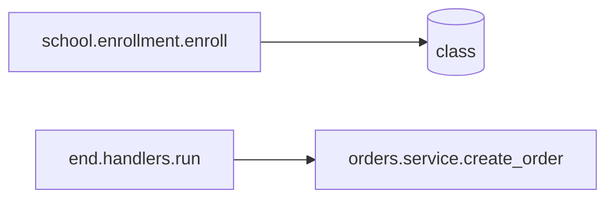

**Quote every label that contains parentheses or brackets.** An unquoted parenthesis or bracket inside a node label, cylinder label, hexagon label, or edge label fails. Spaces, colons, and slashes parse unquoted, but quoting a label that did not need it is always safe, so quote whenever in doubt. Angle brackets do not fail but are silently stripped, quoted or not: `Repository<T>` renders as `Repository`. Write a generic with tildes, `Repository~T~`, or spell it out.

Wrong:

```text
flowchart LR
  orders.models.Order -.->|post_save(Order)| audit.signals.on_order_saved
```

Right:

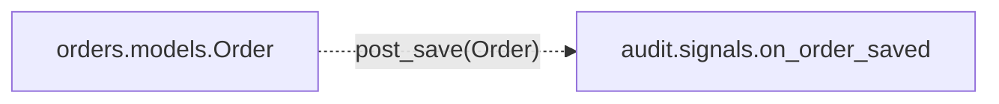

**Comments go on their own line.** A `%%` comment at the end of a node or edge line fails in a flowchart and in an entity-relationship diagram. In a sequence, state, class, or packet diagram it does not fail: it is absorbed into the message, label, or name it follows, or silently ignored, so the diagram renders with the comment text inside it. At the end of a `subgraph` line it does not fail either: the comment text is absorbed into the subgraph's title, `api/ %% dir`, and the subgraph's id is replaced by a generated one, so the directory path is silently lost.

Wrong:

```text
flowchart LR
  api.orders.post_order --> orders.service.create_order %% entry point
```

Right:

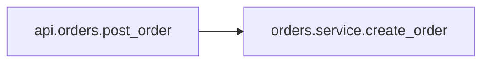

**State names use underscores, never hyphens.**

Wrong:

```text
stateDiagram-v2
  in-progress --> done
```

Right:

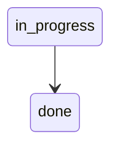

A hyphen fails. A space does not fail: `in progress --> done` renders as three states, `in`, `progress`, and `done`, with a transition from `progress` to `done` and no error, so a state name with a space is lost just as surely. When the value in the code itself contains a hyphen or a space, declare the state once with the exact code value as its display name and an underscore form as its id, then use the id everywhere else.

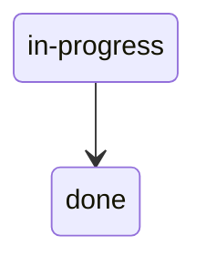

**Nothing in a sequence diagram outside a `%%` comment line contains a semicolon:** not message text, not note text, not a participant alias, quoted or not. Split into two messages, or rephrase the note. The `; left out:` form of the completeness comment is safe because it sits on a `%%` line.

Wrong:

```text
sequenceDiagram
  orders.service->>inventory.service: reserve; charge
```

Right:

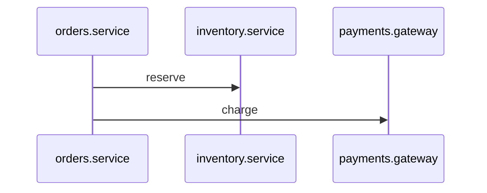

**Every name in a sequence message must exactly match a declared participant.** Any name that does not match, even by one character, silently creates a new participant. The diagram renders and is wrong, with no error.

Wrong:

```text
sequenceDiagram
  participant orders.service
  participant payments.gateway
  orders.services->>payments.gateway: charge
```

Right:

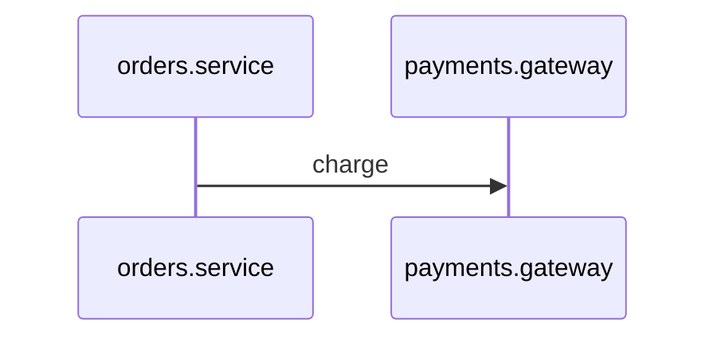

**Entity-relationship lines always have a label, quoted if it has more than one word.** A line with no label fails. An unquoted multi-word label usually does not fail: the first word becomes the label and each later word becomes a phantom entity, so `has lines` renders an entity named `lines` with no error. A few words, `many` among them, are cardinality keywords and fail outright, which is why the example below errors.

Wrong:

```text
erDiagram
  customers ||--o{ orders
  orders ||--|{ order_lines : has many
```

Right:

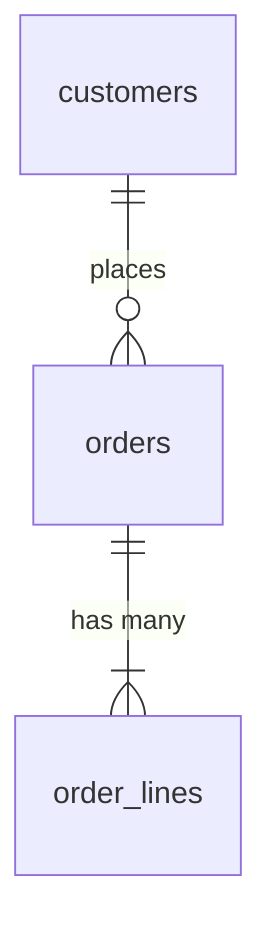

**Class diagram generics use tildes, and the interface or abstract marker goes inside the braces.** Angle brackets fail. A marker on its own line before the class is declared fails. Slashes in class names fail.

Wrong:

```text
classDiagram
  class repositories.base.Repository<T>
  <<interface>> payments.protocols.PaymentProvider
```

Right:

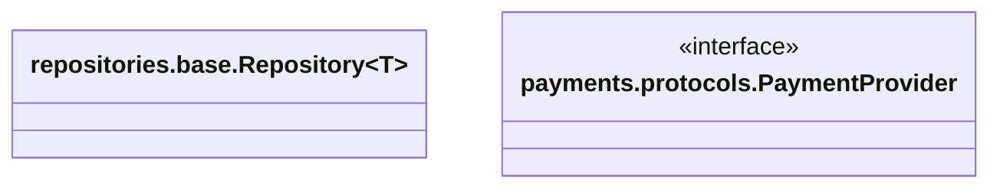

**Packet bit ranges start at 0 and are contiguous, with quoted labels.** A gap, an overlap, or a first field that does not start at 0 fails. Bits the format leaves unused are still a field; name them `reserved` or `unused` so the ranges stay contiguous.

Wrong:

```text
packet-beta
  8-15: version
  24-31: "flags"
```

Right:

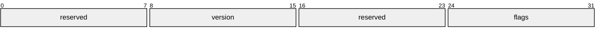

## Use only these types

- Edge table
- Dependency flowchart
- Sequence diagram
- State diagram
- Entity-relationship diagram, relationship level only
- Class diagram, relationships only, for the narrow cases described
- Packet diagram, only for binary formats
- Glossary table
- File notes

Do not use any other Mermaid diagram type or any other structured format.

---

## Edge table

### What it shows

The hidden dependencies: the ones that do not go through a normal call or import. It is the primary record of them: one table for the read scope, holding every hidden dependency found there, whether or not a flowchart or entity-relationship diagram was drawn. A flowchart's dotted edges, cylinders, and hexagons and an entity-relationship diagram's soft references are all rows in it.

### When to use it

Always, once per artifacts document. Search the read scope for the signals listed below and for the soft-reference signals under the entity-relationship diagram, and write one row for each hidden dependency found: events, hooks, injection, flags, callbacks, external calls, table access, soft references, and emitted events with no consumer found. Solid edges between code nodes and enforced foreign keys do not go in. Introduce the table with one line stating its scope in the same form as a diagram's second comment line, `edge table, complete within: api/, orders/` or `edge table, partial within: api/, orders/; left out: ...`. When the scope has no hidden dependencies, that line is followed by `edge table: none` in place of the table, so that a reader can tell a searched-and-empty table from a missing one.

Record one row for each of these, wherever it is found:

- Code that emits or subscribes to events.
- Code that registers behavior when the module is imported.
- ORM lifecycle hooks, which run code without any visible call.
- Dependency injection, where the thing called is decided by a container at runtime.
- Feature flags that change which code runs.
- Calls to external systems through an SDK or HTTP client.
- Code that reads from or writes to more than one database table.
- Dynamic dispatch, where the function called is chosen from a string or a lookup at runtime.

Signals to search for, grouped by mechanism. Any one of these in a file is a hidden dependency to record in the edge table, and a reason to include the file in a dependency flowchart when one is drawn.

- Events, generic: `emit`, `publish`, `dispatch`, `signal`, `subscribe`, `on_`, `addEventListener`, `EventEmitter`, `@receiver`, `@listener`, `@EventListener`, `@OnEvent`, `ApplicationEventPublisher`, `Event::listen`, `ActiveSupport::Notifications`.
- ORM and model hooks: Django `post_save`, `pre_save`, `post_delete`, `signals.`; Rails `after_commit`, `after_save`, `before_validation`, `after_create`, `dependent:`, observers; SQLAlchemy `@event.listens_for`; Mongoose `schema.pre`, `schema.post`; Prisma `$use`; TypeORM `@BeforeInsert`, `@AfterUpdate`; Hibernate and JPA `@PrePersist`, `@PostLoad`, `@EntityListeners`.
- Registration at import time: `@register`, `@hook`, `registry[`, `REGISTRY`, `HANDLERS`, `plugins.append`, `app.use(`, `router.use(`, `MIDDLEWARE`, `INSTALLED_APPS`, `entry_points`, `importlib.metadata`, `__init_subclass__`, metaclasses, `setup.py` plugin declarations.
- Dependency injection: `container.resolve`, `inject`, `@inject`, `@Injectable`, `@Autowired`, `Provide`, `Provider`, `bind(`, `get_instance`, `ServiceLocator`.
- Feature flags: `is_enabled`, `isEnabled`, `flags.get`, `variation(`, `getTreatment`, `feature_enabled`, `LaunchDarkly`, `Unleash`, `Split`, `Flagsmith`, `ConfigCat`, `Optimizely`, `waffle`.
- Dynamic dispatch: `getattr(`, `importlib.import_module`, `__import__`, `require(variable)`, `import(variable)`, `reflect.`, `Class.forName`, `send(:`, `public_send`, `constantize`, a dictionary of functions looked up by string.
- External systems: `stripe`, `boto3`, `aws-sdk`, `google.cloud`, `twilio`, `sendgrid`, `requests.`, `httpx.`, `fetch(`, `axios.`, `grpc`, any SDK named after a company or product.
- Tables: model or entity classes, `INSERT`, `UPDATE`, `DELETE`, `SELECT`, `.save(`, `.create(`, `.update(`, `.delete(`, `.query(`, `.objects.`, `.find(`, `.where(`.

Signals that look like the above but are not:

- `useState`, `setState`, `useReducer` in React or similar frontend code. That is component state, not a dependency.
- The `event` parameter of a click or keyboard handler. That is a browser event object, not a domain event.
- `signal.SIGTERM`, `signal.signal(` in Python. Those are operating-system signals.
- `emit` inside a Vue or Angular component. That is a parent-child component event, local to the UI tree.
- `subscribe` on an RxJS observable or a Redux store. That is in-process and usually not a cross-module dependency.
- `dispatch` in a Redux reducer. Same.
- A single table accessed by a file that does nothing else is not a reason to draw a flowchart. Its writes still go in the edge table, so that `writes:` names every writer.

### How to write it

| Source | Target | Kind | Name | Defined in |
|---|---|---|---|---|
| orders.service.create_order | notifications.handlers.on_order_created | event | OrderCreated | orders/service.py, notifications/handlers.py |
| orders.service.create_order | Stripe | external | charge | orders/service.py |
| orders.service.create_order | orders | table | write | orders/service.py |
| orders.models.Order | audit.signals.on_order_saved | hook | post_save | orders/models.py, audit/signals.py |
| orders.service.get_price | pricing.v2.calculate | flag | PRICING_V2 on | orders/service.py, pricing/v2.py |
| orders.service.get_price | pricing.v1.calculate | flag | PRICING_V2 off | orders/service.py, pricing/v1.py |
| orders.service.cancel_order | no consumer found | event | OrderCancelled | orders/service.py |
| orders.service.create_order | payments.stripe.StripeProvider | di | payments.protocols.PaymentProvider | orders/service.py, payments/stripe.py, bound in app/wiring.py |
| billing.reports.build | customers (billing database) | table | read | billing/reports.py |
| orders | promotions | soft-ref | promotion_code, validated in orders.service.validate_promotion | orders/models.py, promotions/models.py, orders/service.py |

The example shows rows of every kind in one table, which is how the artifacts document carries them.

Kind is one of: `event`, `hook`, `di`, `flag`, `callback`, `external`, `table`, `soft-ref`. If a hidden dependency fits none of these, for example a shared file on disk, a cache key, or an environment variable read at runtime, use `other`. Its Name column then starts with one mechanism word, `env`, `file`, `cache`, `channel`, `trigger`, `registry`, `signal`, or `mechanism` when none of those fits, followed by the name the code uses: `channel toastQueue`, `env ORDERS_SPOOL_DIR`.

Source and Target follow the identifier format from the general rules, and the arrow always runs from the thing that acts to the thing acted on. What that means for each kind is fixed:

- `event`: Source is the emitting function; Target is one consuming function. One row per consumer. An emitted event for which no consumer was found still gets one row, with Target `no consumer found`, so that the absence is recorded as a fact rather than left as a gap. A consumer known to exist outside this repository, another service that subscribes to the event, gets one row with Target `<service name> (outside repository)`.
- `hook`: Source is the object whose operation fires the hook, usually a model class; Target is the handler function that runs.
- `flag`: Source is the function that checks the flag; Target is the code path the flag selects. Two rows per flag, one with Name `<FLAG> on` and one with Name `<FLAG> off`. If nothing runs when the flag is off, the off row's Target is `skipped`.
- `di`: Source is the function that asks the container for an abstraction; Target is the implementation the container actually provides. Name is the abstraction. Defined in lists the resolving file, the implementation's file, and then `bound in` followed by the file where the binding is configured, or `bound in unknown`.
- `callback`: Source is the function that is handed over; Target is the function that receives it and will call it later. Name is the parameter or registration point it is handed to.
- `external`: Source is the calling function; Target is the external system. Name is the operation.
- `table`: Source is the function that reads or writes; Target is the table. Name is `read` or `write`. A table in another database, schema, or service is written as `<table> (<system>)`, as in `customers (billing database)`; a table in this repository's own schema is the bare name.
- `soft-ref`: Source is the referencing table, the one holding the column; Target is the referenced table, written as `<table> (<system>)` when it lies in another database, schema, or service. Name is the column, followed by `, validated in` and the full identifier of the function that checks the reference. If no validator was found in the inspected paths, use `, validation not found within <paths>`; if validation could not be assessed, use `, validation unknown`. Use `, not validated` only when the inspected write paths establish that the reference is accepted without validation, and name those paths in a file note. Defined in lists the referencing model's file, the referenced table's file, and, when a validator is named, the validator's file.
- `other`: Source and Target as for the closest kind above; Name is the mechanism word and the name the code uses, as defined under Kind above.

Unless the kind's rule above says otherwise, Defined in lists the file at each end when there are two, or `unknown` for an end that could not be found; a `no consumer found` row lists the emitter's file only. For any kind, an end known to lie outside this repository is written as `<system name> (outside repository)` in Source or Target and as `unknown` in Defined in.

---

## Dependency flowchart

### What it shows

Which pieces of code depend on which other pieces, across file boundaries, and what kind of dependency each one is. It separates ordinary calls and imports from the hidden kinds of dependency: events, hooks, dependency injection, feature flags, callbacks. It also shows which database tables and external systems a piece of code touches.

### When to use it

Draw the flowchart only when the picture adds something the edge table's rows cannot show. Those cases are:

- Files at an architectural boundary where the direction of dependency is a rule: the API layer may call the domain layer, the domain layer may call infrastructure, never the reverse. Draw these to show whether the rule holds.
- Files involved in an import cycle.

Otherwise the table alone is enough. The hidden dependencies themselves are found by the signals listed under the edge table; a file that has any of them is a candidate node when a flowchart is drawn.

### When not to use it

- For a file with no imports from outside its own directory and none of the constructs above. It is a leaf. The diagram would be its import list redrawn.
- For utilities, pure functions, data classes, constants, config, tests, generated code, or vendored code.
- For the control flow inside one function. Decision diamonds showing if/else branches are the code redrawn. This document does not allow that use of a flowchart.
- To show every ordinary call in an ordinary service. The hidden edges are what matter.

### How to write it

Use `flowchart LR`. The two comment lines are `%% dependency flowchart` and the completeness line. Node names are the full identifiers from the identifier format, used directly as ids; a label is needed only when the id had to differ from the real name, because the name contains a space or is a reserved word, and the label is quoted if it contains parentheses or brackets, though quoting one that did not need it does no harm. Directories are subgraphs whose id is the directory path with its trailing slash. Declare each code node once, inside its directory's subgraph. Where the code has a clear flow, put the subgraphs in the order the flow passes through them and list edges starting from the entry point; where it does not, for example a file with many unrelated callers, start from that file and group edges by the node they touch. Tables and external systems appear in the edge where they are first used.

Edge and shape meanings are fixed:

- Solid edge `-->`: a direct call or import.
- Dotted edge `-.->`: a hidden dependency. Label it with the name of the event, hook, flag, or mechanism. Put a comment before it naming the file at each end, or saying that an end is outside the repository or could not be found. An emitted event for which no consumer was found is not drawn as an edge, since an edge needs a target; record it as a `%%` comment on its own line, `%% OrderCancelled: emitted in orders/service.py, no consumer found`, and as an edge-table row.
- Cylinder `[( )]`: a database table or data store.
- Hexagon `{{ }}`: an external system.
- Subgraph: a directory or a service.

Example:

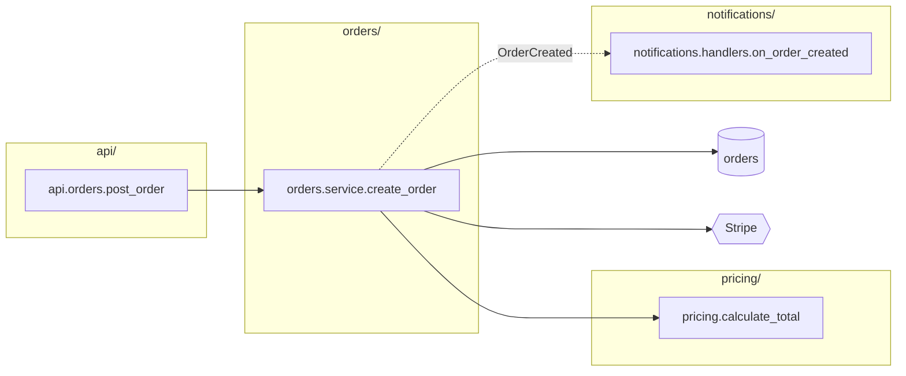

What breaks in this type: a reserved word as an id or as the first segment of one; an unquoted label or edge label with parentheses or brackets; a comment at the end of a node or edge line. What renders silently wrong: `click` at the start of a line, which drops that line; `end` as a subgraph id, which swallows the lines after it into the title; a semicolon in an id, which splits the line into two statements; a comment at the end of a `subgraph` line, which replaces the directory id; a node declared twice, which keeps only one.

Every dotted edge, cylinder, hexagon, and no-consumer comment in the flowchart corresponds to a row in the edge table (defined above). Solid edges between code nodes do not; every edge to a cylinder or hexagon does, even though it is drawn solid.

---

## Sequence diagram

### What it shows

For one specific scenario, what happens in what order, across which components, and which steps are asynchronous. It is the right tool for flows that leave the current process or module and continue somewhere else.

### When to use it

Build one when the code takes part in a flow that crosses a boundary reading cannot follow.

- Calls to other services or third parties over HTTP or gRPC.
- Producing to or consuming from a queue or topic.
- Webhook handlers, especially ones that fan out to several internal components.
- Scheduled or cron jobs that call into services.
- Authentication flows: OAuth, SSO, token refresh.
- Multi-step operations that must be undone if a later step fails (sagas, compensation logic).
- Retry, timeout, and circuit-breaker paths.
- Fan-out, where one step starts several others and waits for all of them.
- Any `async`/`await` that crosses a module boundary where the order of completion matters.

Also build one for a single-process flow where the order of side effects is the point and the steps are spread across several modules: a request that validates, reserves inventory, charges a card, and emits an event, with each step in a different module. Or a database transaction that spans calls into several repositories.

Signals to search for, grouped by mechanism:

- Network calls: `requests.`, `httpx.`, `urllib`, `fetch(`, `axios.`, `got(`, `http.Client`, `HttpClient`, `RestTemplate`, `WebClient`, `grpc.`, `Stub(`, `.rpc(`, any vendor SDK.
- Queues and topics, producing: `.delay(`, `.apply_async(`, `perform_async`, `perform_later`, `enqueue`, `Queue.add`, `producer.send`, `send_message`, `publish(`, `topic.publish`, `PUBLISH`, `xadd`, `.push(` on a queue client.
- Queues and topics, consuming: `@celery.task`, `@shared_task`, `@task`, `@job`, `class ... < Sidekiq::Worker`, `ActiveJob`, `Worker(`, `.process(`, `consumer.subscribe`, `@KafkaListener`, `@SqsListener`, `@RabbitListener`, `receive_message`, `poll(`.
- Scheduling: `cron`, `@scheduled`, `@Scheduled`, `schedule.every`, `APScheduler`, `setInterval`, `beat_schedule`, `whenever`, `sidekiq-cron`.
- Webhooks: a route whose path contains `webhook`, `callback`, `notify`, or `hook`; signature verification code such as `verify_signature`, `hmac.compare_digest`.
- Fan-out and concurrency: `Promise.all`, `Promise.allSettled`, `asyncio.gather`, `ThreadPoolExecutor`, `ProcessPoolExecutor`, `go func`, `sync.WaitGroup`, `errgroup`, `CompletableFuture.allOf`, `parallel(`.
- Resilience: `@retry`, `retrying`, `tenacity`, `backoff`, `circuit_breaker`, `CircuitBreaker`, `timeout=`, `deadline`, `Polly`, `resilience4j`.
- Transactions spanning modules: `transaction.atomic`, `@Transactional`, `BEGIN`, `COMMIT`, `ROLLBACK`, `session.begin`, `with_transaction`, `saga`, `compensate`.

Signals that look like the above but are not:

- `await` on a function in the same module. That is a call, not a boundary.
- `setTimeout` used once for a UI delay. Not a scheduled job.
- `Promise.all` over functions that all live in one file. Fan-out inside a file is the code redrawn.
- `subscribe` on an RxJS observable. In-process.
- A `try`/`except` with a single retry loop around a local function. Not a resilience boundary unless the retried call is a network call.

### When not to use it

- When every participant would be in one file or one module. That is a call chain the code already shows.
- When there would be fewer than three participants, unless the point of the diagram is an asynchronous step or a retry between just two.
- When the flow has no asynchronous step and crosses no boundary.
- To be exhaustive. Build one diagram per scenario, and only for scenarios with distinct routing: the main path, plus any failure path that goes somewhere different from the main path. Do not draw a failure path that just returns an error from the same place.
- For a CRUD handler that calls one repository and returns.

### How to write it

Use `sequenceDiagram`. The two comment lines are `%% scenario:` followed by a short name, and the completeness line. The scenario name is a noun phrase with no commas, semicolons, or parentheses, because the Placement Guide reuses it as a flow name inside comma-separated values: `order placement`, `order placement with charge declined`. Before naming a scenario, look for a flow with the same entry point under `## Flows` in the repository's READMEs and reuse its name, so that a later run does not rename a flow that has not changed. Declare every participant before the first message with `participant` followed by its full identifier, in the order of first appearance. A participant is normally a module, with the function named in the message text; use a function or class as a participant only when the scenario needs that finer grain. Messages use that same identifier, character for character. Use an alias only when the real name is a reserved word, or when it contains a space and you want an id without one, since a space in a participant name does not fail in this version: declare `participant google_maps as Google Maps`, with no quotes around the alias, since quotes are rendered as part of the name, and use the id in every message.

Arrow meanings are fixed:

- `->>`: a synchronous call. The caller waits for the operation represented by this message to finish.
- `-)`: an asynchronous send. The caller continues without waiting for the recipient's processing to finish. Use this only when that behavior was confirmed in the implementation; an event name or a queue API does not determine the arrow.
- `-->>`: a return value.

Before choosing an arrow, inspect what the caller waits for. An event whose handlers run before the emit call returns uses synchronous calls to those handlers. For a queue publish that waits for the broker to accept the message, draw a synchronous call to the queue and its acknowledgment return; draw later delivery to the consumer separately as an asynchronous message. A publish that does not wait for acceptance uses an asynchronous send. State in a note what acknowledgment means where it matters, and do not equate acceptance with completed consumer work. If the waiting behavior cannot be established, record that uncertainty in a file note rather than choosing an unsupported arrow.

Add a `Note over` line at each point where a reader would lose the trail: an asynchronous hand-off, a transaction boundary, a step that can fail without undoing earlier steps. One Note per asynchronous hand-off, placed at the send; the delivery arrow from a queue to its consumer is the same hand-off and needs no second Note. Use `alt` blocks only when the branches route to different participants. Do not use `alt` for an internal if/else. Use `par` for steps that run at the same time.

Retries and repeats come in two shapes, and they are drawn differently. A retry that happens in place, the same call attempted again by the same caller, is a `loop` block around the repeated message, with the bound in the loop label: `loop up to 3 attempts`. A retry that re-enters through a queue or a scheduler, a worker that re-enqueues its own job or a cron that picks the record up again next run, is drawn once as the message back to the queue or scheduler participant, using the arrow for the waiting behavior actually observed, followed by a `Note over` stating the retry limit and the function that enforces it. Do not unroll repeats into copies of the same messages, and do not draw a second pass through the flow. If the limit is not enforced anywhere, say that in the note; an unbounded retry is exactly the kind of fact a reader needs. Around twelve messages is a comfortable length; if a scenario needs many more and has a natural seam, split it into two scenarios, and if it has no seam, keep it whole.

Example:

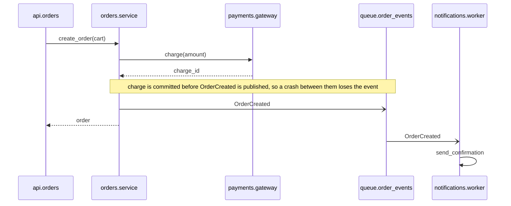

What breaks in this type: a semicolon anywhere outside a `%%` comment line; a reserved word as a participant name or as its first segment; a name in a message that does not exactly match a declared participant, which silently adds a phantom participant; an `alt`, `par`, or `loop` block without its closing `end`; a `%%` comment at the end of a message or participant line, which does not fail but becomes part of the text.

---

## State diagram

### What it shows

The states and transitions found within the read scope, what triggers them, which states are known to be final, and which transitions the implementation explicitly prevents. The full picture usually exists nowhere in the code: the transitions and their guards are scattered across handlers. A missing edge alone does not establish that a transition is prohibited.

### When to use it

Build one whenever the code contains an entity with a stored state field whose value is changed in more than one place.

Signals to search for:

- A field or column named `status`, `state`, `phase`, `stage`, `step`, `mode`, `lifecycle`, `workflow_state`, or a compound like `payment_status`, `approval_status`, `fulfillment_status`.
- An enum whose members read like a lifecycle: `pending`, `active`, `processing`, `completed`, `failed`, `cancelled`, `expired`, `draft`, `published`, `archived`, `approved`, `rejected`. Enums are declared differently in every language and all of these count: Python `class Status(Enum)` or `Literal[...]`; Django `choices=`; Rails `enum status:`; TypeScript `type Status = 'pending' | 'active'` or `enum Status`; Java and C# `enum Status`; Go `const ( StatusPending = iota ... )`; Prisma `enum`; SQL `CHECK (status IN (...))`.
- Assignments to that field in more than one file.
- Conditionals of the form `if thing.status == X` that guard a change.
- A family of methods like `advance`, `promote`, `approve`, `reject`, `cancel`, `complete`, `transition`, `mark_as_`.
- Several booleans on one entity that get set in sequence, such as `is_paid`, `is_shipped`, `is_cancelled`, or `confirmed`, `dispatched`, `delivered`. These encode a state machine with no state field. Treat each combination of values that the code actually produces as a state; combinations that never occur are not states.
- Timestamp columns that record when something happened, such as `approved_at`, `paid_at`, `shipped_at`, `deleted_at`, `archived_at`. A null-or-set timestamp is a state, and several of them together are a lifecycle.

Typical places these live: order, payment, subscription, and invoice lifecycles; job, task, and workflow runners; approval and review flows; provisioning and deployment pipelines; connection, session, and authentication handshakes; multi-step operations with compensation; content publishing; protocol handlers with modes.

Also build one when the state field exists and all of its transitions are in one place. The diagram will be simple in that case, but it is still complete and still useful.

Signals that look like the above but are not:

- `useState`, `state = {` in a UI component. Component state, not a stored lifecycle.
- `status_code`, `response.status`, `res.status(`. HTTP status, not a lifecycle.
- `state` in a Redux reducer or a store. A data container, not an entity lifecycle, unless it holds a field that is one.
- A `type`, `kind`, `role`, or `category` field. Those are categories; nothing transitions between their values.
- A single boolean such as `is_active`. Two values with one transition each is not worth a diagram.

### When not to use it

- For a boolean flag on its own.
- For an enum that is a category rather than a lifecycle.
- For state that exists only in memory during one request and is never stored.
- For steps in a process. This is the most common mistake. If you find yourself writing states like "validating", "charging", "sending email", stop. Those are steps in an execution, not states of an object. That flow belongs in a sequence diagram or a dependency flowchart.
- When a state machine library is already in use: xstate, python-transitions, aasm, statesman, Stateless, Spring StateMachine, or similar. The machine is already declared in code. Do not redraw it. Instead, read the declaration and record, as a file note, any place that sets the state directly and bypasses the machine.

The test that resolves most doubt: is this a property of an object that still exists between requests, or a position in an execution that is happening right now? Only the first is a state.

### How to write it

Use `stateDiagram-v2`. The two comment lines are `%% entity:` with the full class identifier and the field, and the completeness line. State names are the stored values as written in code, the string or number the field actually holds, with underscores in place of any hyphens or spaces; when an enum member's name differs from its stored value, as in `PENDING = "pending"`, the stored value is the state id and the member name is not used (see "Mermaid that parses" for how to keep the exact code value visible). Start with `[*]` and the initial state, or several `[*] -->` lines if the entity can begin in more than one state; each of these lines is labeled with the trigger that creates the entity in that state. End with the terminal states, marked `--> [*]`; these lines are markers, not transitions, and carry no label. Use a terminal marker only when the inspected implementation establishes that the state is final. If no outgoing transition was found but finality is uncertain, omit the marker and state the search scope and uncertainty in a comment. If the lifecycle has no terminal state, for example a connection that reconnects forever, say so in a comment. Label every other transition with the real trigger: the full identifier of the function or event handler that performs it, so that the file each transition lives in follows from the name. If the trigger cannot be identified, for example a status written by raw SQL from many places, label it `unknown` and say in a comment what you found. Where a condition must hold for the transition to happen, add it in square brackets after the trigger. Mermaid has no syntax for conditions, so this is our convention inside the label. A retry that leaves the state unchanged is a transition from the state to itself, drawn once, with the attempt limit as its guard, and the transition taken when the limit is exhausted is a separate line: `pending --> pending: jobs.retry_charge [attempts < 3]` and `pending --> failed: jobs.retry_charge [attempts >= 3]`. Where a transition a reader might expect was not found or is explicitly prevented, say which in a comment, following the absence rule under "Written for an AI reader." For a lifecycle encoded in several booleans or timestamps, name the fields in the entity comment, `%% entity: orders.models.Order, fields: is_paid, is_shipped, is_cancelled`, and write each state as the combination that occurs, for example `paid_unshipped`. Use nested states only when the code actually has sub-states. Do not use concurrent regions; an entity with two independent state fields gets two diagrams, one per field.

This diagram is the only form for a lifecycle. There is no table; every fact a table would hold is in the labels.

Example:

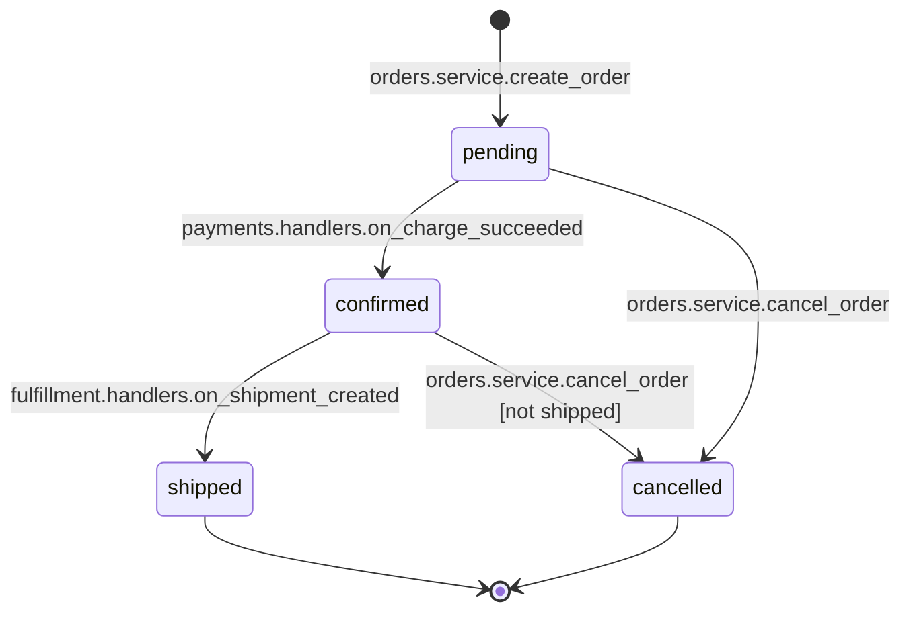

What breaks in this type: a hyphen in a state id; a reserved word as a state id. What renders silently wrong: a space in a state id, which splits the name into separate states; `state` as the source of a transition, which empties the whole diagram; a semicolon in a transition label, which creates phantom states. The fix for all of these is the same: use the underscore form as the id and, if the code value differs, declare it once with `state "code-value" as code_value`.

---

## Entity-relationship diagram, relationship level

### What it shows

Which database tables exist in an area of the code and how they relate to each other: one-to-one, one-to-many, many-to-many. At the level used here, it shows relationships only, not columns. Its main value is finding the relationships the database does not enforce.

### When to use it

- The code touches migrations, model or entity definitions, schema files, or raw SQL.
- The code references more than one table.
- There are soft references: relationships that exist in the code but are not enforced by the database. These are the most valuable thing this diagram can capture, because no schema tool will show them.
- Data-heavy areas with many-to-many relationships: billing, ledgers, inventory, scheduling.
- A single table with many other tables depending on it.
- Reporting or analytics queries that join many tables.

Signals to search for:

- Schema and models: files under `migrations/`, `db/migrate/`, `alembic/`, `prisma/`; `class ... (models.Model)`, `class ... < ApplicationRecord`, `@Entity`, `@Table`, `Base = declarative_base()`, `model ... {` in Prisma, `CREATE TABLE`.
- Enforced relationships, which go in the diagram as ordinary lines: `ForeignKey(`, `references`, `belongs_to`, `has_many`, `has_one`, `@ManyToOne`, `@OneToMany`, `relationship(`, `REFERENCES`, `@relation`.
- Soft references, which go in the diagram labeled `soft-ref`: a column ending in `_id` with none of the enforced-relationship markers above; a `_type` and `_id` pair, including Rails `polymorphic: true`, Django `GenericForeignKey` and `content_type`, and any `owner_type`/`owner_id` or `subject_type`/`subject_id` pattern; ids stored inside `JSONField`, `jsonb`, `ArrayField`, `text[]`, or a serialized column; columns named `external_id`, `remote_id`, or `<vendor>_id` such as `stripe_customer_id`; a reference to a table in another database, schema, or service.
- Joins in raw SQL: `JOIN`, `LEFT JOIN`, and subqueries that reference a second table.

Signals that look like the above but are not:

- The table's own primary key `id`. Not a reference.
- A `_id` column that has a `ForeignKey`, `references`, or `REFERENCES` marker. That is enforced; it is an ordinary line, not a soft reference.
- A `user_id` on a log or audit row that is never joined back. Still record it, but as `soft-ref`; do not promote it to an enforced line.

### When not to use it

- When nothing in scope touches persistence: API clients, stateless services, pure computation.
- For frontend code, unless it maintains a normalized client-side store.
- To transcribe the schema with all of its columns. That is derivable from the schema.
- When schema tooling already generates a relationship view. Then do not redraw it; record only the soft references it cannot show.

### How to write it

Use `erDiagram`. The two comment lines are `%% data model:` with the area, and the completeness line. Entity names match table names exactly. Show relationships and cardinality only. Include a column only when it is needed to explain a relationship. Every line has a label. Label every relationship the database does not enforce with `soft-ref` followed by the column, quoted, so it can be told apart from an enforced foreign key. When the referenced table lives in another database, schema, or service, keep the bare table name as the entity, since an entity name cannot carry spaces, and put the system in the label: `orders }o--|| customers : "soft-ref customer_id (billing database)"`. The edge table's Target then carries `customers (billing database)`.

The cardinality marks, reading the symbol nearest each table: `||` exactly one, `|o` zero or one, `}|` one or more, `}o` zero or more. On the right-hand side of a line the same marks are mirrored: `||`, `o|`, `|{`, `o{`. So `customers ||--o{ orders` reads "one customer, zero or more orders."

Example:

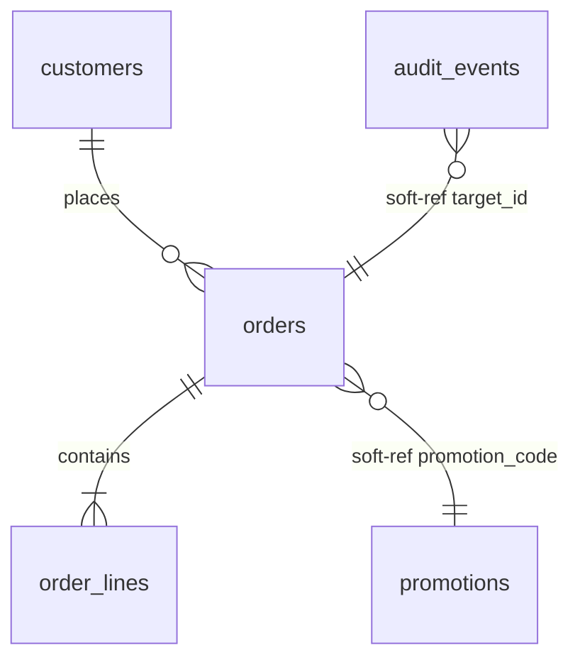

What breaks in this type: a relationship line with no label; a reserved word as an entity name, escaped by quoting the name. What renders silently wrong: a multi-word label without quotes, which splits into a one-word label and phantom entities; a space in an entity name, which splits the same way.

Add every `soft-ref` relationship to the edge table with kind `soft-ref`.

---

## Class diagram, relationships only

### What it shows

Which classes inherit from or implement which others, across files. This is a narrow use. The one thing it captures that is hard to see otherwise is the inbound side of a hierarchy: given a base class or interface, who are all of its subclasses or implementers? That question cannot be answered from the base's own file.

### When to use it

- Plugin architectures, where implementations are discovered and registered rather than referenced directly.
- Strategy or command patterns with implementations spread across several packages.
- Framework-style base classes such as `BaseHandler`, `Command`, `Job`, `View`, with many subclasses in many files.
- An abstract base class or interface with several implementers, roughly more than three, across more than one file.
- Especially in languages where implementers are not marked: Python `Protocol`s and Go interfaces. There, "who implements this" cannot be found by searching, and the diagram is the only way to record the answer.
- Code that dispatches on type or keeps a registry of classes.

Signals to search for:

- Base declarations: Python `ABC`, `abstractmethod`, `Protocol`, `class Base:` with `raise NotImplementedError`; TypeScript and Java `interface`, `abstract class`; C# `interface I...`; Go `type ... interface {`; Rust `trait`; Ruby `include`, `raise NotImplementedError`; PHP `interface`, `abstract class`.
- Many implementers: more than three `class X(Base)`, `extends Base`, `implements Base`, `impl Base for`, or Go structs whose method set matches an interface, spread over more than one file.
- Dispatch on type: `isinstance(`, `match ... case`, `switch (x.constructor)`, `instanceof`, `case class`, a dictionary or map from a string to a class, `registry.register(SomeClass)`.

Signals that look like the above but are not:

- `@dataclass`, `TypedDict`, `NamedTuple`, Pydantic `BaseModel`, `record`, `struct` used as a plain record. Data shapes, not hierarchies.
- A React component class extending `Component`. Framework boilerplate, not a domain hierarchy.
- ORM model classes extending `Model` or `ApplicationRecord`. Those are tables; describe them with the entity-relationship diagram.
- A mixin used by one class.

### When not to use it

- For a hierarchy that lives in one file.
- For data classes, DTOs, or records.
- For flat or functional code with no hierarchies.
- In TypeScript, Java, or C# where `implements` and `extends` are explicit and a search finds every implementer. Then the diagram is derivable and usually not needed; build it anyway if the hierarchy is a plugin surface or the implementers are spread across packages.
- To list attributes or methods. Never include members. The code already shows them.

### How to write it

Use `classDiagram`. The two comment lines are `%% hierarchy:` with the base name, and the completeness line. Class names are the full `module.Class` identifiers. Show only relationship lines, with the base on the left: `<|--` for inheritance and `<|..` for interface implementation. Mark interfaces and abstract classes with `<<interface>>` or `<<abstract>>` inside the class braces. No attributes, no methods.

Example:

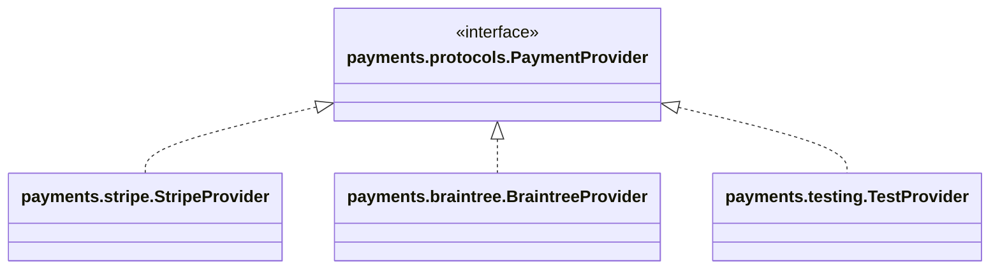

What breaks in this type: angle brackets for generics (use tildes); `<<interface>>` on its own line before the class is declared; a slash in a class name; a reserved word as a segment of a class name.

---

## Packet diagram

### What it shows

The byte and bit layout of a binary record, packet, or header.

### When to use it

Only when the code parses or produces a binary format: network protocol codecs, file-format readers and writers, embedded or firmware code, custom wire formats, bit-packed flags.

Signals to search for: `struct.pack`, `struct.unpack`, `ctypes.Structure`, `memoryview`; `Buffer.`, `DataView`, `ByteBuffer`, `readUInt32LE`, `writeUInt16BE` and relatives; Go `encoding/binary`, `binary.Read`, `binary.Write`, `unsafe.Sizeof`; C `#pragma pack`, `__attribute__((packed))`, `union` with bit fields; bit shifting and masking on integers such as `>> 4 & 0x0F`; named byte offsets and magic numbers; `htons`, `ntohl`.

Signals that look like the above but are not:

- `struct` in Go or C used as an ordinary in-memory record, with no serialization to bytes.
- JSON, XML, YAML, or CSV parsing. Text formats have no bit layout.
- Base64 or hex encoding of an opaque blob. There is no layout to show.

### When not to use it

- For anything that is not a binary layout. This diagram has no other use.
- When the format is declared in a schema: protobuf, flatbuffers, Cap'n Proto, ASN.1. The schema is the diagram. Do not redraw it.

### How to write it

Use `packet-beta`. The two comment lines are `%% format:` with the format name, and the completeness line. One row per field, with its bit range, starting at 0 and with no gaps. Labels are quoted. Field names match the names used in the parsing code. A single bit is written as `8: "flag"`.

Example:

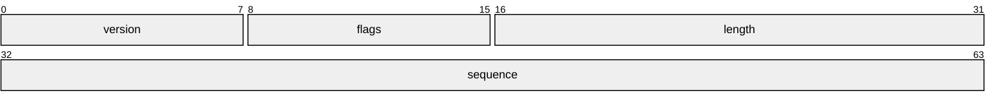

What breaks in this type: a gap or overlap between ranges; a first range that does not start at 0; an unquoted label.

---

## Glossary table

### What it shows

The words the code uses for the things it is about, what each word means here, and the identifier that represents it. Its purpose is to make sure the same word is used for the same concept everywhere, and to record when a word means something narrower or different from its everyday meaning.

### When to use it

Almost always. Build one whenever the code introduces nouns beyond the framework's own. Give priority to:

- Domain-heavy code where terms carry business meaning: billing, insurance, logistics, healthcare, finance, legal, compliance.
- Any term used in documentation, tickets, or the user interface that does not appear as an identifier in the code. That mismatch is worth recording on its own.
- Any concept with more than one name across layers: the UI calls it a cart, the code calls it a `Basket`, the table is `checkout_sessions`. Record all the names and pick the one the code uses most as canonical.
- Any term whose meaning here differs from its ordinary meaning: "a batch is exactly 500 rows"; "active means the customer is being billed, not that they are logged in."
- Domain enums and what each member means.
- Terms that are defined in comments.

Words that are not glossary terms: framework nouns such as request, response, handler, controller, view, model, service, repository, middleware, component, hook, reducer. Record only the nouns that belong to what the software is about.

### When not to use it

Skip it only when the code introduces no domain nouns at all: pure utilities, generic framework glue.

### How to write it

| Term | Canonical identifier | Meaning | Defined in | Known aliases | Notes |
|---|---|---|---|---|---|
| order | `orders.models.Order` | A customer's confirmed purchase of one or more lines. Exists from checkout until fulfillment or cancellation. | orders/models.py | purchase (API docs), checkout (UI) | A cart is not an order until `orders.service.create_order` runs. |
| batch | `imports.models.ImportBatch` | Exactly 500 rows from one upload, processed as a unit. | imports/models.py | chunk (jobs/) | Size is fixed in `BATCH_SIZE`; changing it affects retry behavior. |

One row per concept. Meaning is a sentence or two in plain language, longer only if the concept needs it. Known aliases lists every other name found for the same thing, with where each is used, or `none`. Notes is for anything surprising, or `none`.

---

## File notes

### What they are

For each file, a few plain sentences, usually one to three and more for a file that does a lot: what the file is responsible for, and anything a reader would not expect. A hook that fires on save. A function that is only ever called from a scheduled job. A value that must stay in sync with a value in another file. A workaround for a bug in an external system.

File notes are also the place for anything that does not fit a diagram type, and for saying what was looked for and not found.

### When to write them

For every file in the read scope, except those in the never-diagram list below.

### When not to

After the `Owns` sentence, do not restate what the file obviously is from its name. "This file contains the order service" is not a note. A note tells the reader something they would otherwise have to discover.

### How to write them

One block per file, starting with the file path and then a first sentence that states what the file is responsible for, written as `Owns` followed by a noun phrase, as in the example; the Placement Guide copies that phrase into the file's `owns:` line. The sentences after it hold everything else:

```text
orders/service.py: Owns creation and cancellation of orders. Emits OrderCreated on create; see edge table. orders.service.cancel_order is also called from the nightly expiry job, jobs.expire_orders.run (jobs/expire_orders.py), not only from the API.
```

---

## Telling look-alike types apart

Each pair below is a common confusion. Apply the test and pick the type it names.

**State diagram or sequence diagram?** Is this a property of an object that still exists between requests, or a position in an execution that is happening right now? A stored `status` column is a state. "First it validates, then it charges" is a sequence. If the candidate state names are verbs or verb phrases, `validating`, `sending_email`, it is a sequence.

**Sequence diagram or dependency flowchart?** Does the description need the words "then", "after", "before", or "waits for"? If yes, it is a sequence: the order matters. If the description is "A calls B" or "A depends on B" with no ordering, it is a dependency flowchart. A dependency flowchart shows what can happen; a sequence diagram shows what does happen, in order, for one case.

**Entity-relationship diagram or class diagram?** Is the class an ORM model, a table, or a record that is stored? Then it is an entity-relationship diagram, whatever the class syntax looks like. The class diagram is only for inheritance and interface implementation, and only when the hierarchy crosses files.

**Solid edge or dotted edge?** Does the caller name the thing it calls, by importing it or calling it by name? Then it is a solid edge, a direct call. Does the caller name only a message, an event, a key, or a flag, and something else decides what runs? Then it is a dotted edge, a hidden dependency.

**Cylinder or hexagon?** Is it a store this codebase owns and can query directly, a table, a cache, a bucket? Cylinder. Is it a system run by someone else, reached over the network with credentials? Hexagon. A managed database you own is a cylinder. A payment processor, an email service, a maps API is a hexagon.

**Soft reference or enforced relationship?** Does the column have a foreign key constraint, or an ORM declaration like `ForeignKey`, `belongs_to`, `@ManyToOne` that creates one? Enforced: an ordinary line. Is it just a column that happens to hold another table's id? Soft reference: label it.

---

## Things never to diagram

Regardless of type, do not build diagrams of the following, and do not write file notes for them. Several of them are still worth reading as a source of facts: a migration tells you the tables, a generated client tells you the endpoints, a test tells you which transitions are exercised. Read them for what they reveal about the code you are describing; do not make them the subject of a diagram.

- Tests. Read them for the transitions and paths they exercise; do not draw them or describe them.
- Generated code.
- Vendored or third-party dependencies.
- Migrations as a subject. They are a source for the entity-relationship diagram, not something to diagram themselves.
- Config, constants, translation files, static assets.
- Build scripts.
- Pure utility modules with no domain meaning.

---

## Priority among types

When more than one type applies to the same code, this is their order of value, highest first.

1. Stored state fields: the state diagram.
2. Boundary crossings, meaning network calls, queues, jobs, webhooks: sequence diagrams for the scenarios that cross them.
3. Hidden dependencies, meaning events, hooks, registries, injection, flags, external systems: the edge table, and the dependency flowchart where it adds something.
4. The data model: the entity-relationship diagram, if more than one table is involved or any soft references exist.
5. Hierarchies that span files: the class diagram, if the criteria above are met.
6. Binary formats: the packet diagram.

File notes and glossary entries apply throughout, regardless of which diagrams are built.

---

## Checklist for each artifact

Content:

- Does every edge, transition, participant, and row correspond to something you read in the code, with anything suspected but not seen written as `%% suspected:` or in a file note instead?
- Does every name in it follow the identifier format from the general rules, with its last segment present in the code it points at? Search for one or two to confirm.
- Are the two comment lines present: what the diagram shows, and `%% complete within:` or `%% partial within:` naming the read scope, with `; left out:` on the partial form?
- Is there anything in it a reader could have learned by opening one file? If so, remove it.
- Are meaningful absences stated in comments, distinguishing what was not found in the inspected scope from what is explicitly prevented, with any claim about intent supported by a cited source?
- Are there any placeholder or aggregate nodes, abbreviations, or sentences used as names? If so, replace them.
- Is every dotted edge, soft reference, and hidden dependency also in the edge table, and does every dotted edge in a flowchart carry a comment naming its files?
- Does every state transition carry a full-identifier trigger, so the file it lives in follows from the name, and is every meaningful absence stated as a comment inside the diagram?
- Is the scope stated, including anything known to connect to the diagram but left outside it?
- Where a guideline did not fit cleanly and you did the closest accurate thing instead, is that explained in a comment?

Syntax, checked by eye since the diagram cannot be rendered here:

- No id, and no dotted segment of an id in the positions the reserved-word list names for this diagram's type, is a reserved word, per the reserved-word list under "Mermaid that parses", and every escape uses the form given there.
- Every label containing parentheses or brackets is in double quotes, including edge labels.
- Every `%%` comment is on its own line.
- Every `subgraph`, `alt`, `par`, and `loop` has a matching `end`.
- Every name used in a sequence message exactly matches a declared participant.
- No sequence message, note, or participant alias contains a semicolon.
- No state name contains a hyphen or a space.
- Every entity-relationship line has a label, quoted if it has more than one word.
- Packet ranges start at 0 with no gaps, and every label is quoted.
