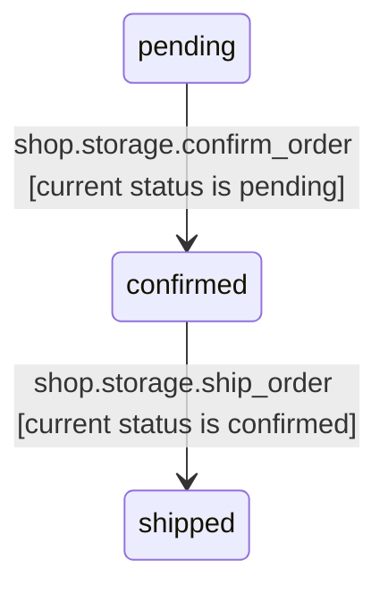

# Partial maintenance artifacts

Authored input fixture for the code after the known move and `code.patch`.
Read scope: `shop/`. The source map and lifecycle carried by the moved file
still refer to `shop.models` / `shop/models.py`; those are known old locations.
`shop/records.py` is the new owner. This supplied change is not a request to
move the diagram to Markdown or rename the confirmation scenario.

## State diagram

## Edge table

edge table, partial within: shop/; left out: unchanged event and table-access rows

| Source | Target | Kind | Name | Defined in |
|---|---|---|---|---|
| shop.storage.ship_order | orders | table | write | shop/storage.py |

## File notes

shop/records.py: Owns order records and status values. The definition moved from shop/models.py and now includes shipped. Existing creation and cancellation remain supported by shop.storage.create_order and shop.storage.cancel_order despite their omission from this partial artifact.

shop/storage.py: Owns SQLite order storage and guarded status changes. ship_order changes confirmed to shipped only. Existing creation, confirmation, and cancellation code remains present; its existing documentation must be reconciled against that code.

shop/service.py: Owns order confirmation and synchronous confirmation-event delivery. Its Order import now uses shop.records; confirmation behavior is unchanged.

shop/notifications.py: Owns confirmation inbox and its OrderConfirmed subscription. Its Order import now uses shop.records; subscription and delivery behavior are unchanged.
