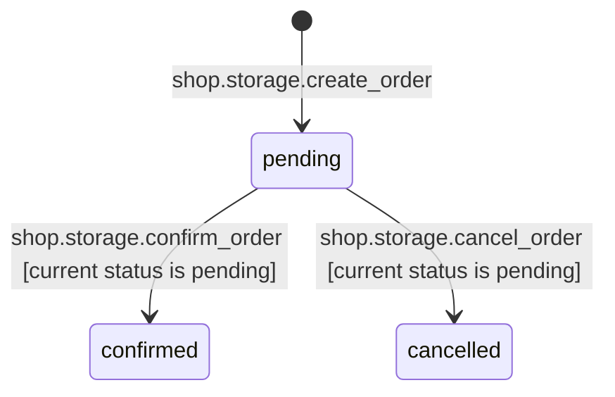
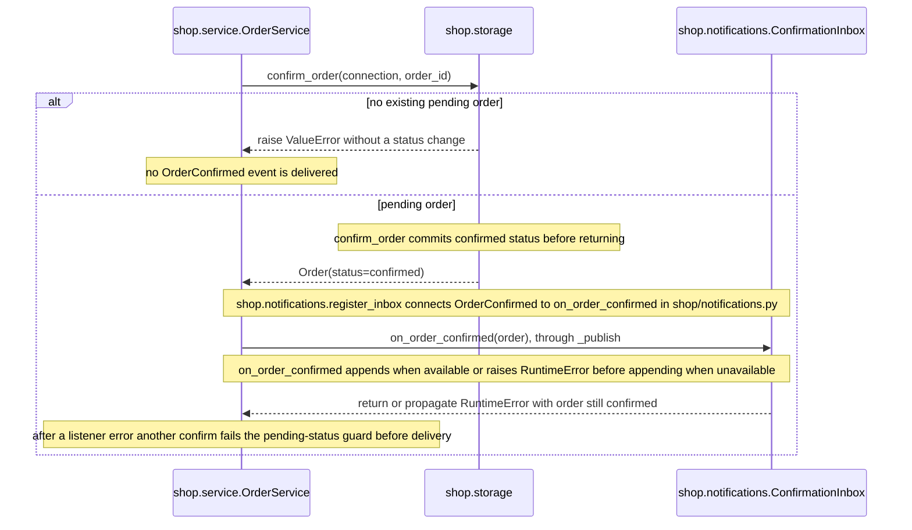
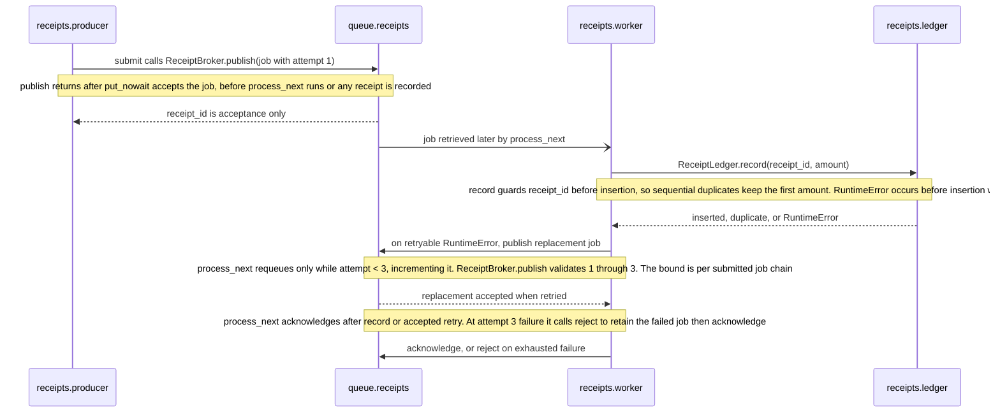
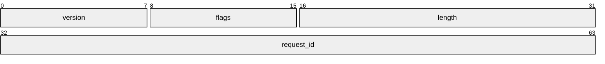

# Supplied artifacts

Authored input fixture, checked against `before/`; not a captured generator run.
Treat `before/` as repository root. Read scope: `shop/`, `transport/`, `receipts/`.
Each scope comment below is raw input metadata, not persisted documentation.

## State diagrams

## Sequence diagrams

## Edge table

edge table, complete within: shop/, transport/, receipts/

| Source | Target | Kind | Name | Defined in |
|---|---|---|---|---|
| shop.service.OrderService.confirm | shop.notifications.ConfirmationInbox.on_order_confirmed | event | OrderConfirmed | shop/service.py, shop/notifications.py, registered in shop/notifications.py (shop.notifications.register_inbox) |
| shop.storage.create_order | orders | table | write | shop/storage.py |
| shop.storage.get_order | orders | table | read | shop/storage.py |
| shop.storage.confirm_order | orders | table | write | shop/storage.py |
| shop.storage.cancel_order | orders | table | write | shop/storage.py |
| receipts.producer.submit | receipts.worker.process_next | other | channel receipts | receipts/producer.py, receipts/worker.py, handed off through receipts/broker.py (receipts.broker.ReceiptBroker.receipts) |

## Packet diagrams

## Glossary table

| Term | Canonical identifier | Meaning | Defined in | Known aliases | Notes |
|---|---|---|---|---|---|
| confirmation | `shop.service.OrderService.confirm` | A committed order status change followed by synchronous listener delivery. | shop/service.py | none | A listener failure can leave the order confirmed without an inbox entry. |

## File notes

shop/models.py: Owns order records and status values. The lifecycle combines guarded storage functions; the SQLite CHECK constrains values, not transition order.

shop/storage.py: Owns SQLite order storage and guarded status changes. confirm_order commits before returning to the service; the store lasts only for the connection's lifetime.

shop/service.py: Owns order confirmation and synchronous confirmation-event delivery. With an inbox registered, a successful status-update commit precedes its OrderConfirmed delivery. A listener error at _publish leaves the order confirmed; another confirm fails the pending-status guard before delivery.

shop/notifications.py: Owns confirmation inbox and its OrderConfirmed subscription. register_inbox connects OrderService.confirm to ConfirmationInbox.on_order_confirmed without the service importing the consumer; delivery is synchronous.

transport/frame.py: Owns message frame representation. Its fields do not declare offsets, byte order, or the synthesized wire length field. The header is assembled by transport.encoder.encode and checked by transport.decoder.decode.

transport/encoder.py: Owns message frame encoding. The header uses a length excluding its own eight bytes, consumed by transport.decoder.decode.

transport/decoder.py: Owns message frame decoding. The decoder rejects a short header and total sizes inconsistent with its payload length.

receipts/broker.py: Owns receipt queue acceptance and completion tracking. publish accepts via Queue.put_nowait before returning receipt_id; it never calls process_next. The queue participant denotes the receipts Queue held here, not a service outside this repository.

receipts/producer.py: Owns submission of receipt jobs. Its caller and the worker must share the same ReceiptBroker for this handoff. The publish return reports acceptance, not a recorded receipt.

receipts/worker.py: Owns receipt processing and bounded requeue. process_next polls the broker's receipts queue. Its attempt < 3 guard permits two requeues after the first attempt; a fresh submit starts a separate chain. It acknowledges only after record, accepted requeue, or retention in failed via reject. A crash after dequeue is not recovered by this in-memory example.

receipts/ledger.py: Owns receipt insertion with a duplicate receipt_id guard. record preserves the first amount for repeated receipt_id values under sequential processing; this in-memory protection is not restart durability or a concurrency guarantee.
