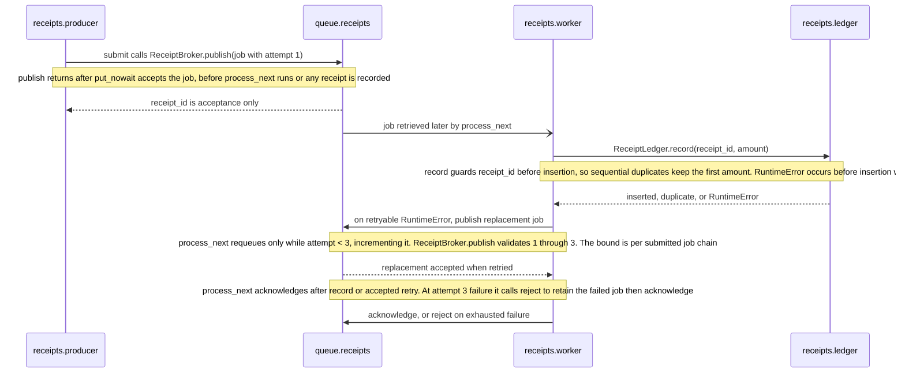

## Flows

### Queued receipt

[`submit`](producer.py) and [`process_next`](worker.py) must receive the same
[`ReceiptBroker`](broker.py). `process_next` polls its `receipts` queue later;
`publish` never calls a worker. [`ReceiptLedger.record`](ledger.py) records an
in-memory receipt, with one sequential worker assumed. The duplicate guard and
queue contents do not survive restart, and this example promises no external
payment or message delivery.

