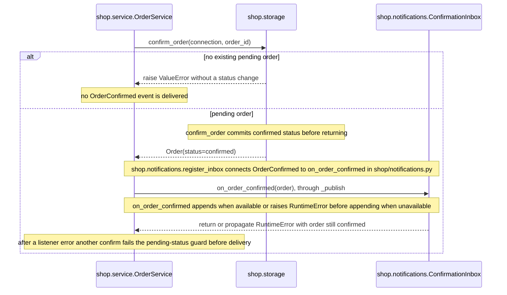

## Owns

- [models.py](models.py) — order records and status values
- [service.py](service.py) — order confirmation and synchronous confirmation-event delivery

## Flows

### Order confirmation

This scenario uses one inbox connected by `shop.notifications.register_inbox`
in [notifications.py](notifications.py). The service is in [service.py](service.py);
the guarded update and transaction are in [storage.py](storage.py). Storage and
the inbox are in memory; the commit does not make them survive process exit.

