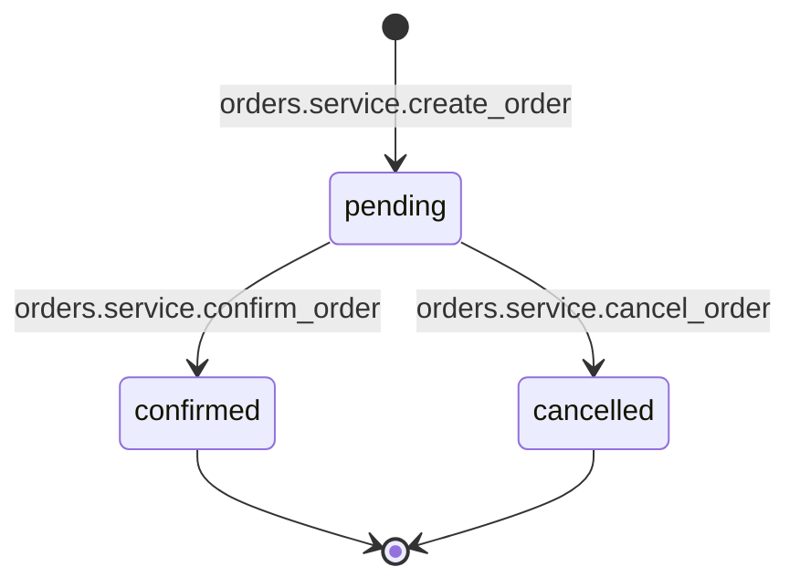
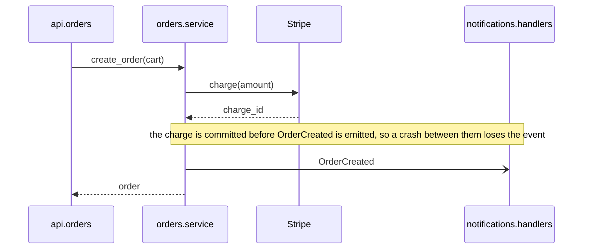
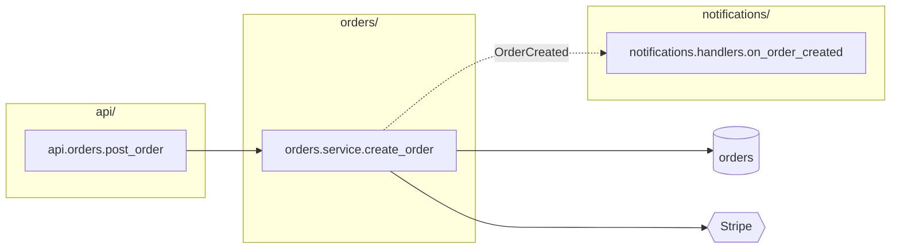
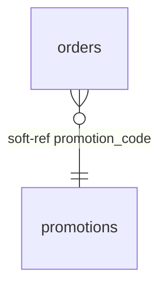

# Placement Guide

## What this document is

You receive three things: a change to the code, the repository as it stands after that change, and a set of artifacts describing the area the change touched. The artifacts are diagrams, tables, and file notes written according to the Code Diagram Guide: an edge table, dependency flowcharts, sequence diagrams, state diagrams, entity-relationship diagrams, class diagrams, packet diagrams, a glossary table, and file notes.

You have one job: decide which facts in those artifacts get written into the repository, where each one goes, what already in the repository needs updating or removing as a result, and what gets left out. Then make the qualifying changes.

This document tells you how to make each of those decisions. It is deliberately opinionated. Your judgment is needed to determine which file owns something, whether a fact is already visible in the code, whether an existing statement is contradicted, and which line an inline comment belongs to. The inclusion rules below decide which kinds of documentation qualify and where they belong. If a proposed addition does not clearly meet them, leave it out.

Two kinds of rule appear below. The rules under "What qualifies," "What is never written," and "Constraints," the map block format, and in the key reference each key's template, the file it goes on, and the key it pairs with, are absolute. Each key's "write it when" and "do not write it when" conditions define what qualifies, and applying them to the code in front of you is exactly where your judgment goes. Everything else describes the normal case. Where a rule does not fit the code in front of you cleanly, do the closest thing that keeps the written material accurate and traceable to the code.

## What qualifies

Add a fact only when all three conditions hold. Existing material follows the reconciliation rules; uncertainty about a proposed addition is not permission to erase an existing fact.

1. **It is supported.** Check it against the current code. A reason, intention, or requirement also needs an explicit source, such as an existing comment or documented contract; behavior alone does not establish intent.
2. **It serves a specific reading task.** It exposes a hidden connection, brings scattered behavior together, explains a constraint or hazard, or supplies one of the navigation indexes explicitly allowed below. Identify what the reader can find or what mistake they can avoid when deciding whether to include it; do not add a separate usefulness explanation to the entry. General usefulness is not enough.
3. **It can be read correctly on its own.** Identify what the fact applies to, preserve conditions that affect its meaning, and avoid claims of completeness, exclusivity, or intent that the evidence does not establish. An unfamiliar reader should not need to know how the artifacts were produced.

Then apply the key's inclusion rules. If support or value remains uncertain, omit the proposed addition. Do not turn a search result into a claim about the whole system: a caller behind a flag does not establish that all callers require it, and a missing transition does not establish a prohibition.

Put information near the code it describes, in a fixed searchable form. Keep hidden connections at both ends and full diagrams in one place with local pointers. A fact that merely repeats nearby code is omitted, except for the explicitly allowed responsibility, writer, and external-system indexes. Those indexes help readers choose a file or find documented endpoints across files. The ability to derive a fact with tools is not by itself a reason to omit it.

Use the Code Diagram Guide's identifier format and writing rules. Preserve names exactly. Reshape artifact wording only as needed to meet an output template or narrow a claim to its verified meaning; do not invent missing facts. The diagram-copying rules below specify the allowed changes to diagrams.

## The five homes

Everything you write goes into exactly one of these. Nothing goes anywhere else.

**1. The map block** at the top of a source file. A delimited comment block with a fixed set of keys, holding selected relationships and navigation information: what it owns, its hidden dependencies at both ends, the tables it writes, the external systems it calls, where the lifecycle it owns is documented, the byte layout it encodes or decodes, the flows it takes part in. This is the most important home. Most of what you write goes here.

**2. A comment directly above the code it describes.** Two forms, and no others. An inline comment: a plain sentence or two on its own line directly above a specific line of code, for the few facts that belong to a line rather than to a file and that the code cannot make clear on its own: why a line is the way it is, a hazard at exactly this point, a value that must match a value elsewhere. And the state diagram: the artifact's diagram copied under the diagram-copying rules as a comment block directly above the definition of a stored state's values, or directly below the map block when no such definition exists in a source file, the one comment with a fixed form, pointed to by a `transitions:` line in the owner's map block and in other files whose code performs its transitions.

**3. A directory README** (`README.md` in the directory). For facts that belong to a directory rather than a file: what the directory owns, the kept flows, those that cross a boundary or span more than one top-level directory, whose entry point lives here (as sequence diagrams), and a dependency-direction rule when one exists and no tool enforces it.

**4. The root agent file**: the repository's root instructions file for AI readers, whatever it is already called (`AGENTS.md`, `CLAUDE.md`, or similar). If more than one exists, use the one the repository's agents are configured to load where that is stated, and otherwise `AGENTS.md`. If none exists, create `AGENTS.md`. You write index lines into it, into fixed sections: one line per top-level directory, one line per named flow, one line pointing at the glossary; and the map block legend from the appendix, so that every reader knows what the blocks mean. Never diagrams, never tables, never prose beyond a line outside the legend. Every AI reader reads this file at the start of every session, so its length is a cost paid on every task.

**5. The root glossary**: `GLOSSARY.md` at the repository root, with the same columns as the artifact glossary table. Qualifying glossary rows from the artifacts are merged here and nowhere else.

The table below names the allowed homes for qualifying facts; some relationships require entries in more than one file. This table is the summary; the sections that follow give the conditions and the exact forms.

| Fact | Home | Form |
|---|---|---|
| what a file is responsible for | map block | `owns:` |
| a caller whose execution context or hidden connection matters | map block of the callee | `called from:` |
| an event, hook, feature flag, container binding, callback, or other hidden mechanism | map block at both ends | `event out:`/`event in:`, `hook out:`/`hook in:`, `flag out:`/`flag in:`, `di out:`/`di in:`, `callback out:`/`callback in:`, `other out:`/`other in:` |
| tables a file writes, and tables in another database or service it reads or writes | map block | `writes:`, `reads remote:`, `writes remote:` |
| an external system a file calls | map block | `calls:` |
| a column that refers to another table with no foreign key | map block at both ends | `soft-ref out:`, `soft-ref in:` |
| the lifecycle of a stored state field | comment block directly above the definition of its values, or below the map block when no definition exists in a source file, plus pointers in the owner and transition-writer map blocks | the state diagram under the copying rules; `transitions:` |
| a binary layout | map block | `format:` |
| a danger that belongs to a file as a whole | map block | `hazard:` |
| a fact about one line: why it is the way it is, a hazard at that point, a value that must match another, an assignment that bypasses a state machine | inline comment directly above the line | a plain sentence |
| a flow that crosses a boundary or spans more than one top-level directory | README of the entry point's directory, plus the map block of every participating file | `## Flows` sequence diagram; `entry point of:`, `participates in:` |
| what a directory owns | directory README | `## Owns` |
| a dependency-direction rule that no tool enforces | directory README | `## Dependency direction` |
| the data model, only when the repository has no schema source of truth | directory README | `## Data model` |
| the index of described directories and named flows | root agent file | `## Map`, `## Flows`, `## Glossary` |
| the meaning of the map block keys | root agent file | `## Map blocks` legend |
| a domain term, its canonical identifier, and its aliases | `GLOSSARY.md` | one row |

The dependency flowchart and the class diagram are never written as diagrams, and the entity-relationship diagram only in the no-schema case; what they carry arrives through the rows above. Anything that fits no row is not written.

## The map block

### Format

The block is made of the language's line-comment marker followed by a fixed key, a colon, and the fact. It opens with a line whose content after the comment marker is exactly `map` and closes with one whose content after the marker is exactly `end map`, so that tooling can find and replace the whole block. In Python:

```text
# map
# owns: creation and cancellation of orders
# participates in: order placement (api/README.md)
# called from: jobs.expire_orders.run (jobs/expire_orders.py); scheduled expiry runs without an HTTP request
# event out: OrderCreated -> analytics.consumers.on_order_created (analytics/consumers.py), notifications.handlers.on_order_created (notifications/handlers.py)
# writes: orders
# calls: Stripe (charge, refund)
# end map
```

In a language with `//` comments, every line starts with `//`. In a language with only block comments, the block is one block comment whose lines follow the same shape. Never use a docstring or a string literal for the map block, even where that is the convention for module documentation; comments are uniform across languages and never affect runtime.

The block goes after any shebang, encoding, license, magic comment, or compiler directive line, and before the first import or the first statement. Lines like Ruby's `# frozen_string_literal: true`, Go's build constraints, or `// @flow` must stay where the language expects them; placing the block above them can silently change behavior. If the file has an existing module docstring, the map block goes before it. If the file already has a map block, replace the whole block; never append a second one. Leave one blank line between `end map` and whatever follows, because several languages attach a leading comment to the next declaration, Go doc comments, JSDoc, and Javadoc among them. In Go the block goes after the package clause and before the imports. In PHP it goes after the opening tag and any `declare` line.

### Key reference

The block is terse by design, so every key is defined here in full. Each entry has the same parts. **Means** is the fact the line states, in the words a reader should take from it. **Template** is the exact shape of the value; placeholders are in angle brackets and everything outside them is literal. **Example** is one real line. **Write it when** and **Do not write it when** are your conditions; if neither matches, the key is not written. **On** is the file that gets the line. **Pairs with** is the key written at the other end of the same fact, when the fact has two ends. The appendix supplies a self-contained reader legend for the root agent file. An entry must still name its subject and material conditions clearly. Keys appear in the block in the order given here. A key is written only when the artifacts supply a fact for it in this file, or when an existing fact under it survived reconciliation. A key with nothing to say is omitted: never written empty, never written with `none` as its whole value, never added because other files have it or because the block would look more complete with it. Omission carries no meaning to a reader, by rule, so there is nothing to signal by writing a key without a fact.

Conventions that apply to every value:

- `<identifier>` is a name in the Code Diagram Guide's identifier format: `orders.service.create_order`, `orders.models.Order`, a bare table name, a bare product name.
- A repository path in parentheses, `(<file>)`, after an identifier is the file that defines that identifier; a reader can open it directly. Parentheses are used for nothing else except the operations after an external system name in `calls:`, the system after a table name in `reads remote:`, `writes remote:`, and `soft-ref out:`, the field list in `transitions:`, the `(no FK; ...)` note in `soft-ref out:`, the README path after a flow name in `entry point of:` and `participates in:`, and the source file after `<table>.<column>` in `soft-ref in:`. These source and README paths let a reader open the relevant code or diagram directly.
- `->` reads "to" and `<-` reads "from." The arrow points the way control or data moves. An `out` key describes something leaving this file; an `in` key describes something arriving in it.
- Several items of the same kind in one value are separated by commas. Several independent statements in one value are separated by semicolons.
- The file in parentheses is always a source file a person edits. When the name also exists in a file generated from that source, the generated file is never cited.
- For a relationship key whose template leaves the local function or object implicit, append `; in <local identifier>` when more than one local subject is possible. Append `; when <condition>` when a condition limits the relationship and the template does not already express it. For example: `event out: OrderCreated -> notifications.handlers.on_order_created (notifications/handlers.py); in orders.service.create_order; when payment is committed`. Each qualifier applies to every endpoint on that line: group endpoints only when they share the same local subject and condition. Otherwise repeat the key on separate lines, even for the same event or hook. Paired entries must preserve the same condition, with local subjects named from their respective ends. These qualifiers extend the templates below; they are not new keys.
- A fact's identity is its key, endpoints (including the local subject), and any condition that changes the relationship, not its wording. Keep existing wording for the same fact when it remains accurate and unambiguous. A format change needed to name the subject or condition is an update, not a second fact.
- An end that lies outside this repository is written as `<system name> (outside repository)`. It has no file and no partner line, and the file check in the procedure does not apply to it.
- Items within a value are sorted alphabetically by identifier, so that the same facts always produce the same line.
- A key that says "one line per X" is repeated for each X, with further lines when local subjects or conditions differ. Sort by X, then local identifier, condition, and endpoint identifiers. Split flag branches follow the ordering in `flag out:` below. A file that owns several state fields has one `transitions:` line per field, in field-name order.

**`map` and `end map`**
Not keys but delimiters: a comment line whose content after the marker is exactly `map` opens the block and one whose content is exactly `end map` closes it. Everything between them follows this reference. Tooling finds the block by these lines, so they are written exactly, with no colon and nothing else after the marker.

**`owns:`**
Means: what this file is responsible for.
Template: `owns: <noun phrase describing the responsibility>`
Example: `owns: creation and cancellation of orders`
Write it when: the file notes give a purpose statement for this file, which they do for every file they describe. It is the first line of the block and the source for directory navigation. If a module docstring already states the same purpose, reuse its wording for `owns:` rather than composing a competing description. Leave the docstring alone. If the two descriptions disagree, resolve the discrepancy against the code before adding `owns:`. If the discrepancy remains unresolved, do not add or replace the purpose statement.
Do not add it when: the artifacts give no purpose statement for the file. That happens when the file is the far end of a two-ended fact, an `event in:` or `soft-ref in:` for example, and was not itself described. An unresolved conflict with an existing purpose statement also prevents adding or replacing `owns:`. In either case, an existing `owns:` follows reconciliation; if none survives, write the block without it. A file the artifacts say nothing about at all gets no new block.
On: the file itself. Pairs with: nothing.

**`entry point of:`**
Means: a kept flow, one that crosses a process, service, queue, scheduler, or thread boundary or spans more than one top-level directory, takes its first step inside this repository in this file, and its sequence diagram is in the named README. The diagram shows what, if anything, comes before this file: a queue, an external system, or code outside the repository. Its arrows show whether the flow also crosses a process, service, or queue boundary.
Template: `entry point of: <flow name> (<README path>), <flow name> (<README path>)`
Example: `entry point of: order placement (api/README.md)`
Write it when: a sequence diagram was written into a README and this file defines the first participant in this repository to send a message, where a message is a call or an asynchronous send, not a return.
Do not write it when: the flow was not kept. When the first sender is a queue, an external system, or code outside the repository, the line goes on the file of the first participant in this repository that sends a message; when that file would never get a map block, such as a generated router, it goes on the next participant in the repository that does get one. In both cases the diagram, not this line, says where the flow truly begins.
On: the entry file. Pairs with: `participates in:` on every other participating file.

**`participates in:`**
Means: this file is one step of a flow that starts somewhere else; the diagram is in the named README.
Template: `participates in: <flow name> (<README path>), <flow name> (<README path>)`
Example: `participates in: order cancellation (orders/README.md), order placement (api/README.md)`
Write it when: a kept sequence diagram has a participant defined in this file that is not the entry point.
Do not write it when: the participant is a queue, an external system, code outside the repository, or a file on the never-diagram list.
On: each participating file. Pairs with: `entry point of:`.

**`called from:`**
Means: the named caller reaches code here from an execution context or connection that matters when changing it.
Template: `called from: <identifier> (<file>), <identifier> (<file>); <why this caller matters>`
Example: `called from: jobs.expire_orders.run (jobs/expire_orders.py); scheduled expiry runs without an HTTP request`
Write it when: a verified caller uses a different execution context, such as a scheduled job calling request-path code or a migration calling service code, and the difference matters to behavior such as authentication, retries, or transaction handling; or a hidden mechanism makes the caller difficult to discover. The clause states that concrete context or mechanism. A different top-level package or a note calling the caller surprising is not enough on its own.
Do not write it when: it only lists ordinary callers; the reason is merely that a caller is in another package; or another map entry already exposes the same caller and relevant context.
On: the callee's file. Pairs with: nothing; the caller's side is visible in the caller's own code.

**`event out:`**
Means: this file emits the named event, and these are verified consumers documented here; the list need not include every consumer.
Template: `event out: <EventName> -> <consumer identifier> (<file>), <consumer identifier> (<file>)`. One line per event name and shared local subject and condition. A consumer outside this repository is written as `<service name> (outside repository)` and gets no `event in:` line anywhere.
Example: `event out: OrderCreated -> analytics.consumers.on_order_created (analytics/consumers.py), notifications.handlers.on_order_created (notifications/handlers.py)`
Write it when: the edge table has a row of kind `event` whose Source is in this file. A row whose Target is `no consumer found` is a search result, not a verified connection: do not turn it into an `event out:` entry. A concrete behavior such as an event deliberately discarded qualifies only under the separate absence rules.
Do not write it when: the "event" is a direct function call, which is visible in the code; when it is a component-local UI event; when a consumer is only suspected.
On: the emitter's file. Pairs with: `event in:` on each consumer's file.

**`event in:`**
Means: a function in this file runs when the named event is emitted from the named place.
Template: `event in: <EventName> <- <emitter identifier> (<file>), <emitter identifier> (<file>)`. One line per event name and shared local subject and condition.
Example: `event in: ChargeSucceeded <- payments.gateway.charge (payments/gateway.py)`
Write it when: the edge table has a row of kind `event` whose Target is in this file.
Do not write it when: the subscription is to an in-process observable or store local to one module.
On: the consumer's file. Pairs with: `event out:`.

**`hook out:`**
Means: an operation on an object defined in this file, such as saving or deleting it, causes a handler somewhere else to run.
Template: `hook out: <hook name> -> <handler identifier> (<file>), <handler identifier> (<file>)`. One line per hook name and shared local subject and condition.
Example: `hook out: post_save -> audit.signals.on_order_saved (audit/signals.py)`
Write it when: the edge table has a row of kind `hook` whose Source is an object defined in this file. The object's own file exposes the relationship to readers of the model. Check the registration and triggering operation; do not assume that bulk operations or every code path invokes the hook. Use the condition qualifier for a material restriction.
Do not write it when: the handler is defined in this same file, where it is visible; when the hook is framework-internal with no project handler attached.
On: the file defining the hooked object, usually the model. Pairs with: `hook in:`.

**`hook in:`**
Means: a function in this file runs as a hook on an object defined elsewhere.
Template: `hook in: <hook name> <- <object identifier> (<file>)`
Example: `hook in: post_save <- orders.models.Order (orders/models.py)`
Write it when: the edge table has a row of kind `hook` whose Target is a handler in this file.
Do not write it when: the hooked object is defined in this same file.
On: the handler's file. Pairs with: `hook out:`.

**`flag out:`**
Means: this file checks a feature flag, and the flag decides which code runs.
Template: `flag out: <FLAG_KEY> -> on: <identifier> (<file>); off: <identifier> (<file>)`. When the flag only gates one path and nothing runs in its place, write `off: skipped`. A trailing `; when <condition>` applies to both branches. If the branches have different conditions, use separate lines: `flag out: <FLAG_KEY> on -> <identifier> (<file>); when <condition>` and `flag out: <FLAG_KEY> off -> <identifier> (<file>); when <condition>`. Omit `; when` on an unrestricted branch; use `-> skipped` for a branch that does nothing. For a given flag check, use either the joined form or the split form, never both, and document both states. Put `; in <checking identifier>` before `; when` if the local checker needs naming. Sort split lines by flag, checker, on before off, condition, and target.
Example: `flag out: PRICING_V2 -> on: pricing.v2.calculate (pricing/v2.py); off: pricing.v1.calculate (pricing/v1.py)`
Write it when: the edge table has rows of kind `flag` whose Source is in this file. The artifact records two rows per flag, Name `<FLAG> on` and `<FLAG> off`; they become the two branches in the joined or split form. Verify any additional branch condition in the code and preserve it on the paired `flag in:` entry.
Do not write it when: the value checked is a build-time constant or a configuration setting that does not change at runtime; that is configuration, and it is visible.
On: the checking file. Pairs with: `flag in:` on the file holding each gated path, when that is a different file.

For example, if the on branch calls V2 only for paid accounts while the off branch calls V1 for every account, write these lines on the checker, with the matching condition on the V2 file:

```text
# flag out: PRICING_V2 on -> pricing.v2.calculate (pricing/v2.py); when account is paid
# flag out: PRICING_V2 off -> pricing.v1.calculate (pricing/v1.py)
```

```text
# flag in: PRICING_V2 on <- orders.service.get_price (orders/service.py); when account is paid
```

**`flag in:`**
Means: the named caller reaches code in this file when its flag check has the named state, on or off. This says nothing about other callers or executions.
Template: `flag in: <FLAG_KEY> on <- <checking identifier> (<file>)` or `flag in: <FLAG_KEY> off <- <checking identifier> (<file>)`. One line per flag, state, local subject, and condition.
Example: `flag in: PRICING_V2 off <- orders.service.get_price (orders/service.py)`
Write it when: the edge table has a row of kind `flag` whose Target path is in this file and whose checker is in a different file; the row's Name, `<FLAG> on` or `<FLAG> off`, supplies the state.
Do not write it when: the check and the gated path are in the same file.
On: the file holding the gated path. Pairs with: `flag out:`.

**`di out:`**
Means: this file asks a container or locator for an abstraction, and this is where the binding that chooses the implementation lives.
Template: `di out: <abstraction identifier> via <file where the binding is configured>`
Example: `di out: payments.protocols.PaymentProvider via app/wiring.py`
Write it when: the edge table has a row of kind `di` whose Source is in this file; the row's Defined in names the binding file after `bound in`, which becomes the `via` clause, or `via unknown` when the artifacts could not find it.
Do not write it when: the dependency is passed in by a visible caller as an argument; that is an ordinary call.
On: the resolving file. Pairs with: `di in:`.

**`di in:`**
Means: a class in this file is what a container hands out for the named abstraction.
Template: `di in: <abstraction identifier> <- <resolving identifier> (<file>), <resolving identifier> (<file>)`
Example: `di in: payments.protocols.PaymentProvider <- orders.service.create_order (orders/service.py)`
Write it when: the edge table has a row of kind `di` whose Target implementation is in this file.
Do not write it when: construction is only a direct call, with no verified container binding. Other direct construction does not invalidate a container relationship.
On: the implementation's file. Pairs with: `di out:`.

**`callback out:`**
Means: this file hands one of its functions to another module, which will call it later.
Template: `callback out: <function identifier> -> <receiving identifier> (<file>)`
Example: `callback out: orders.service.on_payment_done -> payments.gateway.charge (payments/gateway.py)`
Write it when: the edge table has a row of kind `callback` whose handed-over function is defined in this file.
Do not write it when: the function is called directly by name from the other module; when the callback never leaves this file.
On: the file that hands the function over. Pairs with: `callback in:`.

**`callback in:`**
Means: a function received by code in this file is, in practice, the named function from elsewhere.
Template: `callback in: <parameter or registration point> of <receiving identifier> <- <function identifier> (<file>)`
Example: `callback in: on_complete of payments.gateway.charge <- orders.service.on_payment_done (orders/service.py)`
Write it when: the edge table has a row of kind `callback` whose receiver is in this file.
Do not write it when: the receiver is generic library code outside the repository.
On: the receiving file. Pairs with: `callback out:`.

**`other out:`** and **`other in:`**
Means: a hidden dependency through a mechanism none of the keys above covers: a file on disk, a cache key, an environment variable read at runtime, a database trigger, a shared in-memory registry.
Template: `other out: <mechanism> <name> -> <identifier> (<file>)` and `other in: <mechanism> <name> <- <identifier> (<file>)`, where `<mechanism>` is the one word the edge-table row carries, from the Code Diagram Guide's list, and `<name>` is the name the code uses
Example: `other out: file settings.ORDERS_SPOOL_DIR -> jobs.import.run (jobs/import.py)` and, on the other file, `other in: file settings.ORDERS_SPOOL_DIR <- orders.export.write_spool (orders/export.py)`
Write it when: the edge table has a row of kind `other`. Name the mechanism first, so a reader knows what to look for.
Do not write it when: any specific key above fits; prefer the specific key.
On: both ends. Pairs with: each other.

**`writes:`**
Means: executing code in this file can change rows in these tables.
Template: `writes: <table>, <table>`
Example: `writes: orders, order_lines`
Write it when: the edge table has a row of kind `table` whose Source is in this file with a write operation: insert, update, delete, save, create, or a bulk equivalent.
Do not write it when: the file only reads the table; the file only defines the model and contains no write logic; the write is in a migration.
On: each writing file. Pairs with: nothing. This is a deliberate navigation index, even for a locally visible write: searching the key and table name finds documented writers, not necessarily all writers. The line describes the union of writes in this file, not every function in it.

**`reads remote:`**
Means: this file reads a table or store that belongs to another database, schema, or service.
Template: `reads remote: <table> (<system or database>)`
Example: `reads remote: customers (billing database)`
Write it when: the edge table has a row of kind `table` with Name `read` whose Target is written as `<table> (<system>)`, which is how the artifacts mark a table outside this repository's own schema.
Do not write it when: the table is in this repository's schema; reads of local tables are never written.
On: the reading file. Pairs with: nothing.

**`writes remote:`**
Means: executing code in this file can change rows in a table that belongs to another database, schema, or service.
Template: `writes remote: <table> (<system or database>)`
Example: `writes remote: customers (billing database)`
Write it when: the edge table has a row of kind `table` with Name `write` whose Target is written as `<table> (<system>)`.
Do not write it when: the table is in this repository's schema; that is `writes:`.
On: the writing file. Pairs with: nothing.

**`calls:`**
Means: this file makes network calls to a system run by someone else.
Template: `calls: <System> (<operation>, <operation>); <System> (<operation>)`
Example: `calls: SendGrid (send); Stripe (charge, refund)`
Write it when: the edge table has a row of kind `external` whose Source is in this file.
Do not write it when: the call is to a service inside this repository, which is a flow participant covered by `participates in:`; when the "system" is a library rather than a network service.
On: the calling file. Pairs with: nothing; the external system has no file here. This is a deliberate index of documented network dependencies and their operations, even when the calls are locally visible. Searching it does not prove that other callers are absent.

**`soft-ref out:`**
Means: the named column refers to another table without a foreign key constraint. A named validator establishes one check, not the only check or a guarantee that all writes use it.
Template: `soft-ref out: <source table>.<column> -> <target table> (no FK; validated in <identifier> (<file>))`. When validation has not been established, use `soft-ref out: <source table>.<column> -> <target table> (no FK)`; absence of a validator in this line makes no claim about validation.
Example: `soft-ref out: orders.promotion_code -> promotions (no FK; validated in orders.service.validate_promotion (orders/service.py))`
Write it when: a verified `soft-ref` relationship has its referencing column in a model defined in this file. A `validated in` artifact clause supplies the check after it is confirmed. If the artifact says `validation unknown` or `validation not found within <paths>`, keep the verified relationship without a validation clause. If inspected write paths accept the reference without validation, describe those particular paths in a qualifying inline comment or hazard; do not write an unqualified `not validated` claim. For a reference into another database or service, name the system after the target table: `soft-ref out: orders.customer_id -> customers (billing database) (no FK)`.
Do not write it when: the column has a foreign key constraint or an ORM declaration that creates one.
On: the file defining the referencing model. Pairs with: `soft-ref in:`, except for references into other systems, which have no second end here.

**`soft-ref in:`**
Means: the named source column points at the named local table without a foreign key constraint.
Template: `soft-ref in: <target table> <- <source table>.<column> (<source file>)`
Example: `soft-ref in: orders <- audit_events.target_id (audit/models.py)`
Write it when: a verified `soft-ref` relationship points at a table defined in this file.
Do not write it when: the reference is enforced.
On: the file defining the referenced table. Pairs with: `soft-ref out:`.

**`transitions:`**
Means: this file defines a stored state or contains code that changes it; the line points to the one kept diagram of its lifecycle.
Template: `transitions: <entity identifier>.<field>, diagram above <identifier of the definition>`. For a lifecycle encoded in several booleans or timestamps: `transitions: <entity identifier> (<field>, <field>), diagram above <identifier of the class>`. For a field whose values are bare string or number literals with no enum: `transitions: <entity identifier>.<field>, diagram above <identifier of the class>`. When the diagram had to be placed at the top of the file because no definition exists in a source file: `transitions: <entity identifier>.<field>, diagram below this block`.
Example on the owner: `transitions: orders.models.Order.status, diagram above orders.models.OrderStatus`. Example on a writer: `transitions: orders.models.Order.status, diagram in orders/models.py above orders.models.OrderStatus`. For a diagram below the owner's map block, a writer uses `transitions: <entity identifier>.<field>, diagram in <owner file> below map block`. The same external-location suffix applies to the multi-field form.
Write it when: a state diagram qualifies under the state-diagram rules and this is the owner file or a file defining a verified transition shown in it. The owner is the file where the state's values are defined: the enum, the union type, the choices list, or, when the state is a combination of booleans or timestamps or when its values are bare string or number literals with no enum, the class or type that declares the field. Only when the values are defined only in generated code or a migration and no source type declares the field is the owner the file that assigns the field in the most places. The diagram itself is placed as described under "State diagram" in the placement rules; this line only points at it.
Do not write it when: a state machine library declares the machine; then nothing from the diagram is written, and only a bypass gets an inline comment.
On: the owner file and other eligible files that perform a shown transition. The owner points to the local diagram; writers point to that same diagram and do not copy it. The transition labels provide the links from the diagram back to the writers.

**`format:`**
Means: this file encodes or decodes the named binary layout, given beneath.
Template: `format: <name>`, followed by the packet diagram's lines under the copying rules, each as a continuation line indented two spaces so that the block keeps its one-key-per-line shape.
Example:

```text
# format: frame header
#   packet-beta
#   %% format: frame header
#   %% selected view; omissions do not establish absence
#   0-7: "version"
#   8-15: "flags"
#   16-31: "length"
#   32-63: "sequence"
```

Write it when: a packet diagram assembles a handwritten byte layout whose offsets or fields otherwise require following several encoding or decoding operations.
Do not write it when: the format is declared in a schema file; then the schema is the source.
On: the codec's file. Pairs with: nothing.

**`hazard:`** (in the map block)
Means: something about this file's behavior that a reader must know before editing anything in it.
Template: `hazard: <one sentence: what is dangerous, and what not to do>`
Example: `hazard: retries the Stripe charge with no attempt limit; a persistent failure loops until the job is killed`
Write it when: a sequence note or file note states a danger that belongs to the file as a whole rather than to one line: a retry with no enforcing line, an operation that is not idempotent, an ordering across functions that must be preserved.
Do not write it when: the danger belongs to one identifiable line, which gets an inline comment instead; when it is a general truth about all code, such as "network calls can fail."
On: the file. Pairs with: nothing.

No other keys exist in the map block. A fact that fits none of them goes in `hazard:` if it qualifies; or is about a line and becomes an inline comment if a rule in this document sends it there; or is not written.

## Comments above the code

Two things are written as comments directly above code: inline comments, described here, and the state diagram, a fixed-form comment block whose placement is described under "State diagram" in the placement rules by artifact type. Nothing else is written as a comment above code.

Code should explain itself. An inline comment is written only when the code cannot, and something important would otherwise be unclear: why a line exists, why it is unusual, what it works around, what elsewhere depends on it. It goes directly above the code it refers to. It never describes what the code does, since that is visible by reading it. It is a plain sentence or two, in no fixed form and with no prefix.

You write an inline comment only where a rule in this document says a fact from the artifacts belongs on a specific line: a file note or sequence note that explains one line, a sequence note that names a hazard at one line, an assignment that bypasses a state machine library, a value that must match a value elsewhere. Examples of the sentences you would write:

```text
# The vendor returns 200 with an empty body above 5 requests per second; the sleep is deliberate.
# The charge is committed before OrderCreated is published, so a crash between the two loses the event.
# Sets status directly instead of going through orders.machine.OrderMachine; the machine's guards do not run here.
# Must match BATCH_SIZE in jobs/import.py; the two are read by the same retry logic.
```

Mechanics, which are about not breaking the code rather than about style: the comment is on its own line immediately above the line it describes, using the language's line-comment marker. Never a trailing comment on the code line itself, since some linters reflow those and some languages treat them differently. Never inside a string, a docstring, or a multi-line expression; if the only safe position is above a multi-line statement, use the line above its first line. If a comment already sits directly above the target line, reconcile with it: keep it if it says the same thing, replace it if the change made it false, and never add a second comment above the same line.

## Directory README

A README gets three sections, and a fourth in one case, added if absent and replaced wholesale if present. Any other content already in the README is left exactly as it is. A README is created for a directory only when at least one of its sections would have content; a directory whose only blocks lack `owns:` gets none.

`## Owns`: one line per file in the directory that has a map block with an `owns:` line, in the form `orders/service.py — creation and cancellation of orders`, copied from that line; a file whose block has no `owns:` is not listed. Then one line per subdirectory that has its own README, in the form `handlers/ — see orders/handlers/README.md`, so that READMEs form a tree a reader can walk down.

`## Flows`: one `### <scenario name>` heading per sequence diagram whose entry point is in this directory, each followed by the sequence diagram under the diagram-copying rules, including its scenario and notes, in a `mermaid` fenced block. Flows whose entry point is elsewhere are not repeated here; the participating files' `participates in:` lines point to where they live.

`## Dependency direction`: written only when the artifacts cite an explicit documented directional rule between this directory and others, such as the API layer calling the domain and never the reverse, and no tool in the repository enforces it. One line per rule: `orders/ may depend on pricing/, inventory/; nothing in those may depend on orders/`. An observed lack of reverse imports does not establish a rule. If an import-boundary tool enforces the rule, it lives in that configuration and this section is not written.

`## Data model`: written only in the case described under the entity-relationship rules, a repository with no schema source of truth. It holds the relationship-level diagram under the diagram-copying rules.

A README created by you contains only these sections. Do not write prose.

## The root agent file

You touch four sections and nothing else. Three are indexes: each is added if absent and each of its list lines is added, updated, or removed to match the current state, one line per item, sorted alphabetically, in a fixed form. A list line in square brackets under an index heading is a placeholder left by the template and is removed. Descriptive text directly under an index heading, before the first list item, is left exactly as it is. The fourth section is the legend.

`## Map`: one line per top-level directory that contains a map block or a README, in the form `orders/ — creation, cancellation, and lifecycle of orders`, derived from that directory's README `## Owns` section. This is the one place you compose a sentence rather than copy one: one sentence, naming responsibilities and nothing else. A bare wrapper directory that holds all of the code, `src/` for example, is skipped and its children are listed as top-level, the same way the identifier format drops `src`. Directories with nothing written in them are not listed. A directory whose blocks all lack an `owns:` line is listed with the fixed phrase `promotions/ — referenced by other directories; not yet described`, so that a reader can reach it.

`## Flows`: one line per named flow in any README, in the form `order placement — entry api.orders — api/README.md`, where the entry is the first participant to send a message, as declared in the diagram, whether or not it is in this repository, so that a flow which begins in a queue or an external system says so in the index.

`## Glossary`: the single line `See GLOSSARY.md.`

`## Map blocks`: the legend that tells any reader what the keys in a map block mean. Written verbatim from the appendix at the end of this document if the section is absent. If it is present and differs from the appendix, the whole section is replaced with the appendix text. If it matches, it is not touched.

If the file has other sections, commands, conventions, anything hand-written, they are not yours. Do not edit, reorder, or reformat them.

## The glossary

`GLOSSARY.md` holds one table with the artifact glossary's columns: Term, Canonical identifier, Meaning, Defined in, Known aliases, Notes. Add a row only when it resolves an ambiguous domain term, records aliases used for the same concept, or explains a domain-specific meaning not apparent from the identifier. A routine noun with an obvious meaning does not qualify. Rows are sorted by Term. Merging rules:

- A term not yet present is added as its artifact row.
- A term present with the same canonical identifier and a meaning that agrees keeps its existing row; any aliases the artifact found that the row lacks are appended to Known aliases.
- A term present with a different canonical identifier or a meaning that disagrees is a conflict. Read the code at both `Defined in` locations. If the code agrees with the artifact and the existing row is out of date, replace the row. If both are real, two things share a word, and that is a vocabulary problem in the code, not something you resolve here: keep both as separate rows, distinguished by canonical identifier, put `conflict: same term, two meanings` in both Notes columns.
- A row is never deleted by you, including when its term has disappeared from the code.

## Placement rules by artifact type

Each section says, for the facts an artifact type carries, where each kind of fact goes and what is dropped. "Both ends" means the fact is written at the file on each side of a connection, so that a reader arriving at either side sees it. When one side is a file on the Code Diagram Guide's never-diagram list or lies outside the repository, the fact is written on the other side only, naming the excluded end.

### Copying a kept diagram

Incoming artifacts retain their Code Diagram Guide scope lines. Persisted diagrams contain selected, verified information rather than a record of the inspection. Make only these transformations before comparing or writing a kept diagram:

- Remove `%% suspected:` lines.
- Replace `%% complete within: <paths>` with `%% selected view; omissions do not establish absence`.
- Replace `%% partial within: <paths>; left out: <items>` with `%% selected view; omits: <items>; omissions do not establish absence`.
- Remove comments that only describe searches or files read. If removing one would leave a transition, terminal marker, or other claim misleading, do not keep that diagram. Preserve comments describing verified behavior, conditions, and explicit prohibitions, including the source of a documented reason.

Retain the diagram type, identity line, labels, edges, notes, and their order. Do not narrow conditions or rewrite unsupported claims to make a diagram fit. Omit an unsupported candidate diagram; reconcile any existing diagram under the rules below. Before replacing an existing diagram, apply the whole-diagram reconciliation rules below to its behavioral facts, not just its absence comments. Compare existing diagrams with this transformed version, not with the raw artifact. These transformations also apply to diagrams copied into source comments and packet continuations. Any other use of “copy” below means this transformed copy, with only the bounded repairs allowed by reconciliation.

### Dependency flowchart and edge table

The flowchart itself is never written anywhere. The edge table is what you place, one row at a time, by kind.

- `event`: `event out:` on the emitter's file, listing the verified consumers being documented; `event in:` on each consumer's file, naming the emitter. Both ends, always.
- `hook`: `hook out:` on the file whose object triggers the hook; `hook in:` on the handler's file. Both ends.
- `flag`: `flag out:` on the file that checks the flag, naming the `on:` path and the `off:` path; `flag in:` on each file holding a gated path, carrying `on` or `off`, when that is a different file from the checker. If both paths are in the checking file, `flag out:` alone.
- `di`: `di out:` on the file that resolves the abstraction; `di in:` on the implementation's file. Both ends.
- `callback` and `other`: both ends, same shape.
- `table`: `writes:` on every file that writes the table, or `writes remote:` when the written table is in another database, schema, or service. Reads are not written unless the table is in another database, schema, or service, in which case `reads remote:` on the reading file. The table's own model file gets nothing from this kind; what it gets comes from soft references.
- `external`: `calls:` on the calling file, with the operations. The external system has no file of its own, so there is no second end.
- `soft-ref`: covered under the entity-relationship diagram.

Direct calls and imports are not inventoried as edges. They are visible at the call site. There are two exceptions. The first is a caller meeting the concrete `called from:` conditions; that goes in `called from:` on the callee's file. The second is a directory-level dependency-direction rule, which goes in the README `## Dependency direction` section under the conditions stated there.

### Sequence diagram

A sequence diagram is kept when it brings together ordering, a handoff, a condition, or failure behavior that cannot be understood from one nearby code section, and it crosses a process, service, queue, scheduler, or thread boundary or spans more than one top-level directory. A boundary alone does not justify redrawing an obvious call. Establish the boundary from the code; an asynchronous arrow alone does not prove a process or service boundary. Write it under the copying rules into `## Flows` in the entry point's directory. The entry point is the first participant defined in this repository to send a message, where a message is a call or an asynchronous send, not a return. The entry point's file gets `entry point of:` naming the flow and the README. Every other participant that is a source file in this repository, and not on the never-diagram list, gets `participates in:` naming the flow and the README. Participants that are queues, external systems, code outside the repository, or files on the never-diagram list get nothing.

The `Note over` lines in the diagram are the most valuable lines it has, and they are placed twice. They stay in the diagram in the README, and each one that describes a hazard at an identifiable line of code also becomes an inline comment above that line, in the note's own words. A note about ordering across a boundary, "the charge is committed before the event is published," attaches to the line that publishes. A note about a retry limit attaches to the line that enforces the limit, or, if nothing enforces it, becomes a `hazard:` line in the map block of the file that retries, stating that the retry is unbounded.

A sequence diagram that crosses no such boundary and whose participants are all in one top-level directory is not written. The file notes for those files carry anything worth keeping from it.

If the entry point is in a file that would never get a map block, a generated router, a framework entry, the README is the one for the directory of the first participant that would, and that participant's file gets `entry point of:`. The diagram still shows the true first sender, so nothing is lost.

### State diagram

Keep a state diagram when it brings together transitions or guards scattered across functions or files; skip one that simply redraws a single nearby function or a declared machine. Write it under the copying rules as a comment block placed directly above the definition of the state's values in the owner file: above the enum, the union type, or the choices list that defines them. In a language where a comment directly above a declaration becomes its documentation, Go, Java, and anything using JSDoc among them, leave one blank line between the block and the definition, as with `end map`; otherwise the diagram becomes the type's generated documentation. If the state is a combination of booleans or timestamps, or its values are bare literals with no enum, the block goes directly above the class or type that declares the field. If no such definition exists in a source file, because the values are defined only in generated code or a migration and no source type declares the field, the block goes at the top of the file that assigns the field in the most places, immediately after its map block. The aim is always the same: the lifecycle sits where anyone changing the values will see it.

Each diagram line is prefixed with the language's line-comment marker. Keep observed transitions distinct from prohibited ones: a missing edge does not establish a prohibition, and an intentional restriction requires its explicit source. Do not copy claims contradicted by code. Apply whole-diagram reconciliation before replacing any diagram; it protects existing supported transitions, guards, and notes as well as absence statements. The owner file's map block gets one `transitions:` line pointing at the diagram actually retained.

```text
# stateDiagram-v2
# %% entity: orders.models.Order, field: status
# %% selected view; omissions do not establish absence
# [*] --> pending: orders.service.create_order
# pending --> confirmed: payments.handlers.on_charge_succeeded
# pending --> cancelled: orders.service.cancel_order
# confirmed --> shipped: fulfillment.handlers.on_shipment_created
# confirmed --> cancelled: orders.service.cancel_order [not shipped]
# %% no transition from shipped to cancelled; returns go through returns.service and do not change orders.models.Order.status
# shipped --> [*]
# cancelled --> [*]
class OrderStatus(Enum):
    ...
```

Each other eligible file that defines a verified transition shown in the kept diagram gets a `transitions:` pointer to the owner file and diagram location. This lets a reader starting at a writer discover the lifecycle. Keep only one full diagram. Before replacing, moving, or removing it, search the repository for `transitions:` entries naming its entity and field or its location. Reconcile all owner and writer pointers with the diagram actually retained: add missing pointers for shown writers, remove a pointer when its file no longer owns or performs a shown transition, update locations on a move, and remove all pointers when the diagram is removed. These pointer edits may cross the artifacts' scope; excluded files remain untouched.

When the artifact says a state machine library declares the machine, confirm that declaration in the code. Nothing from the diagram is written, because the code already declares it; remove any superseded lifecycle diagram and its pointers. The one thing that is written is any bypass the artifact found, a place that assigns the state directly instead of going through the machine: that gets an inline comment on the line above the assignment saying so, for example `Sets status directly instead of going through orders.machine.OrderMachine; the machine's guards do not run here.`

### Entity-relationship diagram

Enforced relationships, foreign keys and ORM declarations that create them, are never written. They are in the schema.

Every relationship labeled `soft-ref` is written at both ends. The file holding the referencing column gets `soft-ref out:` naming the column, the referenced table, `no FK`, and where the reference is validated in code if anywhere. The file defining the referenced table gets `soft-ref in:` naming the referencing table and column and its file. A reference to a table in another database, schema, or service is a `soft-ref out:` on the referencing side only, with the other system named.

The diagram itself is not written. If the repository has no schema source of truth at all, no migrations, no model declarations, only raw SQL scattered through the code, write the relationship-level diagram under the copying rules into the README of the directory that owns the data access, under a `## Data model` heading. This is the one case where the diagram is kept.

### Class diagram

Nothing from the class diagram is written.

### Packet diagram

The artifact's Mermaid block is written into the map block of the codec's file under `format:`, one continuation line per line of the block, under the copying rules. This is the one artifact whose diagram form is the compact form, and it has no table equivalent. If the format is declared in a schema file, nothing is written; the schema is the source.

### Glossary table

Every qualifying row merges into `GLOSSARY.md` by the rules above; omit other rows. Nothing from the glossary is written into source files or READMEs. A term's canonical identifier is already the name in the code; that is the link.

### File notes

The purpose statement, what the file owns, becomes `owns:`. A note's references to the artifacts themselves, such as "see edge table," are dropped; the map block has its own lines for those facts. A caller meeting the execution-context or hidden-connection conditions becomes `called from:`. A fact about a specific line, a workaround, a deliberate delay, a value that must match a value elsewhere, becomes an inline comment above that line, in the note's own words. A fact about the file's behavior that a reader must know before editing becomes `hazard:` in the map block. `hazard:` values are the note's clause reshaped into a sentence; inline comments preserve the note's supported meaning as a sentence. Narrow an overbroad note to the verified behavior; omit any unsupported claim.

A note that restates what the file's name already says is not written. A note that says what was looked for and not found is not written, since it is about the making of the artifacts rather than the code, unless it is a meaningful absence about the file's behavior, "no retry around the Stripe call, by design," in which case it is a `hazard:` line.

### Absence comments and suspected comments

Keep an absence only when it describes behavior a reader might otherwise rely on, and the current implementation establishes it: a path explicitly rejected, an operation that drops a failed send without retry, or a documented prohibition enforced by the code. Name the enforcing location or condition where needed. Call it intentional, or supply its reason, only when an explicit source supports that claim.

A search that found no consumer, validator, or transition does not establish a system-wide absence. Do not turn such search results into map entries or behavioral comments. For a kept diagram, apply the copying rules rather than stripping a qualification that its remaining content needs. An absence that qualifies goes beside the relevant code, in a `hazard:` line if it applies to the file, or stays in the canonical diagram.

Comments beginning `%% suspected:` are never written anywhere in the repository. They were not verified against the code.

## What is never written

These are absolute.

- Anything marked `suspected` in an artifact.
- Duplicate structural inventories: direct calls and imports except qualifying `called from:` entries, enforced foreign keys, class members, explicit inheritance, a state machine already declared by a library, or a data model already declared by the schema. The explicitly allowed navigation indexes and useful cross-file diagrams are not excluded merely because tools could reconstruct them.
- A restatement of nearby branches, imports, or fields with no additional relationship or constraint. The explicit navigation-index rules still apply.
- The dependency flowchart and the class diagram as diagrams, ever; the entity-relationship diagram as a diagram, except in the no-schema case. Only sequence diagrams, state diagrams, and packet layouts are written as diagrams.
- Counts that will drift, "called from forty-one files."
- Inspection history in persisted documentation: files read, scope-completeness claims, or searches that found nothing. Input scope lines stay in the artifacts; diagram copies follow the transformations above, which preserve explicit omission warnings without implying completeness.
- Anything into a file on the Code Diagram Guide's never-diagram list: tests, generated code, vendored or third-party code, migrations, config, constants, translation files, static assets, build scripts, and pure utility modules with no domain meaning. If an edge's other end is in such a file, the fact is written on the end that is a real source file, with the other end named, and nothing is written into the excluded file.
- A key with no fact behind it: an empty key, a key whose whole value is `none`, or a key added so that a block resembles other blocks. Omission means nothing was recorded, and that is the only thing it is allowed to mean.
- Credentials, hostnames, internal URLs, account identifiers, or filesystem paths outside the repository, in any line. A `calls:`, `other out:`, or `hazard:` line names the mechanism and the configuration key or environment variable that holds such a value, never the value itself. A `hazard:` line is still written, since the reader needs it, but on a repository that is public or shared beyond the team it is a public statement of a weakness, so keep it to what a reader of the code could see for themselves.
- Prose paragraphs into any file. Every home has a fixed line form; use it.
- Anything into a section of the root agent file that is not one of the four named under "The root agent file."

## Reconciling with what is already there

The repository already has documentation: map blocks from earlier work, READMEs, inline comments, a glossary, and hand-written material. The change you were given may have altered what any of it describes. Reconciliation is half the job.

For every file you would write into, read what is there first. Then:

- A fact in the artifacts that is absent from the existing material is added only if it passes the inclusion and placement rules.
- A fact in the existing material that the artifacts confirm is left as it is, even if you would have worded it differently.
- A fact in the existing material that the artifacts contradict is checked against the post-change code before anything is overwritten. Read the code at the location the artifact cites. If the code agrees with the artifact, update the existing material. If the code agrees with the existing material, the artifact is wrong: do not write it.
- A fact in the existing material that describes something the change removed, an event no longer emitted, a transition no longer possible, a file no longer calling a system, is deleted from every end it was written at.
- A fact in the existing material that the artifacts do not mention at all, in a file the artifacts do cover, is checked against the code the same way. If the code still supports it, keep it. If the code no longer does, delete it. If you cannot tell, keep the existing fact without broadening its claim.
- A recorded absence in the existing material that the artifacts now contradict or omit is handled like any existing behavioral fact. Absences include a `%%` line in a state diagram saying a transition does not exist, an inline comment about a path deliberately not taken, and a `hazard:` line stating that something deliberately does not exist. Read the code at the place the absence is about. If the absence no longer holds, delete it. If it still holds, preserve it; do not write a contradictory artifact claim. For a diagram, apply whole-diagram reconciliation below. A supported absence is never dropped by a whole-block or whole-diagram replacement.
- Existing lines inside a map block that merely restate the code and do not qualify as an allowed navigation index are deleted, in a file you are already writing into. This applies only to lines in the map block vocabulary. Inline comments, docstrings, and README prose are never deleted for restating the code; an inline comment is deleted only when the change made it false, the same test as for any other statement.

When rewriting a map block, remove legacy `complete within:` or `partial within:` lines. Do not use their removal to delete supported relationships or broaden their meaning. Preserve any limitation needed by a surviving entry as a verified subject or condition; if its meaning cannot be established, leave the block unchanged. Convert legacy relationship lines to the current forms only after confirming their subjects and conditions. A legacy `no consumer found` line is a search result and is removed; this is distinct from deleting a supported behavioral absence.

**Whole-diagram reconciliation.** Whole replacement is a writing operation, not permission to discard existing facts. Apply the rules above to every existing edge, guard, terminal marker, layout field, and behavioral note. Also preserve qualifications needed by surviving claims. Removing inspection-only metadata does not count as losing a behavioral fact.

- If the transformed artifact retains all existing facts that reconciliation says to keep, use it after verifying its additions and changes.
- If it omits such facts and the existing diagram has no known-false claim, retain the existing diagram with only the safe metadata transformations above; preserve qualifications its claims still need. Omit the candidate replacement. A partial artifact is not a reason to erase a still-valid edge.
- If the existing diagram contains a known-false claim, do not retain it just to preserve another fact. Prepare a bounded repair: remove or replace the contradicted facts using verified artifact content, retaining the other existing facts and their qualifications. Preserve existing wording and order where still accurate. Do not invent transitions, sequencing, guards, or layout to connect the two versions. Write the repaired diagram whole only if its resulting meaning is clear and all changed claims are verified. Leave unresolved existing facts unchanged without broadening their claims.
- If no such repair can be made without inventing relationships or retaining a known-false claim, remove the misleading diagram and its pointers. Independently useful supported facts may remain in another allowed home only if they meet that home's placement rules. This is a last resort, not permission to replace a valid diagram with a smaller one.

Rebuild map blocks and README sections from the reconciled material, including retained facts and diagrams; do not rebuild them from incoming artifacts alone. Pointers and indexes describe the diagrams actually retained, not a rejected or deferred replacement.

Specific effects of a change to look for:

- A hidden edge the change introduced: write both ends.
- A hidden edge the change removed: delete both ends.
- A hidden edge the change made explicit, an event replaced with a direct call, a hook replaced with a plain function call: delete both ends; the code now says it.
- A transition the change added or removed: reconcile all facts in the existing and transformed artifact diagrams before writing the result whole, then reconcile its owner and writer pointers. A removed transition becomes a `%%` absence line only if the artifact carries a qualifying, verified absence statement.
- An identifier the change renamed: update every map block line, README line, root index line, glossary row, and inline comment that names it. Search the repository for the old name to find them all; a file holding such a mention may be written into even when it is outside the artifacts' scope.
- Code the change moved between files: the facts move with it. Delete from the old file's map block, add to the new file's, and update the other ends, which now point at a different file.
- A file the change deleted: delete every line elsewhere that points at it, and every root index line that names it.
- A flow whose name no longer appears under `## Flows` in any README: delete every `entry point of:` and `participates in:` mention of it and its root `## Flows` line. Flow names exist only in documentation, so nothing else will ever remove them.
- A file the change created: it gets a map block if at least one artifact fact meets the inclusion rules.

## Procedure

Work in this order.

1. Read the change. Identify the files it touched, created, deleted, or renamed, and the identifiers it renamed or moved.
2. Read every artifact. Determine its type, its completeness limits, and the files it covers.
3. For each candidate fact, apply the inclusion gate and the rules for its type. Determine the home, file or path, key or section, and content for each qualifying placement, including both ends of a connection. Omit facts that do not qualify.
4. Read the existing content at every proposed destination.
5. Reconcile, using the rules above, producing the final set of additions, updates, and deletions. Verify against the code before any overwrite of existing material. Before replacing, moving, or removing a lifecycle diagram, search for its existing pointers and reconcile them with the result.
6. Search the repository for every identifier you are about to write, to confirm it exists in the post-change code: the file in parentheses after it must exist and must define or contain the name's last segment. An end written as `(outside repository)` is exempt from this check and is confirmed by reading the code at the in-repository end. Verify the meaning of every proposed addition against the current code, not just the existence of its identifiers. Check explicit sources for reasons or requirements. Then, for every hidden-edge fact you are writing for the first time, an `event`, `hook`, `flag`, `di`, `callback`, `other`, or `soft-ref` row, open the file at each end and confirm the mechanism is there: the emit and the subscription, the hook registration, the flag check and the gated path, the binding, the column and the referenced table's definition. An identifier or fact that fails either check is not written.
7. Compare the final reconciled content with what is present; leave identical content untouched. Write changes: map blocks are replaced whole, in key order. State diagrams above definitions are replaced whole. README sections are replaced whole. Root index sections are updated line by line. The glossary is merged row by row.
8. Re-read every file you wrote to confirm the comment syntax is valid for that language and that no code line changed.

## Constraints

These are absolute.

- You change comments and Markdown only. No code token changes, no whitespace changes to code lines, no reordering of imports, no formatting. If a placement cannot be made without touching code, it is not made.
- Every identifier you write exists in the post-change code: the file in parentheses after it exists, and that file defines or contains the name's last segment. You searched for it. The one exception is an end written as `(outside repository)`, which names a system rather than a file. Every hidden-edge fact you write for the first time was confirmed at both ends in the code, not only in the artifacts.
- New or rewritten map blocks contain no inspection-scope or completeness line. If a legacy block cannot be converted without changing the meaning of an unresolved claim, leave it untouched under reconciliation. Diagram copies preserve their explicit omission warnings under the copying rules; neither maps nor diagrams claim to be exhaustive.
- A second run on unchanged inputs makes no edits: every fact it would write is already present, existing wording is kept, and nothing is appended to an existing block. Map blocks and README sections are replaced whole from the fixed vocabulary. Compare a diagram or packet block with the final transformed and reconciled version, ignoring comment markers and leading whitespace; if they match line for line, leave it untouched.
- Both ends, always, for every connection whose two ends are both source files in the repository; when one end is an excluded file or outside the repository, the other end names it.
- You write an inline comment only where a rule in this document sends a specific fact from the artifacts to a specific line. You do not add comments to code because it seemed to want one.
- Nothing marked `suspected` is written.
- Every key you write is backed by a verified fact from this run's artifacts for that file or by an existing fact retained under reconciliation. You never write a key to signal that nothing was found.
- You do not add a map block to a file the artifacts say nothing about, and you do not write into files outside the artifacts' scope, except: the other end of a connection; an owner or writer needing a lifecycle pointer added, updated, or removed because its canonical diagram is retained, changed, moved, or removed; any file holding a mention of an identifier or file the change renamed, moved, or deleted; the root agent file; the glossary; and a README for a directory containing a file you wrote into. The lifecycle exception permits only the affected pointer edits, not unrelated documentation changes.
- You do not write into files on the never-diagram list.
- You do not edit sections of the root agent file or READMEs that are not the ones named here, and you replace the `## Map blocks` legend only when it differs from the appendix.
- You preserve existing hand-written material outside the map-block vocabulary, prose, inline comments, docstrings, and README text, that the code still supports, wording and all. Lines inside a map block follow the map-block rules whoever wrote them.

## Checklist

- Does every new or rewritten map block open with `map`, close with `end map`, use only the fixed keys in the fixed order, and contain no inspection-scope or completeness line? Were legacy blocks preserved when their qualifications could not be safely converted?
- Is every connection written at both ends, with each end naming the other's file (for `soft-ref out:` the table name stands for the file; for `di out:`, the binding file; for `entry point of:` and `participates in:`, the README)?
- Is every state diagram placed where its `transitions:` line says, directly above the definition of its values or, when no definition exists in a source file, directly below the map block, copied and reconciled under the diagram rules, with owner and writer pointers leading to the same canonical diagram? Were stale pointers found and removed when a diagram or shown writer was removed?
- Does every identifier written exist in the post-change code, with its file confirmed to exist and to contain the name's last segment, and was every first-time hidden-edge fact confirmed at both ends in the code?
- Were all `suspected` items excluded from the repository changes?
- Does each addition meet the inclusion gate and a specific placement rule? Does it add a relationship, constraint, useful combined view, or explicitly allowed navigation entry rather than merely redraw nearby code?
- Is every key in every block backed by a verified artifact fact or an existing fact retained under reconciliation, with no key written to signal absence?
- Did every fact the change removed, renamed, or moved get its existing mentions deleted, updated, or moved, at every end? Did whole-diagram replacement reconcile existing edges, guards, terminal markers, and notes as well as absences, without dropping facts that reconciliation requires keeping or retaining known-false claims?
- Was every addition and changed claim verified against the current code? Are local subjects and material conditions clear, with each line's qualifiers applying to every endpoint and paired entries preserving the same condition? Do flags with different branch conditions use the split form consistently? Are intent, exclusivity, and prohibition claims explicitly supported?
- Did any code line change? Diff to confirm none did.
- Is the root agent file still index lines only in its three index sections, apart from the descriptive text allowed under each heading, is the `## Map blocks` legend present, and is everything else in it untouched?

## Appendix: a worked run

This is one complete run, shortened to what the example needs. The change is commit `3f9c2d1`. It adds `notifications/handlers.py`, which consumes `OrderCreated` and sends the confirmation email, and adds a `promotion_code` column to `orders.models.Order`, validated in `orders.service.validate_promotion`. The analyst was given the read scope `api/`, `orders/`, `notifications/`. For this example, the current code confirms the shown transitions, terminal states, cancellation guard, and failed-send behavior. The repository has no documentation yet apart from a hand-installed root `AGENTS.md`, which already carries the `## Map blocks` legend exactly as it appears in the appendix, empty index sections, and the `## Glossary` line, so the legend is left untouched.

### The artifacts





edge table, complete within: api/, orders/, notifications/

| Source | Target | Kind | Name | Defined in |
|---|---|---|---|---|
| orders.service.create_order | notifications.handlers.on_order_created | event | OrderCreated | orders/service.py, notifications/handlers.py |
| orders.service.create_order | Stripe | external | charge | orders/service.py |
| orders.service.create_order | orders | table | write | orders/service.py |
| orders | promotions | soft-ref | promotion_code, validated in orders.service.validate_promotion | orders/models.py, promotions/models.py, orders/service.py |





| Term | Canonical identifier | Meaning | Defined in | Known aliases | Notes |
|---|---|---|---|---|---|
| order | `orders.models.Order` | A checkout record, including unconfirmed purchases; confirmation is not required for an order to exist. | orders/models.py | checkout record | none |

```text
api/orders.py: Owns the HTTP handlers for orders.
orders/service.py: Owns creation, confirmation, and cancellation of orders, and promotion-code validation. Emits OrderCreated only after the Stripe charge is committed.
orders/models.py: Owns the Order model and its status values. promotion_code has no foreign key; orders.service.validate_promotion checks the reference.
notifications/handlers.py: Owns the OrderCreated consumer that sends the confirmation email. A failed send is logged and dropped; the failed send is not retried.
```

### What is written

`api/orders.py`:

```text
# map
# owns: the HTTP handlers for orders
# entry point of: order placement (api/README.md)
# end map
```

`orders/service.py`, plus one inline comment carrying the sequence note, placed above the line that emits the event:

```text
# map
# owns: creation, confirmation, and cancellation of orders, and promotion-code validation
# participates in: order placement (api/README.md)
# event out: OrderCreated -> notifications.handlers.on_order_created (notifications/handlers.py); in orders.service.create_order
# writes: orders
# calls: Stripe (charge)
# transitions: orders.models.Order.status, diagram in orders/models.py above orders.models.OrderStatus
# end map
```

```text
# The charge is committed before OrderCreated is emitted, so a crash between them loses the event.
events.emit(OrderCreated(order))
```

`orders/models.py`, plus the state diagram directly above the enum it points at:

```text
# map
# owns: the Order model and its status values
# soft-ref out: orders.promotion_code -> promotions (no FK; validated in orders.service.validate_promotion (orders/service.py))
# transitions: orders.models.Order.status, diagram above orders.models.OrderStatus
# end map
```

```text
# stateDiagram-v2
# %% entity: orders.models.Order, field: status
# %% selected view; omissions do not establish absence
# [*] --> pending: orders.service.create_order
# pending --> confirmed: orders.service.confirm_order
# pending --> cancelled: orders.service.cancel_order
# %% orders.service.cancel_order rejects confirmed orders; only pending orders can be cancelled through this function
# confirmed --> [*]
# cancelled --> [*]
class OrderStatus(Enum):
    ...
```

`notifications/handlers.py`, whose file note's verified failure behavior becomes a `hazard:` line:

```text
# map
# owns: the OrderCreated consumer that sends the confirmation email
# participates in: order placement (api/README.md)
# event in: OrderCreated <- orders.service.create_order (orders/service.py)
# hazard: a failed send is logged and dropped; the failed send is not retried
# end map
```

`promotions/models.py`, outside the read scope, opened only to confirm the soft reference and written into only as its other end, and so without `owns:`. The map records only that verified connection; it makes no scope claim:

```text
# map
# soft-ref in: promotions <- orders.promotion_code (orders/models.py)
# end map
```

`api/README.md` holds the flow because the entry point is there; `orders/README.md` and `notifications/README.md` get only an `## Owns` section; `promotions/` gets no README because its only block lacks `owns:`, but it does get a root index line so that a reader can find the block.

```text
## Owns

- api/orders.py — the HTTP handlers for orders

## Flows

### order placement

(the sequence diagram above in a mermaid fenced block, with its scope line replaced by:
%% selected view; omits: failure paths; omissions do not establish absence)
```

The root `AGENTS.md` gains five index lines, four under `## Map` and one under `## Flows`, and `GLOSSARY.md` gains the order row:

```text
- api/ — HTTP handlers for orders
- notifications/ — the OrderCreated consumer and the confirmation email
- orders/ — creation, confirmation, and cancellation of orders, the Order model and its lifecycle, and promotion-code validation
- promotions/ — referenced by other directories; not yet described

- order placement — entry api.orders — api/README.md
```

## Appendix: legend text for the root agent file

The text below is written into the root agent file as a section headed `## Map blocks`, verbatim, if that section is absent, and replaced whole when the section differs from the text below. It exists so that any reader opening any file already knows what the block at the top means, without having read this document.

---

## Map blocks

A source file may begin with a comment block between a comment line reading `map` and a comment line reading `end map`. It records selected relationships and navigation information: what it owns, dependencies that do not go through a visible call or import, tables it writes, external systems it calls, the lifecycle it owns, flows it takes part in. Read it before reading the code. A file with no block has no map information recorded; that says nothing about whether it has been inspected or has hidden connections. The same holds inside a block: a key is written only when there was something to record under it, so a block with no `event in:` line, for example, means nothing was recorded there, not that the file consumes no events. Never take the absence of a block, or of a key within one, as evidence that the thing it would describe does not exist. Entries are selected facts checked when written, not a guarantee of current completeness. Verify relevant behavior before changing it.

Conventions: names are full identifiers, `module.function` for code and bare names for tables and external systems. A repository path in parentheses after a name is the file that defines it. A name followed by `(outside repository)` is a system with no file here and no partner line. `->` means "to" and `<-` means "from," in the direction control or data moves; an `out` line describes something leaving this file and an `in` line something arriving. Every fact whose two ends are both source files in this repository is written at both ends, so what you see here is also written on the other file. When the other end is a test, generated, vendored, or configuration file, or lies outside this repository, this line names it and nothing is written there. Two lines have no partner by design: `called from:`, because the caller's side is visible in the caller's own code, and a `soft-ref out:` into another database or service, which has no second end in this repository. A `di out:` line pairs with `di in:` on the implementation; the binding file it names gets nothing. A qualifier `; in <identifier>` names the local function or object; `; when <condition>` limits every relationship on that line. Endpoints on one line share these qualifiers; separate lines distinguish different subjects or conditions. Neither a listed caller nor a listed validator implies that it is the only one. Diagrams also show selected relationships; their omission warnings limit what they explain.

- `owns:` what this file is responsible for. Use it to choose where to begin reading; it does not exclude other responsibilities or dependencies.
- `entry point of:` the first step inside this repository of a flow that crosses a process, service, queue, scheduler, or thread boundary or spans more than one top-level directory; its sequence diagram is in the named README and shows anything that comes before this file, and its arrows show which boundaries it crosses. Read it before changing what this file sends.
- `participates in:` this file is one step of a flow that starts elsewhere; the diagram is in the named README. A change here can break steps you cannot see from here.
- `called from:` callers whose execution context or hidden connection matters, with the reason stated, such as a scheduled job calling request-path code. Check them before changing behavior or signatures.
- `event out:` an event this file emits, and its documented consumers. Changing when it fires or what it carries can affect them; the list may be incomplete. These connections need not appear as direct calls or imports; a consumer marked `(outside repository)` is another system and has no line here to pair with.
- `event in:` a function here runs when the named event is emitted from the named place. To change what triggers it, go to the emitter.
- `hook out:` an operation on an object defined here, such as saving it, runs a handler elsewhere. Only operations that invoke the registered hook trigger it; bulk operations may bypass it. Respect any stated condition.
- `hook in:` a function here runs as a hook on an object defined elsewhere, when the registered operation and its conditions trigger the hook.
- `flag out:` a feature flag checked here decides which code runs. The two paths appear together as `FLAG -> on: ...; off: ...`, or on separate lines as `FLAG on -> ...` and `FLAG off -> ...` when their conditions differ. A `when` clause applies to its whole line, and `skipped` means that branch does nothing. Check both paths when changing the decision.
- `flag in:` the named caller reaches code here when its flag check has the named state, on or off. Other callers may reach the same code without that flag.
- `di out:` an abstraction resolved through a container here, and where its binding lives. The implementation is not named here; to find or change it, go to the binding.
- `di in:` a class here is what a container hands out for the named abstraction. The resolver need not name the implementation directly; other construction paths may also exist.
- `callback out:` a function here is handed to another module, which calls it later, in a context decided there.
- `callback in:` the named function from elsewhere is supplied to the stated parameter or registration point. Check how this receiver invokes it and handles its failures; other functions may also be supplied.
- `other out:` / `other in:` a hidden dependency through a mechanism named first: a file on disk, a cache key, an environment variable, a database trigger. Read both ends before changing the mechanism.
- `writes:` tables whose rows code in this file can change. Search for `writes:` and the table name to find documented writers; unlisted writers may exist.
- `reads remote:` a table in another database, schema, or service, whose schema this repository does not control.
- `writes remote:` a table in another database, schema, or service that code here writes; its schema is not under this repository's control.
- `calls:` external systems reached over the network, with the operations used. These fail, stall, and throttle independently of this code. Search for `calls:` and a system's name to find documented callers; unlisted callers may exist.
- `soft-ref out:` the named source column points at another table with no foreign key. A named validator is a verified check, not necessarily the only check or one used by every write. No validation clause makes no claim about validation.
- `soft-ref in:` the named source column points at the named local table with no foreign key. Deleting or re-keying rows can orphan those references.
- `transitions:` this file defines a stored state or performs a shown transition; the line points to its canonical diagram, locally or in another file. Labels name transition functions and conditions. An omitted edge does not establish a prohibition; a stated prohibition needs an explicit basis.
- `format:` the byte layout this file encodes or decodes.
- `hazard:` something about this file's behavior to know before editing anything in it.

---
