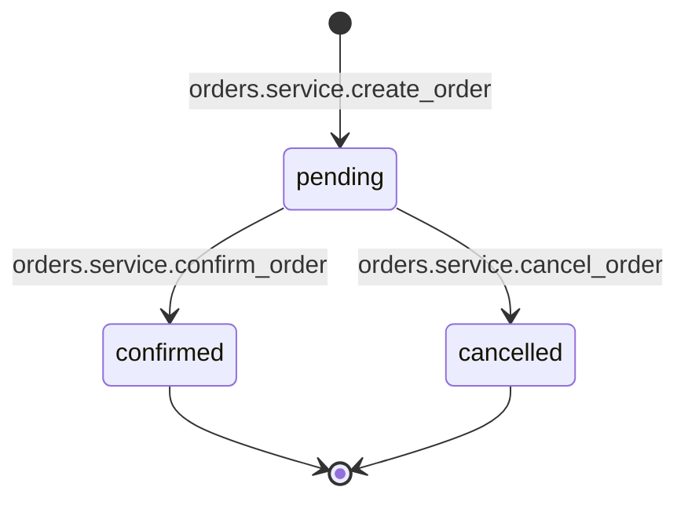
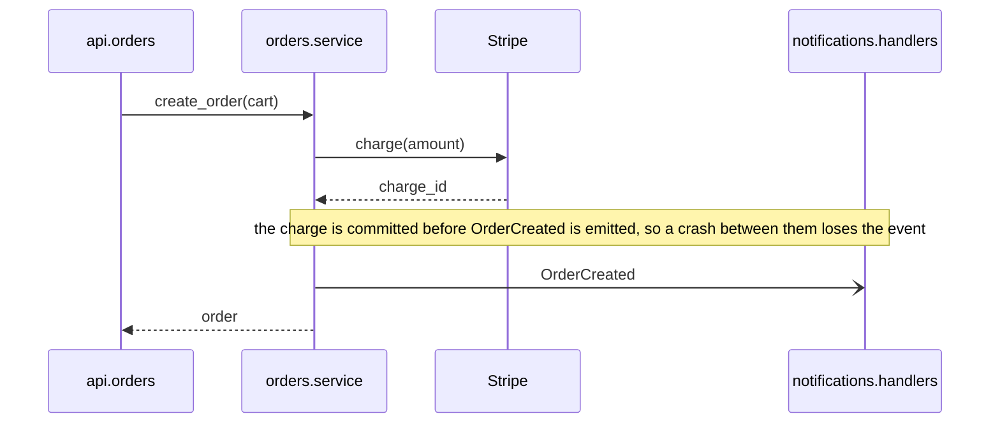
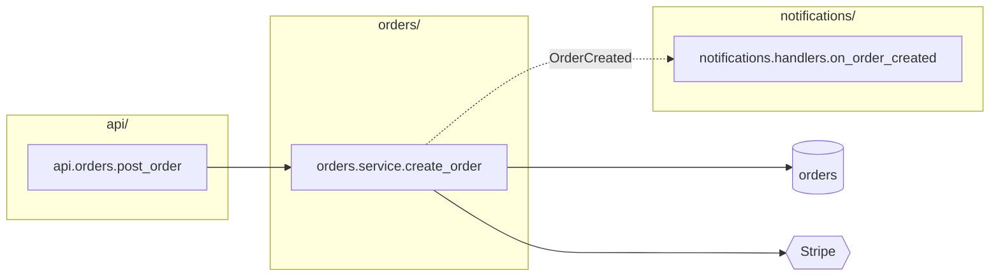
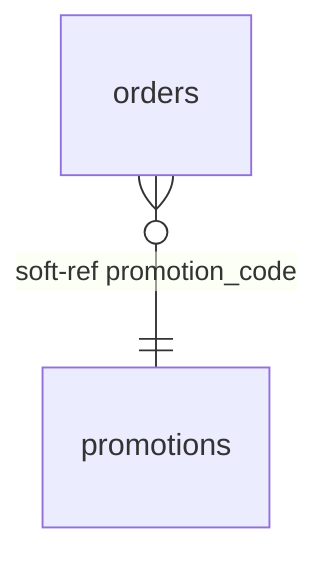

# Placement Guide

## What this document is

You receive the current repository and artifacts describing an area of code, written according to the Code Diagram Guide: an edge table, dependency flowcharts, sequence diagrams, state diagrams, entity-relationship diagrams, class diagrams, packet diagrams, a glossary table, and file notes.

Decide which verified facts and coherent explanations to preserve, where each goes, and which existing material consequently needs updating or removing. A code change or diff is useful additional context when supplied, but is not required. Then make the qualifying changes.

Use judgment to identify ownership, facts already visible in code, contradicted statements, and the line an inline comment belongs to. The inclusion rules determine what qualifies and where it belongs; omit proposed additions that do not clearly meet them.

The rules under "What qualifies," "What is never written," and "Constraints," the map block format, and each key's template and destination file are absolute. Paired keys follow the explicit shared-explanation exception below; it overrides their default pairing requirements. Each key's "write it when" and "do not write it when" conditions define what qualifies; use judgment to apply them to the code. Everything else describes the normal case. Where a normal-case rule does not fit cleanly, use the closest approach that keeps the written material accurate and traceable to the code.

## What qualifies

Add a fact or coherent explanation only when all three conditions hold. Existing material follows the reconciliation rules; uncertainty about a proposed addition is not permission to erase an existing fact.

1. **It is supported.** Check it against the current code. A reason, intention, or requirement also needs an explicit source, such as an existing comment or documented contract; behavior alone does not establish intent.
2. **It serves a specific reading task.** It exposes a hidden connection, brings scattered behavior together, explains a constraint or hazard, or supplies one of the navigation indexes explicitly allowed below. Identify what the reader can find or what mistake they can avoid when deciding whether to include it; do not add a separate usefulness explanation to the entry. General usefulness is not enough.
3. **It can be read correctly on its own.** Identify what the fact applies to, preserve conditions that affect its meaning, and avoid claims of completeness, exclusivity, or intent that the evidence does not establish. An unfamiliar reader should not need to know how the artifacts were produced.

Then apply the relevant diagram or key inclusion rules. If support or value remains uncertain, omit the proposed addition. Do not turn a search result into a claim about the whole system: a caller behind a flag does not establish that all callers require it, and a missing transition does not establish a prohibition.

Put information near the code it describes, in a fixed searchable form. Keep hidden connections discoverable from both ends and each full explanation in one place with specific source pointers. A fact that merely repeats nearby code is omitted, except for the explicitly allowed responsibility, writer, and external-system indexes and connecting facts needed to interpret a qualifying explanation. Those indexes help readers choose a file or find documented endpoints across files. The ability to derive a fact with tools is not by itself a reason to omit it.

Use the Code Diagram Guide's identifier format and writing rules. Preserve names exactly. Reshape artifact wording only as needed to meet an output template or narrow a claim to its verified meaning; do not invent missing facts. The diagram-copying rules below specify the allowed changes to diagrams.

## Choose what to preserve

Apply these decisions in order before routing material to a key or diagram home.

1. **Name the subject.** Identify the scenario and its conditions, state field, dependency relationship, extension mechanism, or binary format. Look for an existing explanation of that subject. Shared participants or similar titles do not make two scenarios the same.
2. **Verify the useful answer.** Apply all three inclusion conditions. For hidden connections, inspect the actual registration, binding, subscription, handoff, or reference check as well as the endpoints. A diagram's existence, size, or directory crossing does not establish value. Keep this selection test internal; it is not additional repository prose.
3. **Keep together, extract, or omit.** Keep a coherent diagram when separating its facts would lose ordering, conditions, failure consequences, a cycle, selection behavior, or necessary context. Extract a fact only when it retains its subject, conditions, and meaning independently. Omit material that passes neither test.
4. **Keep necessary context.** An ordinary edge may close a useful cycle. Preserve connecting edges, guards, notes, and wiring locations needed for the answer. Remove unrelated or unsupported material only at a boundary where the surviving explanation remains independently correct; follow the copying rules.
5. **Reuse a suitable home.** Reconcile an existing explanation before creating another. Otherwise choose one of the homes below and add specific source routes. Distinct views of the same code may remain when they answer different questions; avoid a second copy of the same explanation.
6. **Reconcile direct effects.** Check the affected explanation and its direct pointers and index entries. Preserve supported existing content omitted by the incoming artifacts. Write only the reconciled difference; do not move or rephrase accurate material merely for uniformity.

## The five homes

Use only these homes. Keep one full copy of each explanation; targeted local facts and pointers may accompany it.

**1. The map block** at the top of a source file. A delimited comment block with fixed keys for selected file-wide facts and navigation: responsibility, hidden connections, tables written, external systems called, and pointers to named explanations. It helps readers find relevant code and context; it does not need to describe every operation.

**2. A comment directly above the code it describes.** An inline comment is a plain sentence or two explaining a specific constraint, reason, hazard, matching value, or hidden wiring location. A compact state or packet diagram can sit beside its definition or operation under the placement rules below. Larger explanations have one owner-local Markdown home with source pointers.

**3. Owner-local documentation.** Prefer an existing suitable explanation. For a new explanation spanning code locations, use the responsible area's README. Use a nearby subject-specific Markdown file when the full explanation would crowd the README's other subjects or an existing subject-document convention fits. The README links to that document. Keep enough prose to identify the scenario, conditions, source locations, and semantics needed to read the explanation.

**4. The root agent file**: the repository's existing root instructions file for AI readers (`AGENTS.md`, `CLAUDE.md`, or similar). If several exist, use the one agents are configured to load where stated, otherwise `AGENTS.md`; if none exists, create `AGENTS.md`. Add fixed index sections with one line per top-level directory, one per named flow, and one pointing to the glossary, plus the appendix's map block legend. Never add diagrams or tables, or prose beyond a line outside the legend. AI readers load this file at each session's start, so its length costs every task.

**5. The root glossary**: `GLOSSARY.md` at the repository root, with the same columns as the artifact glossary table. Qualifying glossary rows from the artifacts are merged here and nowhere else.

This table summarizes allowed homes; some relationships need entries in multiple files. The following sections give conditions and exact forms.

| Fact | Home | Form |
|---|---|---|
| what a file is responsible for | map block | `owns:` |
| a caller whose execution context or hidden connection matters | map block of the callee | `called from:` |
| an event, hook, feature flag, container binding, callback, or other hidden mechanism | map block at both ends, or shared explanation with qualifying source pointers | `event out:`/`event in:`, `hook out:`/`hook in:`, `flag out:`/`flag in:`, `di out:`/`di in:`, `callback out:`/`callback in:`, `other out:`/`other in:` |
| tables a file writes, and tables in another database or service it reads or writes | map block | `writes:`, `reads remote:`, `writes remote:` |
| an external system a file calls | map block | `calls:` |
| a column that refers to another table with no foreign key | map block at both ends, or shared explanation with qualifying source pointers | `soft-ref out:`, `soft-ref in:` |
| the lifecycle of a stored state field | beside its definition or in owner-local documentation, with owner and writer pointers | state diagram; `transitions:` |
| a handwritten binary layout assembled across operations | beside its definition or codec operation, or in owner-local documentation, with definition-owner and codec pointers | packet diagram; `format:` |
| a danger that belongs to a file as a whole | map block | `hazard:` |
| a fact about one line: why it is the way it is, a hazard at that point, a value that must match another, an assignment that bypasses a state machine | inline comment directly above the line | a plain sentence |
| a coherent scenario assembling scattered behavior | owner-local documentation, plus the map block of every eligible participating file | `## Flows` sequence diagram or subject-document link; `entry point of:`, `participates in:` |
| a qualifying topology, extension surface, or coupled hidden relationship | owner-local documentation, plus relevant source pointers | `## Explanations` diagram or subject-document link; `explained in:` |
| what a directory owns | directory README | `## Owns` |
| a dependency-direction rule that no tool enforces | directory README | `## Dependency direction` |
| the data model, only when the repository has no schema source of truth | directory README | `## Data model` |
| the index of described directories and named flows | root agent file | `## Map`, `## Flows`, `## Glossary` |
| the meaning of the map block keys | root agent file | `## Map blocks` legend |
| a domain term, its canonical identifier, and its aliases | `GLOSSARY.md` | one row |

Each diagram kind must meet its specific inclusion rules below. Supporting visible relationships may remain when needed to interpret a qualifying whole; this does not authorize structural inventories. Anything fitting no allowed home is omitted.

## The map block

### Format

Each map entry uses the language's line-comment marker, a fixed key, a colon, and the fact. The opening and closing lines contain exactly `map` and `end map` after the marker, so tooling can replace the whole block. In Python:

```text
# map
# owns: creation and cancellation of orders
# participates in: order placement (api/README.md#order-placement)
# called from: jobs.expire_orders.run (jobs/expire_orders.py); scheduled expiry runs without an HTTP request
# event out: OrderCreated -> analytics.consumers.on_order_created (analytics/consumers.py), notifications.handlers.on_order_created (notifications/handlers.py)
# writes: orders
# calls: Stripe (charge, refund)
# end map
```

In a language with `//` comments, every line starts with `//`. In a language with only block comments, the block is one block comment whose lines follow the same shape. Never use a docstring or a string literal for the map block, even where that is the convention for module documentation; comments are uniform across languages and never affect runtime.

The block goes after any shebang, encoding, license, magic comment, or compiler directive line, and before the first import or the first statement. Lines like Ruby's `# frozen_string_literal: true`, Go's build constraints, or `// @flow` must stay where the language expects them; placing the block above them can silently change behavior. If the file has an existing module docstring, the map block goes before it. If the file already has a map block, replace the whole block; never append a second one. Leave one blank line between `end map` and whatever follows, because several languages attach a leading comment to the next declaration, Go doc comments, JSDoc, and Javadoc among them. In Go the block goes after the package clause and before the imports. In PHP it goes after the opening tag and any `declare` line.

### Shared explanations and paired entries

Use ordinary paired entries for a compact hidden connection. A precise explanation pointer may replace expanded paired entries when a retained coherent view already explains a larger routing or conditional network and repeating that network would obscure the local map. All four conditions must hold:

1. The same explanation contains the exact selected relationship, endpoint identifiers and files, material conditions, and any third location establishing the wiring.
2. Both eligible source endpoints have specific pointers to it. Flow, state, or format pointers count only if their destination includes this relationship and its qualifications.
3. Any locally necessary condition or hazard remains visible beside the code or in a qualifying map fact. Never turn a conditional local claim into an unconditional one qualified only at the destination.
4. The explanation points back to the relevant source code. A generic README link is insufficient.

This exception overrides the hidden-connection keys' default **Pairs with** requirements and the artifact rules' paired forms. It changes representation, not evidence or reachability. Excluded and external endpoints remain unedited and are named from the eligible end or explanation. Keep useful existing compact entries; do not convert them merely for consistency. Never select an arbitrary subset of endpoints to shorten a map.

For compact entries, preserve a distinct registration or handoff location when it is necessary to find the connection: a qualifying comment at the registering operation can name both ends, or a linked explanation can record the wiring. Do not silently discard that location after verification.

### Key reference

Each key has the same reference parts: **Means**, the fact readers should understand; **Template**, the exact value shape, with angle-bracket placeholders and everything else literal; **Example**, one real line; **Write it when** and **Do not write it when**, the eligibility conditions (if neither matches, omit the key); **On**, the destination file; and **Pairs with**, the other-end key for a two-ended fact. The appendix provides a self-contained reader legend. Entries must clearly name their subjects and material conditions. Write keys in reference order, only for artifact facts supplied for this file or existing facts retained under reconciliation. Omit keys with nothing to say: never empty, never with `none` as the whole value, and never for resemblance to other blocks or apparent completeness. Omission carries no meaning beyond nothing being recorded.

Conventions that apply to every value:

- `<identifier>` is a name in the Code Diagram Guide's identifier format: `orders.service.create_order`, `orders.models.Order`, a bare table name, a bare product name.
- A repository path in parentheses after an identifier, `(<file>)`, names its defining file for direct navigation. For fixed map values, the other uses of parentheses are: operations after a system in `calls:`; the system after a table in `reads remote:`, `writes remote:`, and `soft-ref out:`; the field list in `transitions:`; the `(no FK; ...)` note in `soft-ref out:`; the Markdown path and heading anchor after a name in `entry point of:`, `participates in:`, and `explained in:`; and the source file after `<table>.<column>` in `soft-ref in:`.
- `->` reads "to" and `<-` reads "from." The arrow points the way control or data moves. An `out` key describes something leaving this file; an `in` key describes something arriving in it.
- Several items of the same kind in one value are separated by commas. Several independent statements in one value are separated by semicolons.
- A defining file in parentheses is always a source file a person edits. Explanation destinations instead name Markdown files and exact heading anchors. When the name also exists in a file generated from that source, the generated file is never cited.
- For a relationship key whose template leaves the local function or object implicit, append `; in <local identifier>` when more than one local subject is possible. Append `; when <condition>` when a condition limits the relationship and the template does not already express it. For example: `event out: OrderCreated -> notifications.handlers.on_order_created (notifications/handlers.py); in orders.service.create_order; when payment is committed`. Each qualifier applies to every endpoint on that line: group endpoints only when they share the same local subject and condition. Otherwise repeat the key on separate lines, even for the same event or hook. Paired entries must preserve the same condition, with local subjects named from their respective ends. These qualifiers extend the templates below; they are not new keys.
- A fact's identity is its key, endpoints (including the local subject), and any condition that changes the relationship, not its wording. Keep existing wording for the same fact when it remains accurate and unambiguous. A format change needed to name the subject or condition is an update, not a second fact.
- An end that lies outside this repository is written as `<system name> (outside repository)`. It has no file and no partner line, and the file check in the procedure does not apply to it.
- Items within a value are sorted alphabetically by identifier, so that the same facts always produce the same line.
- A key that says "one line per X" is repeated for each X, with further lines when local subjects or conditions differ. Sort by X, then local identifier, condition, and endpoint identifiers. Split flag branches follow the ordering in `flag out:` below. A file that owns several state fields has one `transitions:` line per field, in field-name order.

**`map` and `end map`**
Delimiters, not keys: comment lines containing exactly `map` and `end map` after the marker open and close the block. Add no colon or other text. Tooling finds the block by these lines; everything between them follows this reference.

**`owns:`**
Means: what this file is responsible for.
Template: `owns: <noun phrase describing the responsibility>`
Example: `owns: creation and cancellation of orders`
Write it when: the file notes supply its purpose, as they do for every described file. This is the block's first line and the source for directory navigation. If a module docstring states the same purpose, reuse its wording and leave the docstring alone. Resolve disagreements against the code before adding `owns:`; an unresolved discrepancy prevents adding or replacing the purpose statement.
Do not add it when: the artifacts give no purpose statement for the file, as when an undescribed endpoint receives an `event in:` or `soft-ref in:` entry. An unresolved conflict also prevents adding or replacing `owns:`. Existing `owns:` entries follow reconciliation; if none survives, write the block without it. A file the artifacts say nothing about gets no new block.
On: the file itself. Pairs with: nothing.

**`entry point of:`**
Means: this file is the first eligible in-repository sender in a kept sequence. The named Markdown section explains its scenario, including any preceding queue, external system, or excluded code. Entry identity does not determine the diagram's home.
Template: `entry point of: <flow name> (<Markdown path>#<heading anchor>), <flow name> (<Markdown path>#<heading anchor>)`
Example: `entry point of: order placement (api/README.md#order-placement)`
Write it when: a sequence diagram was retained in owner-local documentation and this file defines the first participant in this repository to send a message, where a message is a call or an asynchronous send, not a return.
Do not write it when: the flow was not kept. If the first sender is a queue, external system, or code outside the repository, use the first in-repository participant that sends a message. If its file cannot get a map block, such as a generated router, use the next eligible in-repository participant. The diagram says where the flow truly begins.
On: the entry file. Pairs with: `participates in:` on every other participating file.

**`participates in:`**
Means: this file participates in a kept sequence whose entry is elsewhere; the diagram is in the named Markdown section.
Template: `participates in: <flow name> (<Markdown path>#<heading anchor>), <flow name> (<Markdown path>#<heading anchor>)`
Example: `participates in: order cancellation (orders/README.md#order-cancellation), order placement (api/README.md#order-placement)`
Write it when: a kept sequence diagram has a participant defined in this file that is not the entry point.
Do not write it when: the participant is a queue, an external system, code outside the repository, or a file on the never-diagram list.
On: each participating file. Pairs with: `entry point of:`.

**`explained in:`**
Means: the named explanation covers a subject in this file; the pointer itself asserts no runtime connection.
Template: `explained in: <explanation name> (<Markdown path>#<heading anchor>); in <local identifier>`. Omit `; in` only when the local subject is unambiguous. One line per explanation and local subject; sort by name, local identifier, then path.
Example: `explained in: OrderCreated routing (orders/README.md#ordercreated-routing); in orders.service.create_order`
Write it when: a qualifying topology, extension, or other coherent explanation helps readers of this local subject. Verify that the destination's named heading exists and the explanation covers the subject. Keep a qualifying local condition or hazard if the pointer and nearby code alone would conceal it.
Do not write it when: a flow, `transitions:`, or `format:` pointer already leads to the same explanation for the same purpose; or the destination merely lists unrelated documentation.
On: relevant source files, including both eligible endpoints when using the shared-explanation exception. Pairs with: nothing automatically; the exception supplies endpoint requirements.

**`called from:`**
Means: the named caller reaches code here from an execution context or connection that matters when changing it.
Template: `called from: <identifier> (<file>), <identifier> (<file>); <why this caller matters>`
Example: `called from: jobs.expire_orders.run (jobs/expire_orders.py); scheduled expiry runs without an HTTP request`
Write it when: a verified caller uses a different execution context, such as a scheduled job calling request-path code or a migration calling service code, and the difference matters to behavior such as authentication, retries, or transaction handling; or a hidden mechanism makes the caller difficult to discover. The clause states that concrete context or mechanism. A different top-level package or a note calling the caller surprising is not enough on its own.
Do not write it when: it only lists ordinary callers; the reason is merely that a caller is in another package; or another map entry already exposes the same caller and relevant context.
On: the callee's file. Pairs with: nothing; the caller's side is visible in the caller's own code.

**`event out:`**
Means: this file emits the named event, and these are verified consumers documented here; the list need not include every consumer.
Template: `event out: <EventName> -> <consumer identifier> (<file>), <consumer identifier> (<file>)`. One line per event name and shared local subject and condition. A consumer outside this repository is written as `<service name> (outside repository)` and gets no `event in:` line anywhere.
Example: `event out: OrderCreated -> analytics.consumers.on_order_created (analytics/consumers.py), notifications.handlers.on_order_created (notifications/handlers.py)`
Write it when: the edge table has a row of kind `event` whose Source is in this file. A row whose Target is `no consumer found` is a search result, not a verified connection: do not turn it into an `event out:` entry. A concrete behavior such as an event deliberately discarded qualifies only under the separate absence rules.
Do not write it when: the "event" is a direct function call, which is visible in the code; when it is a component-local UI event; when a consumer is only suspected.
On: the emitter's file. Pairs with: `event in:` on each consumer's file.

**`event in:`**
Means: a function in this file runs when the named event is emitted from the named place.
Template: `event in: <EventName> <- <emitter identifier> (<file>), <emitter identifier> (<file>)`. One line per event name and shared local subject and condition.
Example: `event in: ChargeSucceeded <- payments.gateway.charge (payments/gateway.py)`
Write it when: the edge table has a row of kind `event` whose Target is in this file.
Do not write it when: the subscription is to an in-process observable or store local to one module.
On: the consumer's file. Pairs with: `event out:`.

**`hook out:`**
Means: an operation on an object defined in this file, such as saving or deleting it, causes a handler somewhere else to run.
Template: `hook out: <hook name> -> <handler identifier> (<file>), <handler identifier> (<file>)`. One line per hook name and shared local subject and condition.
Example: `hook out: post_save -> audit.signals.on_order_saved (audit/signals.py)`
Write it when: the edge table has a row of kind `hook` whose Source is an object defined in this file. The object's own file exposes the relationship to readers of the model. Check the registration and triggering operation; do not assume that bulk operations or every code path invokes the hook. Use the condition qualifier for a material restriction.
Do not write it when: the handler is defined in this same file, where it is visible; when the hook is framework-internal with no project handler attached.
On: the file defining the hooked object, usually the model. Pairs with: `hook in:`.

**`hook in:`**
Means: a function in this file runs as a hook on an object defined elsewhere.
Template: `hook in: <hook name> <- <object identifier> (<file>)`
Example: `hook in: post_save <- orders.models.Order (orders/models.py)`
Write it when: the edge table has a row of kind `hook` whose Target is a handler in this file.
Do not write it when: the hooked object is defined in this same file.
On: the handler's file. Pairs with: `hook out:`.

**`flag out:`**
Means: this file checks a feature flag, and the flag decides which code runs.
Template: `flag out: <FLAG_KEY> -> on: <identifier> (<file>); off: <identifier> (<file>)`. When the flag only gates one path and nothing runs in its place, write `off: skipped`. A trailing `; when <condition>` applies to both branches. If the branches have different conditions, use separate lines: `flag out: <FLAG_KEY> on -> <identifier> (<file>); when <condition>` and `flag out: <FLAG_KEY> off -> <identifier> (<file>); when <condition>`. Omit `; when` on an unrestricted branch; use `-> skipped` for a branch that does nothing. For a given flag check, use either the joined form or the split form, never both, and document both states. Put `; in <checking identifier>` before `; when` if the local checker needs naming. Sort split lines by flag, checker, on before off, condition, and target.
Example: `flag out: PRICING_V2 -> on: pricing.v2.calculate (pricing/v2.py); off: pricing.v1.calculate (pricing/v1.py)`
Write it when: the edge table has rows of kind `flag` whose Source is in this file. The artifact records two rows per flag, Name `<FLAG> on` and `<FLAG> off`; they become the two branches in the joined or split form. Verify any additional branch condition in the code and preserve it on the paired `flag in:` entry.
Do not write it when: the value checked is a build-time constant or a configuration setting that does not change at runtime; that is configuration, and it is visible.
On: the checking file. Pairs with: `flag in:` on the file holding each gated path, when that is a different file.

For example, if the on branch calls V2 only for paid accounts while the off branch calls V1 for every account, write these lines on the checker, with the matching condition on the V2 file:

```text
# flag out: PRICING_V2 on -> pricing.v2.calculate (pricing/v2.py); when account is paid
# flag out: PRICING_V2 off -> pricing.v1.calculate (pricing/v1.py)
```

```text
# flag in: PRICING_V2 on <- orders.service.get_price (orders/service.py); when account is paid
```

**`flag in:`**
Means: the named caller reaches code in this file when its flag check has the named state, on or off. This says nothing about other callers or executions.
Template: `flag in: <FLAG_KEY> on <- <checking identifier> (<file>)` or `flag in: <FLAG_KEY> off <- <checking identifier> (<file>)`. One line per flag, state, local subject, and condition.
Example: `flag in: PRICING_V2 off <- orders.service.get_price (orders/service.py)`
Write it when: the edge table has a row of kind `flag` whose Target path is in this file and whose checker is in a different file; the row's Name, `<FLAG> on` or `<FLAG> off`, supplies the state.
Do not write it when: the check and the gated path are in the same file.
On: the file holding the gated path. Pairs with: `flag out:`.

**`di out:`**
Means: this file asks a container or locator for an abstraction, and this is where the binding that chooses the implementation lives.
Template: `di out: <abstraction identifier> via <file where the binding is configured>`
Example: `di out: payments.protocols.PaymentProvider via app/wiring.py`
Write it when: the edge table has a row of kind `di` whose Source is in this file; the row's Defined in names the binding file after `bound in`, which becomes the `via` clause, or `via unknown` when the artifacts could not find it.
Do not write it when: the dependency is passed in by a visible caller as an argument; that is an ordinary call.
On: the resolving file. Pairs with: `di in:`.

**`di in:`**
Means: a class in this file is what a container hands out for the named abstraction.
Template: `di in: <abstraction identifier> <- <resolving identifier> (<file>), <resolving identifier> (<file>)`
Example: `di in: payments.protocols.PaymentProvider <- orders.service.create_order (orders/service.py)`
Write it when: the edge table has a row of kind `di` whose Target implementation is in this file.
Do not write it when: construction is only a direct call, with no verified container binding. Other direct construction does not invalidate a container relationship.
On: the implementation's file. Pairs with: `di out:`.

**`callback out:`**
Means: a function defined in this file is handed to another module, which will call it later.
Template: `callback out: <function identifier> -> <receiving identifier> (<file>)`
Example: `callback out: orders.service.on_payment_done -> payments.gateway.charge (payments/gateway.py)`
Write it when: the edge table has a row of kind `callback` whose handed-over function is defined in this file.
Do not write it when: the function is called directly by name from the other module; when the callback never leaves this file.
On: the callback definition file, even when a third file performs the handoff. Preserve that handoff location under the wiring-location rule. Pairs with: `callback in:`.

**`callback in:`**
Means: a function received by code in this file is, in practice, the named function from elsewhere.
Template: `callback in: <parameter or registration point> of <receiving identifier> <- <function identifier> (<file>)`
Example: `callback in: on_complete of payments.gateway.charge <- orders.service.on_payment_done (orders/service.py)`
Write it when: the edge table has a row of kind `callback` whose receiver is in this file.
Do not write it when: the receiver is generic library code outside the repository.
On: the receiving file. Pairs with: `callback out:`.

**`other out:`** and **`other in:`**
Means: a hidden dependency through a mechanism none of the keys above covers: a file on disk, a cache key, an environment variable read at runtime, a database trigger, a shared in-memory registry.
Template: `other out: <mechanism> <name> -> <identifier> (<file>)` and `other in: <mechanism> <name> <- <identifier> (<file>)`, where `<mechanism>` is the one word the edge-table row carries, from the Code Diagram Guide's list, and `<name>` is the name the code uses
Example: `other out: file settings.ORDERS_SPOOL_DIR -> jobs.import.run (jobs/import.py)` and, on the other file, `other in: file settings.ORDERS_SPOOL_DIR <- orders.export.write_spool (orders/export.py)`
Write it when: the edge table has a row of kind `other`. Name the mechanism first, so a reader knows what to look for.
Do not write it when: any specific key above fits; prefer the specific key.
On: both ends. Pairs with: each other.

**`writes:`**
Means: executing code in this file can change rows in these tables.
Template: `writes: <table>, <table>`
Example: `writes: order_lines, orders`
Write it when: the edge table has a row of kind `table` whose Source is in this file with a write operation: insert, update, delete, save, create, or a bulk equivalent.
Do not write it when: the file only reads the table; the file only defines the model and contains no write logic; the write is in a migration.
On: each writing file. Pairs with: nothing. This is a deliberate navigation index, even for a locally visible write: searching the key and table name finds documented writers, not necessarily all writers. The line describes the union of writes in this file, not every function in it.

**`reads remote:`**
Means: this file reads a table or store that belongs to another database, schema, or service.
Template: `reads remote: <table> (<system or database>)`
Example: `reads remote: customers (billing database)`
Write it when: the edge table has a row of kind `table` with Name `read` whose Target is written as `<table> (<system>)`, which is how the artifacts mark a table outside this repository's own schema.
Do not write it when: the table is in this repository's schema; do not create local-read map indexes. A read needed to interpret a qualifying coherent explanation may remain in that view.
On: the reading file. Pairs with: nothing.

**`writes remote:`**
Means: executing code in this file can change rows in a table that belongs to another database, schema, or service.
Template: `writes remote: <table> (<system or database>)`
Example: `writes remote: customers (billing database)`
Write it when: the edge table has a row of kind `table` with Name `write` whose Target is written as `<table> (<system>)`.
Do not write it when: the table is in this repository's schema; that is `writes:`.
On: the writing file. Pairs with: nothing.

**`calls:`**
Means: this file makes network calls to a system run by someone else.
Template: `calls: <System> (<operation>, <operation>); <System> (<operation>)`
Example: `calls: SendGrid (send); Stripe (charge, refund)`
Write it when: the edge table has a row of kind `external` whose Source is in this file.
Do not write it when: the call is to a service inside this repository, which is a flow participant covered by `participates in:`; when the "system" is a library rather than a network service.
On: the calling file. Pairs with: nothing; the external system has no file here. This is a deliberate index of documented network dependencies and their operations, even when the calls are locally visible. Searching it does not prove that other callers are absent.

**`soft-ref out:`**
Means: the named column refers to another table without a foreign key constraint. A named validator establishes one check, not the only check or a guarantee that all writes use it.
Template: `soft-ref out: <source table>.<column> -> <target table> (no FK; validated in <identifier> (<file>))`. When validation has not been established, use `soft-ref out: <source table>.<column> -> <target table> (no FK)`; absence of a validator in this line makes no claim about validation.
Example: `soft-ref out: orders.promotion_code -> promotions (no FK; validated in orders.service.validate_promotion (orders/service.py))`
Write it when: a verified `soft-ref` relationship has its referencing column in a model defined in this file. A `validated in` artifact clause supplies the check after it is confirmed. If the artifact says `validation unknown` or `validation not found within <paths>`, keep the verified relationship without a validation clause. If inspected write paths accept the reference without validation, describe those particular paths in a qualifying inline comment or hazard; do not write an unqualified `not validated` claim. For a reference into another database or service, name the system after the target table: `soft-ref out: orders.customer_id -> customers (billing database) (no FK)`.
Do not write it when: the column has a foreign key constraint or an ORM declaration that creates one.
On: the file defining the referencing model. Pairs with: `soft-ref in:`, except for references into other systems, which have no second end here.

**`soft-ref in:`**
Means: the named source column points at the named local table without a foreign key constraint.
Template: `soft-ref in: <target table> <- <source table>.<column> (<source file>)`
Example: `soft-ref in: orders <- audit_events.target_id (audit/models.py)`
Write it when: a verified `soft-ref` relationship points at a table defined in this file.
Do not write it when: the reference is enforced.
On: the file defining the referenced table. Pairs with: `soft-ref out:`.

**`transitions:`**
Means: this file defines a stored state or contains code that changes it; the line points to the one kept diagram of its lifecycle.
Template: `transitions: <entity identifier>.<field>, diagram above <identifier of the definition>`. For a lifecycle encoded in several booleans or timestamps: `transitions: <entity identifier> (<field>, <field>), diagram above <identifier of the class>`. For a field whose values are bare string or number literals with no enum: `transitions: <entity identifier>.<field>, diagram above <identifier of the class>`. When the diagram had to be placed at the top of the file because no definition exists in a source file: `transitions: <entity identifier>.<field>, diagram below this block`.
Example on the owner: `transitions: orders.models.Order.status, diagram above orders.models.OrderStatus`. Example on a writer: `transitions: orders.models.Order.status, diagram in orders/models.py above orders.models.OrderStatus`. For a diagram below the owner's map block, a writer uses `transitions: <entity identifier>.<field>, diagram in <owner file> below map block`. The same external-location suffix applies to the multi-field form.
Write it when: a state diagram qualifies under the state-diagram rules and this is the owner file or a file defining a verified transition shown in it. The owner is the file where the state's values are defined: the enum, the union type, the choices list, or, when the state is a combination of booleans or timestamps or when its values are bare string or number literals with no enum, the class or type that declares the field. Only when the values are defined only in generated code or a migration and no source type declares the field is the owner the file that assigns the field in the most places. The diagram itself is placed as described under "State diagram" in the placement rules; this line only points at it.
Do not write it when: the diagram only redraws a nearby declared machine. A bypass warning alone does not justify that redraw; follow the state-diagram rules.
On: the owner file and other eligible files that perform a shown transition. For a Markdown home use `transitions: <entity identifier>.<field>, diagram in <Markdown path>#<heading anchor>` on every such file; the same suffix applies to the multi-field form. All pointers lead to the same diagram; do not copy it. The transition labels provide the links from the diagram back to the writers.

**`format:`**
Means: this file defines, encodes, or decodes the named layout; the line locates its one retained explanation. A definition-only file makes no encoding or decoding claim.
Template: `format: <name>, diagram above <local definition or operation identifier>`; for another source file, `format: <name>, diagram in <source file> above <identifier>`; for Markdown, `format: <name>, diagram in <Markdown path>#<heading anchor>`.
Example: `format: frame header, diagram in transport/README.md#frame-header`
Write it when: a packet diagram assembles a handwritten byte layout whose offsets or fields otherwise require following several encoding or decoding operations.
Do not write it when: it simply redraws an explicit schema; the schema supplies that explanation.
On: the eligible shared-definition owner, when one exists, and every eligible encoder or decoder file documented by the kept layout. All point to the same full copy. Pairs with: nothing; the packet rules require these owner and codec pointers.

**`hazard:`** (in the map block)
Means: something about this file's behavior that a reader must know before editing anything in it.
Template: `hazard: <one sentence describing the verified danger and its consequence>`
Example: `hazard: retries the Stripe charge with no attempt limit; a persistent failure loops until the job is killed`
Write it when: a sequence note or file note states a danger that belongs to the file as a whole rather than to one line: a retry with no enforcing line, an operation that is not idempotent, an ordering across functions that must be preserved.
Do not write it when: the danger belongs to one identifiable line, which gets an inline comment instead; when it is a general truth about all code, such as "network calls can fail."
On: the file. Pairs with: nothing.

No other map keys exist. Material fitting none may belong in a qualifying explanation or inline comment under the rules below; otherwise omit it.

## Comments above the code

Inline comments and compact state or packet diagrams may sit directly above code. Fixed-form diagrams follow their artifact placement rules.

Write an inline comment only to explain something important the code cannot: why a line exists or is unusual, what it works around, or what elsewhere depends on it. Place a plain sentence or two directly above the relevant code, with no fixed form or prefix. Never describe what the code visibly does.

You write an inline comment only where a rule in this document says a fact from the artifacts belongs on a specific line: a file note or sequence note that explains one line, a sequence note that names a hazard at one line, an assignment that bypasses a state machine library, a value that must match a value elsewhere, or a hidden registration or handoff whose endpoints are otherwise difficult to connect. A useful named explanation link may accompany that fact; do not add pointer comments to every function. Examples of the sentences you would write:

```text
# The vendor returns 200 with an empty body above 5 requests per second; the sleep is deliberate.
# The charge is committed before OrderCreated is published, so a crash between the two loses the event.
# Sets status directly instead of going through orders.machine.OrderMachine; the machine's guards do not run here.
# Must match BATCH_SIZE in jobs/import.py; the two are read by the same retry logic.
```

Use the language's line-comment marker on a separate line immediately above the target. Never use a trailing comment, which linters may reflow and languages may treat differently. Never place it inside a string, docstring, or multi-line expression; if the only safe position is above a multi-line statement, use the line above its first line. Reconcile any comment already directly above the target: keep it if it says the same thing, replace it if the change made it false, and never add a second comment there.

## Owner-local documentation

Reuse an existing accurate, discoverable explanation first. Do not move it just because another home might be marginally better. For a new home, use ownership established by the relevant definition, registry, or documented source responsibility. When sequence ownership is unclear, use the directory of the first eligible in-repository sender. Do not guess ownership or automatically move a cross-file explanation to the root.

Use the owner's README by default. A nearby subject-specific Markdown document is allowed when a full explanation would crowd the README's other subjects or fits an existing subject-document convention. Give it a descriptive title and named sections, and link it from the appropriate README section. Source pointers lead directly to the section containing the explanation. Verify every repository-relative path and heading anchor.

These README sections are allowed; add only sections with content and reconcile existing sections before replacement. Preserve unrelated content. Reuse an existing relevant subject heading instead of creating a second explanation under a preferred heading.

`## Owns`: one line per file in the directory with an `owns:` map entry, in the form `orders/service.py — creation and cancellation of orders`, copied from that entry. Then one line per subdirectory with its own README: `handlers/ — see orders/handlers/README.md`. A file without `owns:` is not listed. A directory with no ownership facts can still have a README when it owns a qualifying explanation.

`## Flows`: one `### <scenario name>` heading per retained sequence owned here, followed by its `mermaid` fenced diagram, or a descriptive link to its subject document. Keep the scenario and relevant notes. The entry and participating source files point to its actual section; do not repeat the full diagram in participants' directories.

`## Explanations`: named sections for qualifying topology, extension, coupled hidden relationships, or state/format explanations placed in Markdown. Each has the diagram and necessary supporting sentences, or a descriptive link to its subject document. This section creates no new root index.

`## Dependency direction`: only an explicitly documented directional rule no repository tool enforces, such as `orders/ may depend on pricing/, inventory/; nothing in those may depend on orders/`. Observed missing reverse imports do not establish a rule. A retained topology may explain a verified interaction with a rule without duplicating the rule's authoritative declaration.

`## Data model`: the qualifying no-schema relationship diagram described below.

New prose is limited to scenario, conditions, source references, special semantics, or a verified reason needed to understand the explanation. Do not narrate the implementation, record investigation history, or create a general archive. One full copy is per explanation, not per subsystem: a lifecycle and a sequence may answer different questions about the same code.

## The root agent file

Touch only four sections. Three are indexes: add absent sections and add, update, or remove list lines to match the current state, one item per line in the fixed form, sorted alphabetically. Remove square-bracketed template placeholder list lines. Preserve descriptive text between each index heading and its first list item exactly. The fourth section is the legend.

`## Map`: one line per top-level directory that contains a map block or a README, in the form `orders/ — creation, cancellation, and lifecycle of orders`, derived from that directory's README `## Owns` section. This is the one place you compose a sentence rather than copy one: one sentence, naming responsibilities and nothing else. A bare wrapper directory that holds all of the code, `src/` for example, is skipped and its children are listed as top-level, the same way the identifier format drops `src`. Directories with nothing written in them are not listed. A directory whose blocks all lack an `owns:` line is listed with the fixed phrase `promotions/ — referenced by other directories; not yet described`, so that a reader can reach it.

`## Flows`: one line per retained named flow, in the form `order placement — entry api.orders — api/README.md#order-placement`, where the entry is the first participant to send a message, as declared in the diagram, whether or not it is in this repository, so that a flow which begins in a queue or an external system says so in the index. The destination is the Markdown section containing the sequence, including when a README links to a subject document.

`## Glossary`: the single line `See GLOSSARY.md.`

`## Map blocks`: the reader legend for map keys. Add it verbatim from the appendix if absent; replace the whole section if it differs; leave it untouched if it matches.

If the file has other sections, commands, conventions, anything hand-written, they are not yours. Do not edit, reorder, or reformat them.

## The glossary

`GLOSSARY.md` holds one table with the artifact glossary's columns: Term, Canonical identifier, Meaning, Defined in, Known aliases, Notes. Add a row only when it resolves an ambiguous domain term, records aliases used for the same concept, or explains a domain-specific meaning not apparent from the identifier. A routine noun with an obvious meaning does not qualify. Rows are sorted by Term. Merging rules:

- A term not yet present is added as its artifact row.
- A term present with the same canonical identifier and a meaning that agrees keeps its existing row; any aliases the artifact found that the row lacks are appended to Known aliases.
- A term with a different canonical identifier or conflicting meaning requires checking the code at both `Defined in` locations. Replace an outdated row if the code confirms the artifact. If both entries describe real uses of the term, keep separate rows distinguished by canonical identifier and put `conflict: same term, two meanings` in both Notes columns; resolving the code's vocabulary is outside this task.
- A row is never deleted by you, including when its term has disappeared from the code.

## Placement rules by artifact type

For each artifact type, the rules below specify placement and omission. "Both ends" means discoverability from each connected file: use paired entries by default, or the four-condition shared-explanation exception. If one end is on the Code Diagram Guide's never-diagram list or outside the repository, write only at the other end, naming the excluded end.

### Copying a kept diagram

Incoming artifacts retain their Code Diagram Guide scope lines. Persisted diagrams contain selected, verified information rather than a record of the inspection. Apply these metadata transformations, then the bounded extraction and reconciliation rules, before writing a kept diagram:

- Remove `%% suspected:` lines.
- Replace `%% complete within: <paths>` with `%% selected view; omissions do not establish absence`.
- Replace `%% partial within: <paths>; left out: <items>` with `%% selected view; omits: <items>; omissions do not establish absence`.
- Remove comments that only describe searches or files read. If removing one would leave a transition, terminal marker, or other claim misleading, omit the affected view unless an independently correct portion can be retained under the rules below. Preserve comments describing verified behavior, conditions, and explicit prohibitions, including the source of a documented reason.

Retain the diagram type, identity, labels, edges, guards, notes, and order needed for the selected explanation. Bounded extraction may remove unrelated material or an unsupported portion only when the survivor remains independently correct, with its necessary conditions and scope. An unsupported detached rationale may be removed from an otherwise verified diagram; an unsupported message cannot simply be spliced out to imply a new execution order. Do not drop a layout field and shift later offsets. Keep a subformat only when its independent origin and layout are established. A selected-view warning cannot repair false adjacency, missing failure consequences, or implied finality. If no safe view remains, omit it; independently supported facts may still qualify elsewhere.

Preserve actual registration, binding, or selection locations needed to interpret connections, including third files distinct from the endpoints. Supporting prose or diagram comments may carry exact identifiers and paths when the diagram syntax cannot.

Before replacing an existing diagram, reconcile all its behavioral facts, not just absence comments. Compare with the transformed, reconciled result rather than the raw artifact. These rules also apply to source-comment diagrams. Any other use of “copy” below means this qualified transformation, not a license to invent missing facts.

### Dependency flowchart and edge table

Keep a focused flowchart when its combined relationships explain a verified cycle, a boundary interaction, or hidden routing/registration topology that isolated entries would obscure. Ordinary calls and imports may remain as necessary connecting edges. Omit a general call/import inventory. Put the retained view in owner-local documentation with `explained in:` pointers from relevant source subjects; hidden connections also meet the shared-explanation requirements. A boundary requirement needs an explicit source.

Place independent edge-table facts by kind. The shared-explanation exception may replace expanded hidden-connection pairs:

- `event`: `event out:` on the emitter's file, listing the verified consumers being documented; `event in:` on each consumer's file, naming the emitter. Use the paired form by default.
- `hook`: `hook out:` on the file whose object triggers the hook; `hook in:` on the handler's file. Use the paired form by default.
- `flag`: `flag out:` on the file that checks the flag, naming the `on:` path and the `off:` path; `flag in:` on each file holding a gated path, carrying `on` or `off`, when that is a different file from the checker. If both paths are in the checking file, `flag out:` alone.
- `di`: `di out:` on the file that resolves the abstraction; `di in:` on the implementation's file. Use the paired form by default.
- `callback` and `other`: both ends, same shape.
- `table`: `writes:` on every file that writes the table, or `writes remote:` when the written table is in another database, schema, or service. Local reads get no map index; remote reads use `reads remote:` on the reading file. A local read needed by a qualifying full explanation may remain there. The table's own model file gets nothing from this kind; what it gets comes from soft references.
- `external`: `calls:` on the calling file, with the operations. The external system has no file of its own, so there is no second end.
- `soft-ref`: covered under the entity-relationship diagram.

Do not inventory direct calls and imports as edges; they are visible at the call site. Necessary connecting edges in a qualifying full explanation are allowed. Other exceptions are callers meeting the `called from:` conditions, written as `called from:` on the callee's file, and directory-level dependency-direction rules written in the README's `## Dependency direction` section under its conditions.

### Sequence diagram

Keep a sequence when it assembles ordering, handoffs, conditions, side effects, acknowledgment, or failure consequences scattered across functions or files. A single directory or process is not disqualifying; an obvious call chain remains insufficient. Establish any claimed execution boundary from code; an asynchronous arrow alone does not prove a process or service boundary. Preserve a coherent scenario under the copying rules in owner-local documentation's `## Flows` or its linked subject document.

The entry file defines the first eligible in-repository participant to send a call or asynchronous message, not a return. It gets `entry point of:`; every other eligible participating source file gets `participates in:`. Each names the actual Markdown path and heading anchor. A queue, external system, or excluded file gets no map entry; the diagram still shows the true first sender. Entry selection does not override the home rules.

Keep useful `Note over` lines in the full sequence. A note identifying a local hazard also becomes a comment above that operation when it matters to someone editing there. An ordering consequence attaches to the affected send or write. A retry-limit note attaches to the enforcing line; if the verified retry is unbounded and no one line owns the risk, use a file-wide `hazard:`. This limited duplication preserves local editing context without copying the full explanation.

### State diagram

Keep a state diagram when it brings together transitions or guards scattered across functions or files; skip one that simply redraws a single nearby function or a declared machine. For a compact source view, write it under the copying rules as a comment block placed directly above the definition of the state's values in the owner file: above the enum, the union type, or the choices list that defines them. In a language where a comment directly above a declaration becomes its documentation, Go, Java, and anything using JSDoc among them, leave one blank line between the block and the definition, as with `end map`; otherwise the diagram becomes the type's generated documentation. If the state is a combination of booleans or timestamps, or its values are bare literals with no enum, the block goes directly above the class or type that declares the field. If no such definition exists in a source file, because the values are defined only in generated code or a migration and no source type declares the field, the block goes at the top of the file that assigns the field in the most places, immediately after its map block. If the full view would obscure the definition, put it in owner-local documentation instead. Keep a specific `transitions:` pointer in the owner and shown writers; a relevant local constraint may remain beside the definition.

For a source view, prefix each diagram line with the language's line-comment marker. Keep observed transitions distinct from prohibited ones: a missing edge does not establish a prohibition, and an intentional restriction requires its explicit source. Do not copy claims contradicted by code. Apply whole-diagram reconciliation before replacing any diagram; it protects existing supported transitions, guards, and notes as well as absence statements. The owner file's map block gets a `transitions:` line per field or multi-field lifecycle pointing at the diagram actually retained.

```text
# stateDiagram-v2
# %% entity: orders.models.Order, field: status
# %% selected view; omissions do not establish absence
# [*] --> pending: orders.service.create_order
# pending --> confirmed: payments.handlers.on_charge_succeeded
# pending --> cancelled: orders.service.cancel_order
# confirmed --> shipped: fulfillment.handlers.on_shipment_created
# confirmed --> cancelled: orders.service.cancel_order [not shipped]
# %% no transition from shipped to cancelled; returns go through returns.service and do not change orders.models.Order.status
# shipped --> [*]
# cancelled --> [*]
class OrderStatus(Enum):
    ...
```

Each other eligible file defining a verified transition shown in the kept diagram gets a `transitions:` pointer to the same source or Markdown location. Transition labels and source references lead back to the writers. Reconcile owner and writer pointers under the general direct-reference rules: add missing pointers for shown writers and remove pointers when the file no longer owns or performs a shown transition. Keep one full copy of this lifecycle explanation.

When a library declares a machine, confirm what that declaration covers. Omit a pure redraw; a bypass warning alone does not justify it. A focused explanation may include declared transitions as necessary context for independently useful scattered behavior the declaration does not show. Remove a superseded diagram only after confirming that its supported information remains available in the declaration or another qualifying explanation. A verified bypass gets an inline comment above the assignment, for example `Sets status directly instead of going through orders.machine.OrderMachine; the machine's guards do not run here.`

### Entity-relationship diagram

Do not redraw enforced relationships or create map indexes for them. Preserve verified soft references with their subjects and validation qualifications: `soft-ref out:` at the referencing model and `soft-ref in:` at the referenced model, or the shared-explanation exception when coupled hidden relationships need one coherent view. References into other systems have no second end here.

A relationship-level model assembled from raw SQL with no schema source of truth qualifies for `## Data model` in the data-access owner's README. A focused explanation of coupled soft references may also qualify in `## Explanations`, even when other relationships have schema declarations. Keep an enforced edge only when needed to interpret that independently useful explanation; the presence of a schema neither justifies a redraw nor vetoes distinct scattered context.

### Class diagram

Keep a focused extension or implementation view when discovery or activation is distributed and nearby code does not already expose it adequately. Preserve exact interface, implementation, and registration/selection identifiers and files. Distinguish “implements” from “registered” or “selected”: inheritance does not prove activation, and a selected subset does not imply all implementations are active. Place it in owner-local documentation with `explained in:` pointers from relevant interface, registry, and implementation source files. Omit routine local inheritance/member listings and copies of an adequate nearby registry.

### Packet diagram

Keep a handwritten layout assembled across encoding or decoding operations; omit a redraw of an explicit schema. Put a compact packet diagram above the shared format definition, or above the responsible codec operation when no such definition exists. Use the same language-safe comment rules as state diagrams. If a full view would obscure that code, put it in owner-local documentation. Preserve offsets, units, conditions, and interpretation under the copying rules.

Keep one full copy. The eligible shared-definition owner, when one exists, and every eligible documented encoder/decoder file get `format:` naming that same source location or Markdown section. The explanation names the definition, when present, and those operations with their source paths. Do not embed a packet diagram inside the map block. Reconcile an existing correct layout before changing representation; remove an old header copy only when the retained full explanation preserves its supported meaning.

### Glossary table

Merge qualifying rows into `GLOSSARY.md` under the glossary rules; omit other rows. Write nothing from the glossary into source files or READMEs.

### File notes

The purpose statement, what the file owns, becomes `owns:`. A note's references to the artifacts themselves, such as "see edge table," are dropped; the map block has its own lines for those facts. A caller meeting the execution-context or hidden-connection conditions becomes `called from:`. A fact about a specific line, a workaround, a deliberate delay, a value that must match a value elsewhere, becomes an inline comment above that line, in the note's own words. A fact about the file's behavior that a reader must know before editing becomes `hazard:` in the map block. `hazard:` values are the note's clause reshaped into a sentence; inline comments preserve the note's supported meaning as a sentence. Narrow an overbroad note to the verified behavior; omit any unsupported claim.

A note that restates what the file's name already says is not written. A note that says what was looked for and not found is not written, since it is about the making of the artifacts rather than the code, unless it is a meaningful absence about the file's behavior, "no retry around the Stripe call, by design," in which case it is a `hazard:` line.

### Absence comments and suspected comments

Keep an absence only when it describes behavior a reader might otherwise rely on, and the current implementation establishes it: a path explicitly rejected, an operation that drops a failed send without retry, or a documented prohibition enforced by the code. Name the enforcing location or condition where needed. Call it intentional, or supply its reason, only when an explicit source supports that claim.

A search that found no consumer, validator, or transition does not establish a system-wide absence. Do not turn such search results into map entries or behavioral comments. For a kept diagram, apply the copying rules rather than stripping a qualification that its remaining content needs. An absence that qualifies goes beside the relevant code, in a `hazard:` line if it applies to the file, or stays in the canonical diagram.

Comments beginning `%% suspected:` are never written anywhere in the repository. They were not verified against the code.

## What is never written

These are absolute.

- Anything marked `suspected` in an artifact.
- Duplicate structural inventories: direct calls and imports except qualifying `called from:` entries, enforced foreign keys, class members, explicit inheritance, a state machine already declared by a library, or a data model already declared by the schema. The explicitly allowed navigation indexes and coherent diagrams are not excluded merely because tools could reconstruct them. Visible edges needed to interpret a qualifying explanation are allowed; a pure redraw is not.
- A restatement of nearby branches, imports, or fields with no additional relationship or constraint. The explicit navigation-index rules still apply.
- Counts that will drift, "called from forty-one files."
- Inspection history in persisted documentation: files read, scope-completeness claims, or searches that found nothing. Input scope lines stay in the artifacts; diagram copies follow the transformations above, which preserve explicit omission warnings without implying completeness.
- Anything into a file on the Code Diagram Guide's never-diagram list: tests, generated code, vendored or third-party code, migrations, config, constants, translation files, static assets, build scripts, and pure utility modules with no domain meaning. If an edge's other end is in such a file, the fact is written on the end that is a real source file, with the other end named, and nothing is written into the excluded file.
- A key with no fact behind it: an empty key, a key whose whole value is `none`, or a key added so that a block resembles other blocks. Omission means nothing was recorded, and that is the only thing it is allowed to mean.
- Credentials, hostnames, internal URLs, account identifiers, or filesystem paths outside the repository, in any line. A `calls:`, `other out:`, or `hazard:` line names the mechanism and the configuration key or environment variable that holds such a value, never the value itself. A `hazard:` line is still written, since the reader needs it, but on a repository that is public or shared beyond the team it is a public statement of a weakness, so keep it to what a reader of the code could see for themselves.
- General implementation narratives. Map keys and root indexes keep their fixed forms; owner-local explanations permit only the supporting prose specified above.
- Anything into a section of the root agent file that is not one of the four named under "The root agent file."

## Reconciling with what is already there

Existing map blocks, owner-local explanations, inline comments, glossary rows, and hand-written material may contain claims contradicted by current code. Reconcile them before writing.

For every file you would write into, read what is there first. Then:

- A fact in the artifacts that is absent from the existing material is added only if it passes the inclusion and placement rules.
- A fact in the existing material that the artifacts confirm is left as it is, even if you would have worded it differently.
- A fact in the existing material that the artifacts contradict is checked against the current code before anything is overwritten. Read the code at the location the artifact cites. If the code agrees with the artifact, update the existing material. If the code agrees with the existing material, the artifact is wrong: do not write it.
- A fact in the existing material that describes something the change removed, an event no longer emitted, a transition no longer possible, a file no longer calling a system, is deleted from every end it was written at.
- A fact in the existing material that the artifacts do not mention at all, in a file the artifacts do cover, is checked against the code the same way. If the code still supports it, keep it. If the code no longer does, delete it. If you cannot tell, keep the existing fact without broadening its claim.
- A recorded absence in the existing material that the artifacts now contradict or omit is handled like any existing behavioral fact. Absences include a `%%` line in a state diagram saying a transition does not exist, an inline comment about a path deliberately not taken, and a `hazard:` line stating that something deliberately does not exist. Read the code at the place the absence is about. If the absence no longer holds, delete it. If it still holds, preserve it; do not write a contradictory artifact claim. For a diagram, apply whole-diagram reconciliation below. A supported absence is never dropped by a whole-block or whole-diagram replacement.
- Existing lines inside a map block that merely restate the code and do not qualify as an allowed navigation index are deleted, in a file you are already writing into. This applies only to lines in the map block vocabulary. Inline comments, docstrings, and README prose are never deleted for restating the code; an inline comment is deleted only when the change made it false, the same test as for any other statement.

When rewriting a map block, remove legacy `complete within:` or `partial within:` lines. Do not use their removal to delete supported relationships or broaden their meaning. Preserve any limitation needed by a surviving entry as a verified subject or condition; if its meaning cannot be established, leave the block unchanged. Convert legacy relationship lines to the current forms only after confirming their subjects and conditions. A legacy `no consumer found` line is a search result and is removed; this is distinct from deleting a supported behavioral absence.

**Whole-diagram reconciliation.** Whole replacement is a writing operation, not permission to discard existing facts. Apply the rules above to every existing edge, guard, terminal marker, layout field, and behavioral note. Also preserve qualifications needed by surviving claims. Removing inspection-only metadata does not count as losing a behavioral fact.

- If the transformed artifact retains all existing facts that reconciliation says to keep, use it after verifying its additions and changes.
- If the candidate omits facts that must remain, do not replace the existing diagram with it. Prepare a bounded update: retain those facts and their qualifications, add verified compatible information, and remove or replace contradicted claims. A partial artifact may contribute a valid addition without erasing existing content. Match the same subject and scenario conditions before merging; shared participants alone do not establish a common execution order. Preserve existing wording and order where still accurate. Do not invent transitions, sequencing, guards, or layout to connect the two versions. Write the repaired diagram whole only if its resulting meaning is clear and all changed claims are verified. Leave unresolved existing facts unchanged without broadening their claims.
- If a safe addition cannot be made and the existing diagram has no known-false claim, keep the existing diagram and omit that addition. If a known-false claim cannot be repaired without inventing relationships, remove the misleading diagram and its pointers. Independently useful supported facts may remain in another allowed home only if they meet that home's placement rules. This is a last resort, not permission to replace a valid diagram with a smaller one.

Rebuild map blocks and README sections from the reconciled material, including retained facts and diagrams; do not rebuild them from incoming artifacts alone. Pointers and indexes describe the diagrams actually retained, not a rejected or deferred replacement.

**Direct references.** For each subject being placed or reconciled, follow existing pointers and search its exact identifiers, explanation name, and current location. Include previous names/locations only when known from supplied material or a supplied change. Read relevant matching explanations and their direct source/index references. Update pointers when a view moves, loses a participant, or is removed; add required routes for the view actually retained. Do not recursively audit other explanations associated with its participants. Verify Markdown paths and anchors, not just source identifiers.

Specific effects to handle when established by current code or supplied change information:

- A newly documented hidden edge: make both ends discoverable under the pairing rules.
- A hidden edge confirmed removed: remove its paired entries or affected relationship in the shared explanation; retain pointers still useful for other relationships.
- A hidden edge made explicit, such as an event replaced with a direct call: remove obsolete hidden-edge entries. A visible edge may still be necessary context in a qualifying coherent explanation.
- A transition the change added or removed: reconcile all facts in the existing and transformed artifact diagrams before writing the result whole, then reconcile its owner and writer pointers. A removed transition becomes a `%%` absence line only if the artifact carries a qualifying, verified absence statement.
- An identifier the change renamed: update every map block line, README line, root index line, glossary row, and inline comment that names it. Search the repository for the old name to find them all; a file holding such a mention may be written into even when it is outside the artifacts' scope.
- Code the change moved between files: the facts move with it. Delete from the old file's map block, add to the new file's, and update the other ends, which now point at a different file.
- A file confirmed deleted: remove or revise its references and affected claims, preserving other supported content on the same line; delete a whole entry or index line only when no valid purpose remains. Apply whole-diagram reconciliation to diagrams.
- A retained flow explanation confirmed removed from its source document: delete every `entry point of:` and `participates in:` mention of it and its root `## Flows` line. Flow names exist only in documentation, so nothing else will ever remove them.
- A file the change created: it gets a map block if at least one artifact fact meets the inclusion rules.

## Procedure

Work in this order.

1. Read the artifacts and current code they describe. Note their subjects, conditions, and input scope. If a change is supplied, also note known moves, renames, and removals.
2. Apply “Choose what to preserve”: verify support and reading benefit, then keep together, extract, or omit. Determine allowed homes and source routes without fragmenting necessary meaning.
3. Read existing destination content and relevant existing explanations before creating or replacing anything. Find direct references under the reconciliation rules.
4. Confirm every proposed identifier and defining file in current code. For hidden edges, inspect endpoints and actual registration, binding, subscription, handoff, or reference checks; matching names are insufficient. Preserve a distinct wiring site when necessary for navigation. Confirm explicit sources for reasons and requirements. Outside-repository endpoints are verified from the in-repository code.
5. Reconcile additions, corrections, removals, diagrams, and direct pointers/index entries. Preserve supported information missing from incoming artifacts. Do not invent joins between fragments or merge distinct scenarios. Validate every explanation path and heading anchor.
6. Compare the final reconciled content with what is present; leave matching content and accurate wording untouched. Replace map blocks and affected diagram/README sections whole from reconciled content. Update root index lines and merge glossary rows. Reuse existing homes; an unchanged second pass should make no edits.
7. Re-read changed files to confirm language-safe comments, working paths/anchors, consistent source routes, and no changed code lines.

## Constraints

These are absolute.

- You change comments and Markdown only. No code token changes, no whitespace changes to code lines, no reordering of imports, no formatting. If a placement cannot be made without touching code, it is not made.
- Every identifier you write exists in the current code: the file in parentheses after it exists, and that file defines or contains the name's last segment. You searched for it. The one exception is an end written as `(outside repository)`, which names a system rather than a file. Every hidden-edge fact you write for the first time was confirmed at both ends in the code, not only in the artifacts.
- New or rewritten map blocks contain no inspection-scope or completeness line. If a legacy block cannot be converted without changing the meaning of an unresolved claim, leave it untouched under reconciliation. Diagram copies preserve their explicit omission warnings under the copying rules; neither maps nor diagrams claim to be exhaustive.
- A second run on unchanged inputs makes no edits: every fact it would write is already present, existing wording is kept, and nothing is appended to an existing block. Map blocks and README sections are replaced whole from the fixed vocabulary. Compare a diagram or packet block with the final transformed and reconciled version, ignoring comment markers and leading whitespace; if they match line for line, leave it untouched.
- Both eligible ends of a hidden connection remain discoverable through paired entries or the four-condition shared-explanation exception. Excluded and outside endpoints are named without editing them.
- You write an inline comment only where a rule in this document sends a specific fact from the artifacts to a specific line. You do not add comments to code because it seemed to want one.
- Nothing marked `suspected` is written.
- Every key you write is backed by a verified fact from this run's artifacts for that file or by an existing fact retained under reconciliation. You never write a key to signal that nothing was found.
- Do not write outside the artifacts' scope except at a connection's other end, an affected explanation and its direct source/index references, mentions of a known rename/move/removal, the root agent file, the glossary, or owner-local documentation required by a qualifying placement. These exceptions permit only affected facts and references, not unrelated documentation or recursive audits. A new source map needs an artifact fact or such a required reference; do not invent responsibility statements for undescribed files.
- You do not write into files on the never-diagram list.
- Edit only the named root sections and qualifying owner-local sections; an existing relevant explanation may be reconciled in its current heading. Preserve unrelated text. Replace the `## Map blocks` legend only when it differs from the appendix.
- You preserve existing hand-written material outside the map-block vocabulary, prose, inline comments, docstrings, and README text, that the code still supports, wording and all. Lines inside a map block follow the map-block rules whoever wrote them.

## Checklist

- Does every new or rewritten map block open with `map`, close with `end map`, use only the fixed keys in the fixed order, and contain no inspection-scope or completeness line? Were legacy blocks preserved when their qualifications could not be safely converted?
- Can readers reach each selected hidden connection from both eligible ends? Do shared explanations meet all four exception conditions, including local qualifications, registration evidence, and links back to source?
- Do all flow, state, format, and generic pointers lead to the actual retained explanation and cover the named source subjects? Were direct pointers and indexes reconciled after moves or removals? Does each full explanation have one suitable home, without deleting distinct useful views?
- Does every identifier written exist in the current code, with its file confirmed to exist and to contain the name's last segment, and was every first-time hidden-edge fact confirmed at both ends in the code?
- Were all `suspected` items excluded from the repository changes?
- Does each addition meet the inclusion gate and a specific placement rule? Does it add a relationship, constraint, useful combined view, or explicitly allowed navigation entry rather than merely redraw nearby code?
- Is every key in every block backed by a verified artifact fact or an existing fact retained under reconciliation, with no key written to signal absence?
- Were established removals, renames, and moves reconciled at their affected documentation and direct references? Did whole-diagram replacement reconcile existing edges, guards, terminal markers, and notes as well as absences, without dropping facts that reconciliation requires keeping or retaining known-false claims?
- Was every addition and changed claim verified against the current code? Are local subjects and material conditions clear, with each line's qualifiers applying to every endpoint and paired entries preserving the same condition? Do flags with different branch conditions use the split form consistently? Are intent, exclusivity, and prohibition claims explicitly supported?
- Did any code line change? Diff to confirm none did.
- Is the root agent file still index lines only in its three index sections, apart from the descriptive text allowed under each heading, is the `## Map blocks` legend present, and is everything else in it untouched?

## Appendix: a worked run

This example adds `notifications/handlers.py`, which consumes `OrderCreated` and sends confirmation email, and an `orders.models.Order.promotion_code` column validated by `orders.service.validate_promotion`. The read scope is `api/`, `orders/`, `notifications/`. Current code confirms the shown transitions, terminal states, cancellation guard, and failed-send behavior. The only existing documentation is root `AGENTS.md`, with the exact appendix legend, empty index sections, and the `## Glossary` line; the legend stays untouched.

### The artifacts





edge table, complete within: api/, orders/, notifications/

| Source | Target | Kind | Name | Defined in |
|---|---|---|---|---|
| orders.service.create_order | notifications.handlers.on_order_created | event | OrderCreated | orders/service.py, notifications/handlers.py |
| orders.service.create_order | Stripe | external | charge | orders/service.py |
| orders.service.create_order | orders | table | write | orders/service.py |
| orders | promotions | soft-ref | promotion_code, validated in orders.service.validate_promotion | orders/models.py, promotions/models.py, orders/service.py |





| Term | Canonical identifier | Meaning | Defined in | Known aliases | Notes |
|---|---|---|---|---|---|
| order | `orders.models.Order` | A checkout record, including unconfirmed purchases; confirmation is not required for an order to exist. | orders/models.py | checkout record | none |

```text
api/orders.py: Owns the HTTP handlers for orders.
orders/service.py: Owns creation, confirmation, and cancellation of orders, and promotion-code validation. Emits OrderCreated only after the Stripe charge is committed.
orders/models.py: Owns the Order model and its status values. promotion_code has no foreign key; orders.service.validate_promotion checks the reference.
notifications/handlers.py: Owns the OrderCreated consumer that sends the confirmation email. A failed send is logged and dropped; the failed send is not retried.
```

### What is written

`api/orders.py`:

```text
# map
# owns: the HTTP handlers for orders
# entry point of: order placement (orders/README.md#order-placement)
# end map
```

`orders/service.py`, plus one inline comment carrying the sequence note, placed above the line that emits the event:

```text
# map
# owns: creation, confirmation, and cancellation of orders, and promotion-code validation
# participates in: order placement (orders/README.md#order-placement)
# event out: OrderCreated -> notifications.handlers.on_order_created (notifications/handlers.py); in orders.service.create_order
# writes: orders
# calls: Stripe (charge)
# transitions: orders.models.Order.status, diagram in orders/models.py above orders.models.OrderStatus
# end map
```

```text
# The charge is committed before OrderCreated is emitted, so a crash between them loses the event.
events.emit(OrderCreated(order))
```

`orders/models.py`, plus the state diagram directly above the enum it points at:

```text
# map
# owns: the Order model and its status values
# soft-ref out: orders.promotion_code -> promotions (no FK; validated in orders.service.validate_promotion (orders/service.py))
# transitions: orders.models.Order.status, diagram above orders.models.OrderStatus
# end map
```

```text
# stateDiagram-v2
# %% entity: orders.models.Order, field: status
# %% selected view; omissions do not establish absence
# [*] --> pending: orders.service.create_order
# pending --> confirmed: orders.service.confirm_order
# pending --> cancelled: orders.service.cancel_order
# %% orders.service.cancel_order rejects confirmed orders; only pending orders can be cancelled through this function
# confirmed --> [*]
# cancelled --> [*]
class OrderStatus(Enum):
    ...
```

`notifications/handlers.py`, whose file note's verified failure behavior becomes a `hazard:` line:

```text
# map
# owns: the OrderCreated consumer that sends the confirmation email
# participates in: order placement (orders/README.md#order-placement)
# event in: OrderCreated <- orders.service.create_order (orders/service.py)
# hazard: a failed send is logged and dropped; the failed send is not retried
# end map
```

`promotions/models.py` is outside the read scope, opened only to verify the soft reference and written only as its other end. Its block has no `owns:` and makes no scope claim:

```text
# map
# soft-ref in: promotions <- orders.promotion_code (orders/models.py)
# end map
```

`orders/README.md` holds the flow because the file notes establish order creation as that area's responsibility; `api/orders.py` remains the entry sender. `api/README.md` and `notifications/README.md` get only an `## Owns` section; `promotions/` gets no README because its only block lacks `owns:`, but it does get a root index line so that a reader can find the block.

```text
## Owns

- orders/models.py — the Order model and its status values
- orders/service.py — creation, confirmation, and cancellation of orders, and promotion-code validation

## Flows

### order placement

(the sequence diagram above in a mermaid fenced block, with its scope line replaced by:
%% selected view; omits: failure paths; omissions do not establish absence)
```

The root `AGENTS.md` gains five index lines, four under `## Map` and one under `## Flows`, and `GLOSSARY.md` gains the order row:

```text
- api/ — HTTP handlers for orders
- notifications/ — the OrderCreated consumer and the confirmation email
- orders/ — creation, confirmation, and cancellation of orders, the Order model and its lifecycle, and promotion-code validation
- promotions/ — referenced by other directories; not yet described

- order placement — entry api.orders — orders/README.md#order-placement
```

## Appendix: choosing a representation

These cases assume the stated relationships and conditions are verified in current code.

| Material | Decision | Reason |
|---|---|---|
| A sequence across `orders/reserve.py`, `orders/charge.py`, and `orders/publish.py` explains which completed effect survives a later failure. | Keep the coherent sequence in the order owner's documentation; use anchored flow pointers from its participants. | One top-level directory does not make scattered failure behavior locally obvious. |
| A routine call chain adds only that a scheduled job invokes request-path service code without an HTTP request. | Extract a qualified `called from:` at the callee; omit the chain. | That fact remains useful independently. |
| Three ordinary imports close a dependency cycle. | Keep the focused three-edge view with relevant source pointers. | Each edge is necessary to explain the cycle, despite being visible individually. |
| A nearby state-machine declaration already shows the supplied lifecycle; one assignment bypasses it. | Omit the redraw; comment above the bypass. | The local warning does not justify another copy of the declared machine. |
| The existing lifecycle has A→B and B→C; a candidate verifies guarded A→D but omits B→C. | Keep B→C and add A→D if compatible with the same lifecycle. | A partial candidate can add knowledge without replacing supported facts. |
| Two sequences share participants but describe manual and automatic payment. | Keep distinct scenario explanations when both qualify. | Verified fragments do not establish a combined execution order. |

### A shared routing explanation

Suppose supplied artifacts describe a larger routing network whose subscriptions and conditions are scattered. The retained `orders/README.md#ordercreated-routing` explanation includes this selected relationship, other verified routes, and their wiring locations:

```text
OrderCreated: orders.service.create_order (orders/service.py)
  -> notifications.handlers.on_order_created (notifications/handlers.py)
  when payment is committed and confirmation email is enabled;
  registered in app.events.register_consumers (app/events.py).
```

The actual retained diagram preserves those identifiers, paths, conditions, and registration references. The producer's file map can use:

```text
# explained in: OrderCreated routing (orders/README.md#ordercreated-routing); in orders.service.create_order
```

The consumer's file map can use:

```text
# explained in: OrderCreated routing (orders/README.md#ordercreated-routing); in notifications.handlers.on_order_created
```

If the consumer's local code does not expose that its registration is conditional and this matters when editing it, put the verified fact above the handler:

```text
# app.events.register_consumers (app/events.py) subscribes this handler to
# OrderCreated only when confirmation email is enabled; routing: orders/README.md#ordercreated-routing.
```

The route's payment condition remains in the full explanation; keep it locally too wherever omitting it would make a local claim misleading or hide an edit-point hazard. Each other selected hidden route needs equivalent discovery at its eligible ends. Do not expand a repeated endpoint inventory or retain an arbitrary subset to shorten the map. For one small straightforward connection, use ordinary paired entries instead.

On an unchanged second pass, reuse these headings, pointers, and supported wording. Do not append another explanation or convert already useful compact pairs just to match this example.

## Appendix: legend text for the root agent file

Copy the following `## Map blocks` section verbatim into the root agent file if absent; replace it whole if it differs. It is self-contained for readers who have not read this guide.

---

## Map blocks

A source file may begin with a comment block delimited by `map` and `end map` comment lines. It records selected relationships and navigation: ownership, dependencies without visible calls or imports, tables written, external systems called, lifecycle and format locations, and named explanations. Read it and relevant linked explanations when working in the file; source search may also lead directly to a local comment. A missing block or key means only that nothing was recorded there; it does not show whether the file was inspected or whether what the block or key would describe exists. For example, no `event in:` line does not mean the file consumes no events. These selected facts were checked when written and do not guarantee current completeness. Verify relevant behavior before changing it.

Conventions: names are full identifiers, `module.function` for code and bare names for tables and external systems. A repository path in parentheses after a code name is its defining file; after an explanation name it is a Markdown path and heading anchor. A name followed by `(outside repository)` is a system with no file here and no partner line. `->` means "to" and `<-` means "from," in the direction control or data moves; an `out` line describes something leaving this file and an `in` line something arriving. A compact hidden connection normally has paired entries. A larger coherent relationship network may instead have source pointers from both eligible ends to one full explanation containing its endpoints, conditions, and wiring locations. Follow that explanation; a pointer alone is not proof of a connection. Locally necessary conditions and hazards remain visible beside code or in map facts. When the other end is a test, generated, vendored, or configuration file, or lies outside this repository, this line names it and nothing is written there. Two lines have no partner by design: `called from:`, because the caller's side is visible in the caller's own code, and a `soft-ref out:` into another database or service, which has no second end in this repository. A `di out:` line pairs with `di in:` on the implementation; the binding file it names need not have a paired key; a necessary registration fact may appear beside its wiring code. A qualifier `; in <identifier>` names the local function or object; `; when <condition>` limits every relationship on that line. Endpoints on one line share these qualifiers; separate lines distinguish different subjects or conditions. Neither a listed caller nor a listed validator implies that it is the only one. Diagrams also show selected relationships; their omission warnings limit what they explain.

- `owns:` what this file is responsible for. Use it to choose where to begin reading; it does not exclude other responsibilities or dependencies.
- `entry point of:` the first eligible in-repository sender in a retained scenario. The named Markdown section shows its sequence, including any preceding external or excluded sender. Read it before changing the relevant behavior.
- `participates in:` this file participates in a scenario whose entry is elsewhere; follow its Markdown path and heading anchor to the sequence. A change here can affect other steps.
- `explained in:` a named explanation covering this file or the local subject after `; in`. Follow its exact Markdown section for the combined relationships and source references; it does not imply completeness or a runtime dependency by itself.
- `called from:` callers whose execution context or hidden connection matters, with the reason stated, such as a scheduled job calling request-path code. Check them before changing behavior or signatures.
- `event out:` an event this file emits, and its documented consumers. Changing when it fires or what it carries can affect them; the list may be incomplete. These connections need not appear as direct calls or imports; a consumer marked `(outside repository)` is another system and has no line here to pair with.
- `event in:` a function here runs when the named event is emitted from the named place. To change what triggers it, go to the emitter.
- `hook out:` an operation on an object defined here, such as saving it, runs a handler elsewhere. Only operations that invoke the registered hook trigger it; bulk operations may bypass it. Respect any stated condition.
- `hook in:` a function here runs as a hook on an object defined elsewhere, when the registered operation and its conditions trigger the hook.
- `flag out:` a feature flag checked here decides which code runs. The two paths appear together as `FLAG -> on: ...; off: ...`, or on separate lines as `FLAG on -> ...` and `FLAG off -> ...` when their conditions differ. A `when` clause applies to its whole line, and `skipped` means that branch does nothing. Check both paths when changing the decision.
- `flag in:` the named caller reaches code here when its flag check has the named state, on or off. Other callers may reach the same code without that flag.
- `di out:` an abstraction resolved through a container here, and where its binding lives. The implementation is not named here; to find or change it, go to the binding.
- `di in:` a class here is what a container hands out for the named abstraction. The resolver need not name the implementation directly; other construction paths may also exist.
- `callback out:` a function here is handed to another module, which calls it later, in a context decided there.
- `callback in:` the named function from elsewhere is supplied to the stated parameter or registration point. Check how this receiver invokes it and handles its failures; other functions may also be supplied.
- `other out:` / `other in:` a hidden dependency through a mechanism named first: a file on disk, a cache key, an environment variable, a database trigger. Read both ends before changing the mechanism.
- `writes:` tables whose rows code in this file can change. Search for `writes:` and the table name to find documented writers; unlisted writers may exist.
- `reads remote:` a table in another database, schema, or service, whose schema this repository does not control.
- `writes remote:` a table in another database, schema, or service that code here writes; its schema is not under this repository's control.
- `calls:` external systems reached over the network, with the operations used. These fail, stall, and throttle independently of this code. Search for `calls:` and a system's name to find documented callers; unlisted callers may exist.
- `soft-ref out:` the named source column points at another table with no foreign key. A named validator is a verified check, not necessarily the only check or one used by every write. No validation clause makes no claim about validation.
- `soft-ref in:` the named source column points at the named local table with no foreign key. Deleting or re-keying rows can orphan those references.
- `transitions:` this file defines a stored state or performs a shown transition; the line points to its canonical diagram beside a source definition or in a named Markdown section. Labels name transition functions and conditions. An omitted edge does not establish a prohibition; a stated prohibition needs an explicit basis.
- `format:` the byte layout this file defines, encodes, or decodes, with its one full explanation above a named source definition/operation or at a Markdown section. The eligible definition owner and documented codecs point to the same layout; a definition-only file need not encode or decode it.
- `hazard:` something about this file's behavior to know before editing anything in it.

---
