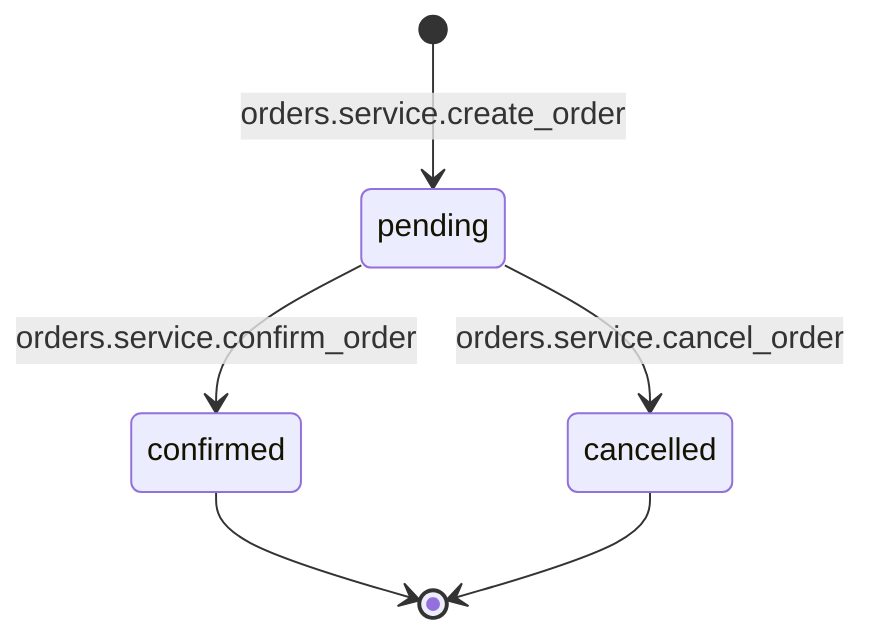
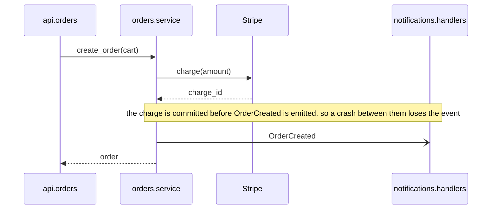
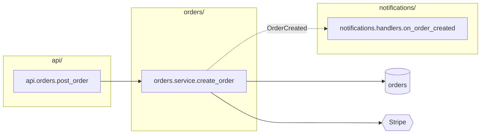
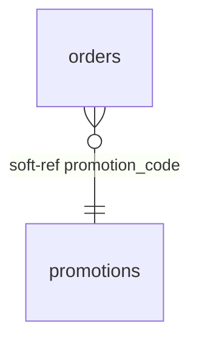

# Placement Guide

## What this document is

You receive three things: a change to the code, the repository as it stands after that change, and a set of artifacts describing the area the change touched. The artifacts are diagrams, tables, and file notes written according to the Code Diagram Guide: an edge table, dependency flowcharts, sequence diagrams, state diagrams, entity-relationship diagrams, class diagrams, packet diagrams, a glossary table, and file notes.

You have one job: decide which facts in those artifacts get written into the repository, where each one goes, what already in the repository needs updating or removing as a result, and what gets left out. Then write it, and report what you did.

This document tells you how to make each of those decisions. It is deliberately opinionated. Your judgment is needed to determine which file owns something, whether a fact is already visible in the code, whether an existing statement is contradicted, and which line an inline comment belongs to. Your judgment is not needed to decide whether documentation is worth having, what form it should take, or where a kind of fact belongs; those decisions are made here.

Two kinds of rule appear below. The rules under "What is never written" and "Constraints," the map block format, and in the key reference each key's template, the file it goes on, and the key it pairs with, are absolute. Each key's "write it when" and "do not write it when" conditions define what qualifies, and applying them to the code in front of you is exactly where your judgment goes. Everything else describes the normal case. Where a rule does not fit the code in front of you cleanly, do the closest thing that keeps the written material accurate and traceable to the code, and say what you did in the report.

## The filter, in one paragraph

A fact is written into the repository when the code cannot say it locally: a dependency that does not go through a visible call or import, the full lifecycle of a stored state field whose writers are scattered, a flow that continues in another process, a relationship the database does not enforce, a reason the code looks the way it does, a thing a reader would expect to exist that deliberately does not. A fact is not written when a reader with the file open would already see it, when a tool could derive it from the code, when it merely restates the code in other words, or when it was not verified against the code. What is written goes as close to the code it describes as possible, in a fixed form that can be found by searching, at both ends of anything that connects two places. Tables are preferred over diagrams wherever a table form exists. Everything written follows the identifier format and the writing rules of the Code Diagram Guide. The artifacts already do, so copy their names exactly; where a fact is reshaped from an artifact row into a key line, the shape changes and the words do not.

## The five homes

Everything you write goes into exactly one of these. Nothing goes anywhere else.

**1. The map block** at the top of a source file. A delimited comment block with a fixed set of keys, holding every fact about that file that the file cannot show on its own: what it owns, its hidden dependencies at both ends, the tables it writes, the external systems it calls, where the lifecycle it owns is documented, the byte layout it encodes or decodes, the flows it takes part in. This is the most important home. Most of what you write goes here.

**2. A comment directly above the code it describes.** Two forms, and no others. An inline comment: a plain sentence or two on its own line directly above a specific line of code, for the few facts that belong to a line rather than to a file and that the code cannot make clear on its own: why a line is the way it is, a hazard at exactly this point, a value that must match a value elsewhere. And the state diagram: the artifact's diagram copied verbatim as a comment block directly above the definition of a stored state's values, or directly below the map block when no such definition exists in a source file, the one comment with a fixed form, pointed to by a `transitions:` line in the file's map block.

**3. A directory README** (`README.md` in the directory). For facts that belong to a directory rather than a file: what the directory owns, the kept flows, those that cross a boundary or span more than one top-level directory, whose entry point lives here (as sequence diagrams), and a dependency-direction rule when one exists and no tool enforces it.

**4. The root agent file**: the repository's root instructions file for AI readers, whatever it is already called (`AGENTS.md`, `CLAUDE.md`, or similar). If more than one exists, use the one the repository's agents are configured to load where that is stated, and otherwise `AGENTS.md`. If none exists, create `AGENTS.md`. You write index lines into it, into fixed sections: one line per top-level directory, one line per named flow, one line pointing at the glossary; and the map block legend from the appendix, so that every reader knows what the blocks mean. Never diagrams, never tables, never prose beyond a line outside the legend. Every AI reader reads this file at the start of every session, so its length is a cost paid on every task.

**5. The root glossary**: `GLOSSARY.md` at the repository root, with the same columns as the artifact glossary table. Every glossary row from the artifacts is merged here and nowhere else.

Every kind of fact the artifacts can carry has exactly one destination among these five. This table is the summary; the sections that follow give the conditions and the exact forms.

| Fact | Home | Form |
|---|---|---|
| what a file is responsible for | map block | `owns:` |
| a caller a reader would not expect | map block of the callee | `called from:` |
| an event, hook, feature flag, container binding, callback, or other hidden mechanism | map block at both ends | `event out:`/`event in:`, `hook out:`/`hook in:`, `flag out:`/`flag in:`, `di out:`/`di in:`, `callback out:`/`callback in:`, `other out:`/`other in:` |
| tables a file writes, and tables in another database or service it reads or writes | map block | `writes:`, `reads remote:`, `writes remote:` |
| an external system a file calls | map block | `calls:` |
| a column that refers to another table with no foreign key | map block at both ends | `soft-ref out:`, `soft-ref in:` |
| the lifecycle of a stored state field | comment block directly above the definition of its values, or below the map block when no definition exists in a source file, plus a pointer in that file's map block | the state diagram verbatim; `transitions:` |
| a binary layout | map block | `format:` |
| a danger that belongs to a file as a whole | map block | `hazard:` |
| a fact about one line: why it is the way it is, a hazard at that point, a value that must match another, an assignment that bypasses a state machine | inline comment directly above the line | a plain sentence |
| a flow that crosses a boundary or spans more than one top-level directory | README of the entry point's directory, plus the map block of every participating file | `## Flows` sequence diagram; `entry point of:`, `participates in:` |
| what a directory owns | directory README | `## Owns` |
| a dependency-direction rule that no tool enforces | directory README | `## Dependency direction` |
| the data model, only when the repository has no schema source of truth | directory README | `## Data model` |
| the index of described directories and named flows | root agent file | `## Map`, `## Flows`, `## Glossary` |
| the meaning of the map block keys | root agent file | `## Map blocks` legend |
| a domain term, its canonical identifier, and its aliases | `GLOSSARY.md` | one row |

The dependency flowchart and the class diagram are never written as diagrams, and the entity-relationship diagram only in the no-schema case; what they carry arrives through the rows above. Anything that fits no row is not written and is listed in the report.

## The map block

### Format

The block is made of the language's line-comment marker followed by a fixed key, a colon, and the fact. It opens with a line whose content after the comment marker is exactly `map` and closes with one whose content after the marker is exactly `end map`, so that tooling can find and replace the whole block. In Python:

```text
# map
# owns: creation and cancellation of orders
# participates in: order placement (api/README.md)
# called from: jobs.expire_orders.run (jobs/expire_orders.py); not only the API
# event out: OrderCreated -> analytics.consumers.on_order_created (analytics/consumers.py), notifications.handlers.on_order_created (notifications/handlers.py)
# writes: orders
# calls: Stripe (charge, refund)
# complete within: api/, orders/, payments/, notifications/, analytics/
# end map
```

In a language with `//` comments, every line starts with `//`. In a language with only block comments, the block is one block comment whose lines follow the same shape. Never use a docstring or a string literal for the map block, even where that is the convention for module documentation; comments are uniform across languages and never affect runtime.

The block goes after any shebang, encoding, license, magic comment, or compiler directive line, and before the first import or the first statement. Lines like Ruby's `# frozen_string_literal: true`, Go's build constraints, or `// @flow` must stay where the language expects them; placing the block above them can silently change behavior. If the file has an existing module docstring, the map block goes before it. If the file already has a map block, replace the whole block; never append a second one. Leave one blank line between `end map` and whatever follows, because several languages attach a leading comment to the next declaration, Go doc comments, JSDoc, and Javadoc among them. In Go the block goes after the package clause and before the imports. In PHP it goes after the opening tag and any `declare` line.

### Key reference

The block is terse by design, so every key is defined here in full. Each entry has the same parts. **Means** is the fact the line states, in the words a reader should take from it. **Template** is the exact shape of the value; placeholders are in angle brackets and everything outside them is literal. **Example** is one real line. **Write it when** and **Do not write it when** are your conditions; if neither matches, the key is not written. **On** is the file that gets the line. **Pairs with** is the key written at the other end of the same fact, when the fact has two ends. What each line means to the reader who meets it is stated once, in the legend in the appendix, which the root agent file carries. Keys appear in the block in the order given here. A key is written only when the artifacts supply a fact for it in this file, or when an existing fact under it survived reconciliation. A key with nothing to say is omitted: never written empty, never written with `none` as its whole value, never added because other files have it or because the block would look more complete with it. Omission carries no meaning to a reader, by rule, so there is nothing to signal by writing a key without a fact. (`event out: <EventName> -> no consumer found` is not an exception: the key is warranted because the file does emit the event, and the value records what the artifacts found about its consumers.)

Conventions that apply to every value:

- `<identifier>` is a name in the Code Diagram Guide's identifier format: `orders.service.create_order`, `orders.models.Order`, a bare table name, a bare product name.
- A repository path in parentheses, `(<file>)`, after an identifier is the file that defines that identifier; a reader can open it directly. Parentheses are used for nothing else except the operations after an external system name in `calls:`, the system after a table name in `reads remote:`, `writes remote:`, and `soft-ref out:`, the field list in `transitions:`, the `(no FK; ...)` note in `soft-ref out:`, the README path after a flow name in `entry point of:` and `participates in:`, and the bare file after `<-` in `soft-ref in:`, where the referencing table's name stands in for an identifier. None of the first five can be mistaken for a path, and the last two are paths by design.
- `->` reads "to" and `<-` reads "from." The arrow points the way control or data moves. An `out` key describes something leaving this file; an `in` key describes something arriving in it.
- Several items of the same kind in one value are separated by commas. Several independent statements in one value are separated by semicolons.
- The file in parentheses is always a source file a person edits. When the name also exists in a file generated from that source, the generated file is never cited.
- A fact's identity is its two ends and its key, not its wording. When a line with the same ends and key already exists, keep its wording and do not add a second line; this covers the mechanism name in `other out:` and the clause after the semicolon in `called from:`.
- An end that lies outside this repository is written as `<system name> (outside repository)`. It has no file and no partner line, and the file check in the procedure does not apply to it.
- Items within a value are sorted alphabetically by identifier, so that the same facts always produce the same line.
- A key that says "one line per X" is repeated for each X, and those lines are sorted by X. A file that owns several state fields has one `transitions:` line per field, in field-name order.

**`map` and `end map`**
Not keys but delimiters: a comment line whose content after the marker is exactly `map` opens the block and one whose content is exactly `end map` closes it. Everything between them follows this reference. Tooling finds the block by these lines, so they are written exactly, with no colon and nothing else after the marker.

**`owns:`**
Means: what this file is responsible for.
Template: `owns: <noun phrase describing the responsibility>`
Example: `owns: creation and cancellation of orders`
Write it when: the file notes give a purpose statement for this file, which they do for every file they describe. It is the first line of the block. If a module docstring already states the purpose, `owns:` is still written; the docstring is left alone.
Do not write it when: the artifacts give no purpose statement for the file. That happens when the file is the far end of a two-ended fact, an `event in:` or `soft-ref in:` for example, and was not itself described. Then the block is written without `owns:`, and the report lists the file as lacking a purpose statement. A file the artifacts say nothing about at all gets no block.
On: the file itself. Pairs with: nothing.

**`entry point of:`**
Means: a kept flow, one that crosses a process, service, queue, scheduler, or thread boundary or spans more than one top-level directory, takes its first step inside this repository in this file, and its sequence diagram is in the named README. The diagram shows what, if anything, comes before this file: a queue, an external system, or code outside the repository. Its arrows show whether the flow also crosses a process, service, or queue boundary.
Template: `entry point of: <flow name> (<README path>), <flow name> (<README path>)`
Example: `entry point of: order placement (api/README.md)`
Write it when: a sequence diagram was written into a README and this file defines the first participant in this repository to send a message, where a message is a call or an asynchronous send, not a return.
Do not write it when: the flow was not kept. When the first sender is a queue, an external system, or code outside the repository, the line goes on the file of the first participant in this repository that sends a message; when that file would never get a map block, such as a generated router, it goes on the next participant in the repository that does get one. In both cases the diagram, not this line, says where the flow truly begins.
On: the entry file. Pairs with: `participates in:` on every other participating file.

**`participates in:`**
Means: this file is one step of a flow that starts somewhere else; the diagram is in the named README.
Template: `participates in: <flow name> (<README path>), <flow name> (<README path>)`
Example: `participates in: order cancellation (orders/README.md), order placement (api/README.md)`
Write it when: a kept sequence diagram has a participant defined in this file that is not the entry point.
Do not write it when: the participant is a queue, an external system, code outside the repository, or a file on the never-diagram list.
On: each participating file. Pairs with: `entry point of:`.

**`called from:`**
Means: this file is called from a place a reader would not expect.
Template: `called from: <identifier> (<file>), <identifier> (<file>)`, optionally followed by a semicolon and a short clause saying what is surprising.
Example: `called from: jobs.expire_orders.run (jobs/expire_orders.py); not only the API`
Write it when: a file note flags a caller as surprising, or the artifacts show a caller of one of these kinds: a background job or scheduled task calling code that looks request-driven; a migration or script calling service code; a caller in a different top-level package; a caller reaching this file through a mechanism that hides it.
Do not write it when: the caller is the one a reader would assume, the API handler for a service, the service for a repository; to list all callers, which a tool can derive.
On: the callee's file. Pairs with: nothing; the caller's side is visible in the caller's own code.

**`event out:`**
Means: this file emits the named event, and these are every consumer the artifacts found.
Template: `event out: <EventName> -> <consumer identifier> (<file>), <consumer identifier> (<file>)`. One line per event name; a file that emits two events has two lines. A consumer outside this repository is written as `<service name> (outside repository)` and gets no `event in:` line anywhere.
Example: `event out: OrderCreated -> analytics.consumers.on_order_created (analytics/consumers.py), notifications.handlers.on_order_created (notifications/handlers.py)`
Write it when: the edge table has a row of kind `event` whose Source is in this file. The edge table records an emitted event with no consumer as a row whose Target is `no consumer found`; write that as `event out: <EventName> -> no consumer found`, because the absence is a fact worth recording.
Do not write it when: the "event" is a direct function call, which is visible in the code; when it is a component-local UI event; when a consumer is only suspected.
On: the emitter's file. Pairs with: `event in:` on each consumer's file.

**`event in:`**
Means: a function in this file runs when the named event is emitted from the named place.
Template: `event in: <EventName> <- <emitter identifier> (<file>), <emitter identifier> (<file>)`. One line per event name.
Example: `event in: ChargeSucceeded <- payments.gateway.charge (payments/gateway.py)`
Write it when: the edge table has a row of kind `event` whose Target is in this file.
Do not write it when: the subscription is to an in-process observable or store local to one module.
On: the consumer's file. Pairs with: `event out:`.

**`hook out:`**
Means: an operation on an object defined in this file, such as saving or deleting it, causes a handler somewhere else to run.
Template: `hook out: <hook name> -> <handler identifier> (<file>), <handler identifier> (<file>)`. One line per hook name.
Example: `hook out: post_save -> audit.signals.on_order_saved (audit/signals.py)`
Write it when: the edge table has a row of kind `hook` whose Source is an object defined in this file. The hook fires on every such operation from any code path, so the object's own file is the right place, not the files that happen to perform the operation.
Do not write it when: the handler is defined in this same file, where it is visible; when the hook is framework-internal with no project handler attached.
On: the file defining the hooked object, usually the model. Pairs with: `hook in:`.

**`hook in:`**
Means: a function in this file runs as a hook on an object defined elsewhere.
Template: `hook in: <hook name> <- <object identifier> (<file>)`
Example: `hook in: post_save <- orders.models.Order (orders/models.py)`
Write it when: the edge table has a row of kind `hook` whose Target is a handler in this file.
Do not write it when: the hooked object is defined in this same file.
On: the handler's file. Pairs with: `hook out:`.

**`flag out:`**
Means: this file checks a feature flag, and the flag decides which code runs.
Template: `flag out: <FLAG_KEY> -> on: <identifier> (<file>); off: <identifier> (<file>)`. When the flag only gates one path and nothing runs in its place, write `off: skipped`.
Example: `flag out: PRICING_V2 -> on: pricing.v2.calculate (pricing/v2.py); off: pricing.v1.calculate (pricing/v1.py)`
Write it when: the edge table has rows of kind `flag` whose Source is in this file. The artifact records two rows per flag, Name `<FLAG> on` and `<FLAG> off`; they become the `on:` and `off:` halves of one line.
Do not write it when: the value checked is a build-time constant or a configuration setting that does not change at runtime; that is configuration, and it is visible.
On: the checking file. Pairs with: `flag in:` on the file holding each gated path, when that is a different file.

**`flag in:`**
Means: code in this file runs only when a flag checked elsewhere is in the named state, on or off.
Template: `flag in: <FLAG_KEY> on <- <checking identifier> (<file>)` or `flag in: <FLAG_KEY> off <- <checking identifier> (<file>)`. One line per flag and state.
Example: `flag in: PRICING_V2 off <- orders.service.get_price (orders/service.py)`
Write it when: the edge table has a row of kind `flag` whose Target path is in this file and whose checker is in a different file; the row's Name, `<FLAG> on` or `<FLAG> off`, supplies the state.
Do not write it when: the check and the gated path are in the same file.
On: the file holding the gated path. Pairs with: `flag out:`.

**`di out:`**
Means: this file asks a container or locator for an abstraction, and this is where the binding that chooses the implementation lives.
Template: `di out: <abstraction identifier> via <file where the binding is configured>`
Example: `di out: payments.protocols.PaymentProvider via app/wiring.py`
Write it when: the edge table has a row of kind `di` whose Source is in this file; the row's Defined in names the binding file after `bound in`, which becomes the `via` clause, or `via unknown` when the artifacts could not find it.
Do not write it when: the dependency is passed in by a visible caller as an argument; that is an ordinary call.
On: the resolving file. Pairs with: `di in:`.

**`di in:`**
Means: a class in this file is what a container hands out for the named abstraction.
Template: `di in: <abstraction identifier> <- <resolving identifier> (<file>), <resolving identifier> (<file>)`
Example: `di in: payments.protocols.PaymentProvider <- orders.service.create_order (orders/service.py)`
Write it when: the edge table has a row of kind `di` whose Target implementation is in this file.
Do not write it when: the class is constructed directly by name somewhere visible.
On: the implementation's file. Pairs with: `di out:`.

**`callback out:`**
Means: this file hands one of its functions to another module, which will call it later.
Template: `callback out: <function identifier> -> <receiving identifier> (<file>)`
Example: `callback out: orders.service.on_payment_done -> payments.gateway.charge (payments/gateway.py)`
Write it when: the edge table has a row of kind `callback` whose handed-over function is defined in this file.
Do not write it when: the function is called directly by name from the other module; when the callback never leaves this file.
On: the file that hands the function over. Pairs with: `callback in:`.

**`callback in:`**
Means: a function received by code in this file is, in practice, the named function from elsewhere.
Template: `callback in: <parameter or registration point> of <receiving identifier> <- <function identifier> (<file>)`
Example: `callback in: on_complete of payments.gateway.charge <- orders.service.on_payment_done (orders/service.py)`
Write it when: the edge table has a row of kind `callback` whose receiver is in this file.
Do not write it when: the receiver is generic library code outside the repository.
On: the receiving file. Pairs with: `callback out:`.

**`other out:`** and **`other in:`**
Means: a hidden dependency through a mechanism none of the keys above covers: a file on disk, a cache key, an environment variable read at runtime, a database trigger, a shared in-memory registry.
Template: `other out: <mechanism> <name> -> <identifier> (<file>)` and `other in: <mechanism> <name> <- <identifier> (<file>)`, where `<mechanism>` is the one word the edge-table row carries, from the Code Diagram Guide's list, and `<name>` is the name the code uses
Example: `other out: file settings.ORDERS_SPOOL_DIR -> jobs.import.run (jobs/import.py)` and, on the other file, `other in: file settings.ORDERS_SPOOL_DIR <- orders.export.write_spool (orders/export.py)`
Write it when: the edge table has a row of kind `other`. Name the mechanism first, so a reader knows what to look for.
Do not write it when: any specific key above fits; prefer the specific key.
On: both ends. Pairs with: each other.

**`writes:`**
Means: executing code in this file can change rows in these tables.
Template: `writes: <table>, <table>`
Example: `writes: orders, order_lines`
Write it when: the edge table has a row of kind `table` whose Source is in this file with a write operation: insert, update, delete, save, create, or a bulk equivalent.
Do not write it when: the file only reads the table; the file only defines the model and contains no write logic; the write is in a migration.
On: each writing file. Pairs with: nothing.

**`reads remote:`**
Means: this file reads a table or store that belongs to another database, schema, or service.
Template: `reads remote: <table> (<system or database>)`
Example: `reads remote: customers (billing database)`
Write it when: the edge table has a row of kind `table` with Name `read` whose Target is written as `<table> (<system>)`, which is how the artifacts mark a table outside this repository's own schema.
Do not write it when: the table is in this repository's schema; reads of local tables are never written.
On: the reading file. Pairs with: nothing.

**`writes remote:`**
Means: executing code in this file can change rows in a table that belongs to another database, schema, or service.
Template: `writes remote: <table> (<system or database>)`
Example: `writes remote: customers (billing database)`
Write it when: the edge table has a row of kind `table` with Name `write` whose Target is written as `<table> (<system>)`.
Do not write it when: the table is in this repository's schema; that is `writes:`.
On: the writing file. Pairs with: nothing.

**`calls:`**
Means: this file makes network calls to a system run by someone else.
Template: `calls: <System> (<operation>, <operation>); <System> (<operation>)`
Example: `calls: SendGrid (send); Stripe (charge, refund)`
Write it when: the edge table has a row of kind `external` whose Source is in this file.
Do not write it when: the call is to a service inside this repository, which is a flow participant covered by `participates in:`; when the "system" is a library rather than a network service.
On: the calling file. Pairs with: nothing; the external system has no file here.

**`soft-ref out:`**
Means: a column defined in this file refers to another table with no foreign key constraint.
Template: `soft-ref out: <column> -> <table> (no FK; validated in <identifier> (<file>))` or `soft-ref out: <column> -> <table> (no FK; not validated)`
Example: `soft-ref out: promotion_code -> promotions (no FK; validated in orders.service.validate_promotion (orders/service.py))`
Write it when: an entity-relationship relationship labeled `soft-ref` has its referencing column in a model defined in this file; the edge-table row's Name carries `validated in <identifier>` or `not validated`, which fills the parenthetical. For a reference into another database or service, name the system after the table in parentheses, as `reads remote:` does: `soft-ref out: customer_id -> customers (billing database) (no FK; not validated)`.
Do not write it when: the column has a foreign key constraint or an ORM declaration that creates one.
On: the file defining the referencing model. Pairs with: `soft-ref in:`, except for references into other systems, which have no second end here.

**`soft-ref in:`**
Means: a column in another table points at a table defined in this file with no foreign key constraint.
Template: `soft-ref in: <table>.<column> <- (<file>)`
Example: `soft-ref in: audit_events.target_id <- (audit/models.py)`
Write it when: an entity-relationship relationship labeled `soft-ref` points at a table defined in this file.
Do not write it when: the reference is enforced.
On: the file defining the referenced table. Pairs with: `soft-ref out:`.

**`transitions:`**
Means: this file owns the lifecycle of a stored state field, and the state diagram for it sits directly above the definition of the field's values in this file.
Template: `transitions: <entity identifier>.<field>, diagram above <identifier of the definition>`. For a lifecycle encoded in several booleans or timestamps: `transitions: <entity identifier> (<field>, <field>), diagram above <identifier of the class>`. For a field whose values are bare string or number literals with no enum: `transitions: <entity identifier>.<field>, diagram above <identifier of the class>`. When the diagram had to be placed at the top of the file because no definition exists in a source file: `transitions: <entity identifier>.<field>, diagram below this block`.
Example: `transitions: orders.models.Order.status, diagram above orders.models.OrderStatus`
Write it when: a state diagram was built and this is the owner file, which is the file where the state's values are defined: the enum, the union type, the choices list, or, when the state is a combination of booleans or timestamps or when its values are bare string or number literals with no enum, the class or type that declares the field. Only when the values are defined only in generated code or a migration and no source type declares the field is the owner the file that assigns the field in the most places; list that case under Flagged as `rule did not fit`, saying so. The diagram itself is placed as described under "State diagram" in the placement rules; this line only points at it.
Do not write it when: a state machine library declares the machine; then nothing from the diagram is written, and only a bypass gets an inline comment.
On: the owner file. Pairs with: nothing. The transition labels in the diagram are full identifiers, so the file each transition lives in follows from the label.

**`format:`**
Means: this file encodes or decodes the named binary layout, given beneath.
Template: `format: <name>`, followed by the packet diagram's lines, verbatim, each as a continuation line indented two spaces so that the block keeps its one-key-per-line shape.
Example:

```text
# format: frame header
#   packet-beta
#   %% format: frame header
#   %% complete within: protocol/frame.py
#   0-7: "version"
#   8-15: "flags"
#   16-31: "length"
#   32-63: "sequence"
```

Write it when: a packet diagram was built for this file.
Do not write it when: the format is declared in a schema file; then the schema is the source.
On: the codec's file. Pairs with: nothing.

**`hazard:`** (in the map block)
Means: something about this file's behavior that a reader must know before editing anything in it.
Template: `hazard: <one sentence: what is dangerous, and what not to do>`
Example: `hazard: retries the Stripe charge with no attempt limit; a persistent failure loops until the job is killed`
Write it when: a sequence note or file note states a danger that belongs to the file as a whole rather than to one line: a retry with no enforcing line, an operation that is not idempotent, an ordering across functions that must be preserved.
Do not write it when: the danger belongs to one identifiable line, which gets an inline comment instead; when it is a general truth about all code, such as "network calls can fail."
On: the file. Pairs with: nothing.

**`complete within:`** or **`partial within:`**
Means: the directories the most recent documentation run read in full when it last wrote this block. Within them, the block is complete for the keys it carries. Every line in the block, including a line that names a file outside these directories, was checked against the code when the block was last written.
Template: `complete within: <path>, <path>` or `partial within: <path>, <path>; left out: <what was deliberately omitted>`
Example: `complete within: api/, orders/, payments/, notifications/`
Write it when: always, as the last line of every block. The value is the read scope of this run, which the edge table's scope line always states and every diagram repeats on its second comment line. If any contributing artifact was partial, the line is `partial within:` with the read scope and the union of what was left out. If the file already had a block, the old line is replaced with this run's line, not merged. Facts kept from earlier runs that name files outside the new line stay in the block: each was verified individually under "Reconciling with what is already there", and the line does not limit what the block may contain.
Do not write it when: never omitted.
On: every map block. Pairs with: nothing.

No other keys exist in the map block. A fact that fits none of them is about the file and goes in `hazard:` if it qualifies; or is about a line and becomes an inline comment if a rule in this document sends it there; or is not written, and is listed in the report.

## Comments above the code

Two things are written as comments directly above code: inline comments, described here, and the state diagram, a fixed-form comment block whose placement is described under "State diagram" in the placement rules by artifact type. Nothing else is written as a comment above code.

Code should explain itself. An inline comment is written only when the code cannot, and something important would otherwise be unclear: why a line exists, why it is unusual, what it works around, what elsewhere depends on it. It goes directly above the code it refers to. It never describes what the code does, since that is visible by reading it. It is a plain sentence or two, in no fixed form and with no prefix.

You write an inline comment only where a rule in this document says a fact from the artifacts belongs on a specific line: a file note or sequence note that explains one line, a sequence note that names a hazard at one line, an assignment that bypasses a state machine library, a value that must match a value elsewhere. Examples of the sentences you would write:

```text
# The vendor returns 200 with an empty body above 5 requests per second; the sleep is deliberate.
# The charge is committed before OrderCreated is published, so a crash between the two loses the event.
# Sets status directly instead of going through orders.machine.OrderMachine; the machine's guards do not run here.
# Must match BATCH_SIZE in jobs/import.py; the two are read by the same retry logic.
```

Mechanics, which are about not breaking the code rather than about style: the comment is on its own line immediately above the line it describes, using the language's line-comment marker. Never a trailing comment on the code line itself, since some linters reflow those and some languages treat them differently. Never inside a string, a docstring, or a multi-line expression; if the only safe position is above a multi-line statement, use the line above its first line. If a comment already sits directly above the target line, reconcile with it: keep it if it says the same thing, replace it if the change made it false, and never add a second comment above the same line.

## Directory README

A README gets three sections, and a fourth in one case, added if absent and replaced wholesale if present. Any other content already in the README is left exactly as it is. A README is created for a directory only when at least one of its sections would have content; a directory whose only blocks lack `owns:` gets none.

`## Owns`: one line per file in the directory that has a map block with an `owns:` line, in the form `orders/service.py — creation and cancellation of orders`, copied from that line; a file whose block has no `owns:` is not listed. Then one line per subdirectory that has its own README, in the form `handlers/ — see orders/handlers/README.md`, so that READMEs form a tree a reader can walk down.

`## Flows`: one `### <scenario name>` heading per sequence diagram whose entry point is in this directory, each followed by the sequence diagram copied verbatim from the artifact, including its two comment lines and its notes, less any `%% suspected:` line, in a `mermaid` fenced block. Flows whose entry point is elsewhere are not repeated here; the participating files' `participates in:` lines point to where they live.

`## Dependency direction`: written only when the artifacts show a directional rule between this directory and others, such as the API layer calling the domain and never the reverse, and no tool in the repository enforces it. One line per rule: `orders/ may depend on pricing/, inventory/; nothing in those may depend on orders/`. If an import-boundary tool is configured, the rule lives in its configuration and this section is not written.

`## Data model`: written only in the case described under the entity-relationship rules, a repository with no schema source of truth. It holds the relationship-level diagram verbatim.

A README created by you contains only these sections. Do not write prose.

## The root agent file

You touch four sections and nothing else. Three are indexes: each is added if absent and each of its list lines is added, updated, or removed to match the current state, one line per item, sorted alphabetically, in a fixed form. A list line in square brackets under an index heading is a placeholder left by the template and is removed. Descriptive text directly under an index heading, before the first list item, is left exactly as it is. The fourth section is the legend.

`## Map`: one line per top-level directory that contains a map block or a README, in the form `orders/ — creation, cancellation, and lifecycle of orders`, derived from that directory's README `## Owns` section. This is the one place you compose a sentence rather than copy one: one sentence, naming responsibilities and nothing else. A bare wrapper directory that holds all of the code, `src/` for example, is skipped and its children are listed as top-level, the same way the identifier format drops `src`. Directories with nothing written in them are not listed. A directory whose blocks all lack an `owns:` line is listed with the fixed phrase `promotions/ — referenced by other directories; not yet described`, so that a reader can reach it; the report's Flagged section still names those files.

`## Flows`: one line per named flow in any README, in the form `order placement — entry api.orders — api/README.md`, where the entry is the first participant to send a message, as declared in the diagram, whether or not it is in this repository, so that a flow which begins in a queue or an external system says so in the index.

`## Glossary`: the single line `See GLOSSARY.md.`

`## Map blocks`: the legend that tells any reader what the keys in a map block mean. Written verbatim from the appendix at the end of this document if the section is absent. If it is present and differs from the appendix, the whole section is replaced with the appendix text and the replacement is listed under Flagged as `legend replaced`. If it matches, it is not touched.

If the file has other sections, commands, conventions, anything hand-written, they are not yours. Do not edit, reorder, or reformat them.

## The glossary

`GLOSSARY.md` holds one table with the artifact glossary's columns: Term, Canonical identifier, Meaning, Defined in, Known aliases, Notes. Rows are sorted by Term. Merging rules:

- A term not yet present is added as its artifact row.
- A term present with the same canonical identifier and a meaning that agrees keeps its existing row; any aliases the artifact found that the row lacks are appended to Known aliases.
- A term present with a different canonical identifier or a meaning that disagrees is a conflict. Read the code at both `Defined in` locations. If the code agrees with the artifact and the existing row is out of date, replace the row. If both are real, two things share a word, and that is a vocabulary problem in the code, not something you resolve here: keep both as separate rows, distinguished by canonical identifier, put `conflict: same term, two meanings` in both Notes columns, and report it.
- A row is never deleted by you. A term that has disappeared from the code is listed under Flagged as `glossary term gone`, not removed.

## Placement rules by artifact type

Each section says, for the facts an artifact type carries, where each kind of fact goes and what is dropped. "Both ends" means the fact is written at the file on each side of a connection, so that a reader arriving at either side sees it. When one side is a file on the Code Diagram Guide's never-diagram list or lies outside the repository, the fact is written on the other side only, naming the excluded end.

### Dependency flowchart and edge table

The flowchart itself is never written anywhere. The edge table is what you place, one row at a time, by kind.

- `event`: `event out:` on the emitter's file, listing every consumer; `event in:` on each consumer's file, naming the emitter. Both ends, always.
- `hook`: `hook out:` on the file whose object triggers the hook; `hook in:` on the handler's file. Both ends.
- `flag`: `flag out:` on the file that checks the flag, naming the `on:` path and the `off:` path; `flag in:` on each file holding a gated path, carrying `on` or `off`, when that is a different file from the checker. If both paths are in the checking file, `flag out:` alone.
- `di`: `di out:` on the file that resolves the abstraction; `di in:` on the implementation's file. Both ends.
- `callback` and `other`: both ends, same shape.
- `table`: `writes:` on every file that writes the table, or `writes remote:` when the written table is in another database, schema, or service. Reads are not written unless the table is in another database, schema, or service, in which case `reads remote:` on the reading file. The table's own model file gets nothing from this kind; what it gets comes from soft references.
- `external`: `calls:` on the calling file, with the operations. The external system has no file of its own, so there is no second end.
- `soft-ref`: covered under the entity-relationship diagram.

Solid edges, direct calls and imports, are never written. They are visible at the call site and derivable by tool. There are two exceptions. The first is a caller a reader would not expect, which the file notes will have flagged; that goes in `called from:` on the callee's file. The second is a directory-level dependency-direction rule, which goes in the README `## Dependency direction` section under the conditions stated there.

### Sequence diagram

A sequence diagram is kept when it crosses a process, service, queue, scheduler, or thread boundary, which its asynchronous arrows show, or when its participants span more than one top-level directory; those are the flows whose steps cannot be seen from any one place. It is written verbatim into the `## Flows` section of the README in the entry point's directory, except that any `%% suspected:` line is removed and goes to the report under Flagged, as the absolute rule below requires. The entry point is the first participant defined in this repository to send a message, where a message is a call or an asynchronous send, not a return. The entry point's file gets `entry point of:` naming the flow and the README. Every other participant that is a source file in this repository, and not on the never-diagram list, gets `participates in:` naming the flow and the README. Participants that are queues, external systems, code outside the repository, or files on the never-diagram list get nothing.

The `Note over` lines in the diagram are the most valuable lines it has, and they are placed twice. They stay in the diagram in the README, and each one that describes a hazard at an identifiable line of code also becomes an inline comment above that line, in the note's own words. A note about ordering across a boundary, "the charge is committed before the event is published," attaches to the line that publishes. A note about a retry limit attaches to the line that enforces the limit, or, if nothing enforces it, becomes a `hazard:` line in the map block of the file that retries, stating that the retry is unbounded.

A sequence diagram that crosses no such boundary and whose participants are all in one top-level directory is not written. The file notes for those files carry anything worth keeping from it.

If the entry point is in a file that would never get a map block, a generated router, a framework entry, the README is the one for the directory of the first participant that would, and that participant's file gets `entry point of:`. The diagram still shows the true first sender, so nothing is lost.

### State diagram

The state diagram is written, verbatim, as a comment block placed directly above the definition of the state's values in the owner file: above the enum, the union type, or the choices list that defines them. In a language where a comment directly above a declaration becomes its documentation, Go, Java, and anything using JSDoc among them, leave one blank line between the block and the definition, as with `end map`; otherwise the diagram becomes the type's generated documentation. If the state is a combination of booleans or timestamps, or its values are bare literals with no enum, the block goes directly above the class or type that declares the field. If no such definition exists in a source file, because the values are defined only in generated code or a migration and no source type declares the field, the block goes at the top of the file that assigns the field in the most places, immediately after its map block, and the file is listed under Flagged as `rule did not fit`. The aim is always the same: the lifecycle sits where anyone changing the values will see it.

The block is the artifact's diagram line for line, including its two comment lines and every `%%` comment stating a transition that deliberately does not exist, each line prefixed with the language's line-comment marker. The one exception is a `%%` comment beginning `suspected:`, which is removed and reported under Flagged; nothing else is added, reworded, or left out. When the code contradicts any line of the artifact's diagram, or still supports an existing `%%` absence line that the artifact's diagram lacks, the existing diagram is left untouched this run and the disagreement is listed under Flagged as `artifact disagrees with code`, as the absence rule under "Reconciling with what is already there" requires. A verbatim copy is never edited line by line. The owner file's map block gets one `transitions:` line pointing at it.

```text
# stateDiagram-v2
# %% entity: orders.models.Order, field: status
# %% complete within: orders/, payments/, fulfillment/
# [*] --> pending: orders.service.create_order
# pending --> confirmed: payments.handlers.on_charge_succeeded
# pending --> cancelled: orders.service.cancel_order
# confirmed --> shipped: fulfillment.handlers.on_shipment_created
# confirmed --> cancelled: orders.service.cancel_order [not shipped]
# %% no transition from shipped to cancelled; returns go through returns.service and do not change orders.models.Order.status
# shipped --> [*]
# cancelled --> [*]
class OrderStatus(Enum):
    ...
```

Nothing is written at the places outside the owner file that assign the field. The diagram's transition labels are full identifiers, so every write site can be found from the diagram, and the diagram is found from the map block of the owner file.

When the artifact says a state machine library declares the machine, nothing from the diagram is written, because the code already declares it. The one thing that is written is any bypass the artifact found, a place that assigns the state directly instead of going through the machine: that gets an inline comment on the line above the assignment saying so, for example `Sets status directly instead of going through orders.machine.OrderMachine; the machine's guards do not run here.`

When transitions to one field are assigned in more than two files and no state machine library is in use, add a line to the report under Flagged recommending conversion to a declared machine, naming the files. You do not perform the conversion.

### Entity-relationship diagram

Enforced relationships, foreign keys and ORM declarations that create them, are never written. They are in the schema.

Every relationship labeled `soft-ref` is written at both ends. The file holding the referencing column gets `soft-ref out:` naming the column, the referenced table, `no FK`, and where the reference is validated in code if anywhere. The file defining the referenced table gets `soft-ref in:` naming the referencing table and column and its file. A reference to a table in another database, schema, or service is a `soft-ref out:` on the referencing side only, with the other system named.

The diagram itself is not written. If the repository has no schema source of truth at all, no migrations, no model declarations, only raw SQL scattered through the code, write the relationship-level diagram verbatim, less any `%% suspected:` line, into the README of the directory that owns the data access, under a `## Data model` heading, and list it under Flagged as `rule did not fit`, saying why. This is the one case where the diagram is kept.

### Class diagram

Nothing from the class diagram is written. Its facts, which classes implement or extend which base, are listed in the report under Not kept with the reason `no key fits`.

### Packet diagram

The artifact's Mermaid block is written into the map block of the codec's file under `format:`, one continuation line per line of the block, verbatim, less any `%% suspected:` line. This is the one artifact whose diagram form is the compact form, and it has no table equivalent. If the format is declared in a schema file, nothing is written; the schema is the source.

### Glossary table

Every row merges into `GLOSSARY.md` by the rules above. Nothing from the glossary is written into source files or READMEs. A term's canonical identifier is already the name in the code; that is the link.

### File notes

The purpose statement, what the file owns, becomes `owns:`. A note's references to the artifacts themselves, such as "see edge table," are dropped; the map block has its own lines for those facts. A surprising caller becomes `called from:`. A fact about a specific line, a workaround, a deliberate delay, a value that must match a value elsewhere, becomes an inline comment above that line, in the note's own words. A fact about the file's behavior that a reader must know before editing becomes `hazard:` in the map block. `hazard:` values are the note's clause reshaped into a sentence; inline comments are the note's own words, written as a sentence.

A note that restates what the file's name already says is not written. A note that says what was looked for and not found is not written, since it is about the making of the artifacts rather than the code, unless it is a meaningful absence about the file's behavior, "no retry around the Stripe call, by design," in which case it is a `hazard:` line.

### Absence comments and suspected comments

Absence comments in any artifact, a transition that does not exist, a consumer that does not listen, a path that is not taken, are written at the home of the thing they are about: a `%%` line inside the state diagram above the definition, an inline comment at the site of a path that is deliberately not taken, a `Note` line preserved in a README flow.

Comments beginning `%% suspected:` are never written anywhere in the repository. They were not verified against the code. Each one goes in the report under Flagged, verbatim, so that it can be checked by someone else.

## What is never written

These are absolute.

- Anything marked `suspected` in an artifact.
- Anything derivable by tool from the code: direct calls and imports, enforced foreign keys, class members, inheritance that is explicit at the subclass, a state machine that a library already declares, a schema that migrations already define.
- Anything a reader with the file open already sees: the branches of a function, the imports, the fields.
- The dependency flowchart and the class diagram as diagrams, ever; the entity-relationship diagram as a diagram, except in the no-schema case. Only sequence diagrams, state diagrams, and packet layouts are written as diagrams.
- Counts that will drift, "called from forty-one files."
- Facts about how the artifacts were made, stated outside a diagram: what was searched, what was not found, which files were read. The completeness line is the only such trace kept in a map block. `%%` comment lines inside a kept sequence or state diagram travel with the diagram, because it is copied whole.
- Anything into a file on the Code Diagram Guide's never-diagram list: tests, generated code, vendored or third-party code, migrations, config, constants, translation files, static assets, build scripts, and pure utility modules with no domain meaning. If an edge's other end is in such a file, the fact is written on the end that is a real source file, with the other end named, and nothing is written into the excluded file.
- A key with no fact behind it: an empty key, a key whose whole value is `none`, or a key added so that a block resembles other blocks. Omission means nothing was recorded, and that is the only thing it is allowed to mean.
- Credentials, hostnames, internal URLs, account identifiers, or filesystem paths outside the repository, in any line. A `calls:`, `other out:`, or `hazard:` line names the mechanism and the configuration key or environment variable that holds such a value, never the value itself. A `hazard:` line is still written, since the reader needs it, but on a repository that is public or shared beyond the team it is a public statement of a weakness, so keep it to what a reader of the code could see for themselves.
- Prose paragraphs into any file. Every home has a fixed line form; use it.
- Anything into a section of the root agent file that is not one of the four named under "The root agent file."

## Reconciling with what is already there

The repository already has documentation: map blocks from earlier work, READMEs, inline comments, a glossary, and hand-written material. The change you were given may have altered what any of it describes. Reconciliation is half the job.

For every file you would write into, read what is there first. Then:

- A fact in the artifacts that is absent from the existing material is added.
- A fact in the existing material that the artifacts confirm is left as it is, even if you would have worded it differently.
- A fact in the existing material that the artifacts contradict is checked against the post-change code before anything is overwritten. Read the code at the location the artifact cites. If the code agrees with the artifact, update the existing material. If the code agrees with the existing material, the artifact is wrong: do not write it, and report the disagreement with both versions and the location you checked.
- A fact in the existing material that describes something the change removed, an event no longer emitted, a transition no longer possible, a file no longer calling a system, is deleted from every end it was written at.
- A fact in the existing material that the artifacts do not mention at all, in a file the artifacts do cover, is checked against the code the same way. If the code still supports it, keep it. If the code no longer does, delete it. If you cannot tell, keep it and list it under Flagged as `existing fact unverified`.
- A recorded absence in the existing material that the artifacts now contradict is handled like any contradicted fact. Absences are a `%%` line in a state diagram saying a transition does not exist, an `event out:` ending in `no consumer found`, an inline comment about a path deliberately not taken, and a `hazard:` line stating that something deliberately does not exist. Read the code at the place the absence is about. If the absence no longer holds, delete it and list it under Removed as `removed by change`. If it still holds, keep it: for a line in a map block, do not write the artifact's version of that line; for a state diagram, leave the whole existing diagram untouched this run rather than editing a verbatim copy; and list the disagreement under Flagged with both versions. An absence is never dropped silently by a whole-block or whole-diagram replacement.
- Existing lines inside a map block that merely restate the code are deleted, in a file you are already writing into. This applies only to lines in the map block vocabulary. Inline comments, docstrings, and README prose are never deleted for restating the code; an inline comment is deleted only when the change made it false, the same test as for any other statement.

Specific effects of a change to look for:

- A hidden edge the change introduced: write both ends.
- A hidden edge the change removed: delete both ends.
- A hidden edge the change made explicit, an event replaced with a direct call, a hook replaced with a plain function call: delete both ends; the code now says it.
- A transition the change added or removed: replace the state diagram above the definition with the artifact's, whole. A removed transition becomes a `%%` absence line only if the artifact's diagram carries one. Before replacing, compare the `%%` absence lines: an absence line in the existing diagram that the artifact's diagram lacks, whether the artifact draws the transition or merely omits the comment, goes through the absence rule above rather than being dropped.
- An identifier the change renamed: update every map block line, README line, root index line, glossary row, and inline comment that names it. Search the repository for the old name to find them all; a file holding such a mention may be written into even when it is outside the artifacts' scope.
- Code the change moved between files: the facts move with it. Delete from the old file's map block, add to the new file's, and update the other ends, which now point at a different file.
- A file the change deleted: delete every line elsewhere that points at it, and every root index line that names it.
- A flow whose name no longer appears under `## Flows` in any README: delete every `entry point of:` and `participates in:` mention of it and its root `## Flows` line. Flow names exist only in documentation, so nothing else will ever remove them.
- A file the change created: it gets a map block if the artifacts have anything to say about it.

## Procedure

Work in this order.

1. Read the change. List every file it touched, created, deleted, or renamed, and every identifier it renamed or moved.
2. Read every artifact. For each, note its type, its completeness line, and the files it covers.
3. Build the placement list: for every fact in every artifact, apply the rules for its type to produce one or more entries of the form (home, file or path, key or section, content). Both-ends facts produce two entries. Facts that fall under "What is never written" produce a "not kept" entry with the reason instead.
4. For every file and path in the placement list, read what is already there.
5. Reconcile, using the rules above, producing the final set of additions, updates, and deletions. Verify against the code before any overwrite of existing material.
6. Search the repository for every identifier you are about to write, to confirm it exists in the post-change code: the file in parentheses after it must exist and must define or contain the name's last segment. An end written as `(outside repository)` is exempt from this check and is confirmed by reading the code at the in-repository end. Then, for every hidden-edge fact you are writing for the first time, an `event`, `hook`, `flag`, `di`, `callback`, `other`, or `soft-ref` row, open the file at each end and confirm the mechanism is there: the emit and the subscription, the hook registration, the flag check and the gated path, the binding, the column and the referenced table's definition. An identifier or fact that fails either check is not written and is reported under Flagged.
7. Write. Map blocks are replaced whole, in key order. State diagrams above definitions are replaced whole. README sections are replaced whole. Root index sections are updated line by line. The glossary is merged row by row.
8. Re-read every file you wrote to confirm the comment syntax is valid for that language and that no code line changed.
9. Write the report.

## Constraints

These are absolute.

- You change comments and Markdown only. No code token changes, no whitespace changes to code lines, no reordering of imports, no formatting. If a placement cannot be made without touching code, it is not made, and it is reported.
- Every identifier you write exists in the post-change code: the file in parentheses after it exists, and that file defines or contains the name's last segment. You searched for it. The one exception is an end written as `(outside repository)`, which names a system rather than a file. Every hidden-edge fact you write for the first time was confirmed at both ends in the code, not only in the artifacts.
- Every kept block ends with its completeness line.
- A second run on unchanged inputs makes no edits: every fact it would write is already present, existing wording is kept, and nothing is appended to an existing block. Map blocks and README sections are replaced whole from the fixed vocabulary. A diagram or packet block already in place is the same as the artifact's when the two match line for line once the comment marker and leading whitespace are removed, and is then left untouched.
- Both ends, always, for every connection whose two ends are both source files in the repository; when one end is an excluded file or outside the repository, the other end names it.
- You write an inline comment only where a rule in this document sends a specific fact from the artifacts to a specific line. You do not add comments to code because it seemed to want one.
- Nothing marked `suspected` is written.
- Every key you write is backed by a fact from this run's artifacts for that file or by an existing fact the code still supports. You never write a key to signal that nothing was found.
- You do not add a map block to a file the artifacts say nothing about, and you do not write into files outside the artifacts' scope, except: the other end of a connection, any file holding a mention of an identifier or file the change renamed, moved, or deleted, the root agent file, the glossary, and a README for a directory containing a file you wrote into.
- You do not write into files on the never-diagram list.
- You do not edit sections of the root agent file or READMEs that are not the ones named here, and you replace the `## Map blocks` legend only when it differs from the appendix.
- You preserve existing hand-written material outside the map-block vocabulary, prose, inline comments, docstrings, and README text, that the code still supports, wording and all. Lines inside a map block follow the map-block rules whoever wrote them.

## The report

The report is the last thing you produce and has six sections, each a list, each line in the form shown. Empty sections are written with the word `none`. A fact may appear under both Not kept and Flagged: Not kept records that it was not written, Flagged that someone must look at it. A README section or a root index section counts as one Placed line listing its items.

**Placed**: `<path> — <key, section, or home> — <content in one line>`, one per fact written for the first time.

**Updated**: `<path> — <key or section> — was: <old> — now: <new>`, one per existing fact changed.

**Removed**: `<path> — <key or section> — <what> — <why>`, one per existing fact deleted, where `<why>` is a short fixed phrase reused whenever the same reason recurs. The reasons the rules in this document produce are `removed by change`, `made explicit by change`, `contradicted by code`, and `restated the code`; a reason not foreseen here is written in the same style, a phrase rather than a sentence.

**Not kept**: `<artifact> — <fact> — <reason>`, where `<reason>` is a short fixed phrase reused whenever the same reason recurs. The reasons the rules in this document produce include `derivable`, `visible in file`, `suspected`, `about the artifacts, not the code`, `excluded file`, `identifier not found`, `fact not confirmed`, `flow crosses no boundary`, `count`, `no key fits`, `general truth`, `duplicate of a placed fact`, `blocked by code change`, and `local read`. The set cannot be closed, because not every reason can be foreseen; a new reason is a phrase in the same style, not a sentence, and is reused once coined. One line per artifact fact that was not written. Facts that were not written because they were already present and unchanged are counted under Unchanged instead.

**Flagged**: `<path or artifact> — <kind> — <detail>`, one line per item a human should look at or decide, where `<kind>` is a short fixed phrase reused whenever the same kind recurs. The kinds the rules in this document name are `no owns` (a file that received a map block without an `owns:` line because the artifacts gave it no purpose statement), `state machine candidate` (transitions to one field assigned in more than two files), `glossary conflict`, `artifact disagrees with code` (with both versions and the location checked in the detail), `suspected` (the item verbatim), `identifier not found`, `fact not confirmed`, `outside scope` (a dependent the artifacts named as outside their scope, or a file written into as the other end of a connection), `glossary term gone` (a glossary term whose canonical identifier no longer exists in the code), `existing fact unverified` (an existing fact the artifacts do not mention and the code neither confirms nor refutes), `legend replaced`, and `rule did not fit` (any place where a rule did not fit and you did the closest thing, saying what). As with the other sections, a kind not foreseen here is written as a phrase in the same style and reused once coined.

**Unchanged**: one line, `<count> facts already present and unchanged`, so that every fact in every artifact is accounted for.

## Checklist before the report

- Does every map block open with `map`, close with `end map`, use only the fixed keys in the fixed order, and end with a completeness line derived from this run's artifacts? Does every block without an `owns:` line appear in the report?
- Is every connection written at both ends, with each end naming the other's file (for `soft-ref out:` the table name stands for the file; for `di out:`, the binding file; for `entry point of:` and `participates in:`, the README)?
- Is every state diagram placed where its `transitions:` line says, directly above the definition of its values or, when no definition exists in a source file, directly below the map block, copied line for line?
- Does every identifier written exist in the post-change code, with its file confirmed to exist and to contain the name's last segment, and was every first-time hidden-edge fact confirmed at both ends in the code?
- Is every `suspected` item in the report and nowhere in the repository?
- Is anything written that a tool could derive or that the file already shows? If so, remove it.
- Is every key in every block backed by a fact from the artifacts for that file, with no key written to signal absence?
- Did every fact the change removed, renamed, or moved get its existing mentions deleted, updated, or moved, at every end? Did every recorded absence the artifacts dropped go through the absence rule and into the report?
- Was every overwrite of existing material verified against the code first?
- Did any code line change? Diff to confirm none did.
- Is the root agent file still index lines only in its three index sections, apart from the descriptive text allowed under each heading, is the `## Map blocks` legend present, and is everything else in it untouched?
- Does the report account for every fact in every artifact, as placed, updated, not kept, flagged, or counted as unchanged?

## Appendix: a worked run

This is one complete run, shortened to what the example needs. The change is commit `3f9c2d1`. It adds `notifications/handlers.py`, which consumes `OrderCreated` and sends the confirmation email, and adds a `promotion_code` column to `orders.models.Order`, validated in `orders.service.validate_promotion`. The analyst was given the read scope `api/`, `orders/`, `notifications/`. The repository has no documentation yet apart from a hand-installed root `AGENTS.md`, which already carries the `## Map blocks` legend exactly as it appears in the appendix, empty index sections, and the `## Glossary` line, so the legend is left untouched.

### The artifacts





edge table, complete within: api/, orders/, notifications/

| Source | Target | Kind | Name | Defined in |
|---|---|---|---|---|
| orders.service.create_order | notifications.handlers.on_order_created | event | OrderCreated | orders/service.py, notifications/handlers.py |
| orders.service.create_order | Stripe | external | charge | orders/service.py |
| orders.service.create_order | orders | table | write | orders/service.py |
| orders | promotions | soft-ref | promotion_code, validated in orders.service.validate_promotion | orders/models.py, promotions/models.py, orders/service.py |





| Term | Canonical identifier | Meaning | Defined in | Known aliases | Notes |
|---|---|---|---|---|---|
| order | `orders.models.Order` | A customer's purchase of one or more lines. Exists from checkout until confirmation or cancellation. | orders/models.py | none | none |

```text
api/orders.py: Owns the HTTP handlers for orders.
orders/service.py: Owns creation, confirmation, and cancellation of orders, and promotion-code validation. Emits OrderCreated only after the Stripe charge is committed.
orders/models.py: Owns the Order model and its status values. promotion_code has no foreign key; orders.service.validate_promotion is the only check.
notifications/handlers.py: Owns the OrderCreated consumer that sends the confirmation email. A failed send is logged and dropped; there is no retry, by design.
```

### What is written

`api/orders.py`, whose completeness line is partial because the sequence diagram that contributes to it is partial:

```text
# map
# owns: the HTTP handlers for orders
# entry point of: order placement (api/README.md)
# partial within: api/, orders/, notifications/; left out: failure paths
# end map
```

`orders/service.py`, plus one inline comment carrying the sequence note, placed above the line that emits the event:

```text
# map
# owns: creation, confirmation, and cancellation of orders, and promotion-code validation
# participates in: order placement (api/README.md)
# event out: OrderCreated -> notifications.handlers.on_order_created (notifications/handlers.py)
# writes: orders
# calls: Stripe (charge)
# partial within: api/, orders/, notifications/; left out: failure paths
# end map
```

```text
# The charge is committed before OrderCreated is emitted, so a crash between them loses the event.
events.emit(OrderCreated(order))
```

`orders/models.py`, plus the state diagram directly above the enum it points at:

```text
# map
# owns: the Order model and its status values
# soft-ref out: promotion_code -> promotions (no FK; validated in orders.service.validate_promotion (orders/service.py))
# transitions: orders.models.Order.status, diagram above orders.models.OrderStatus
# complete within: api/, orders/, notifications/
# end map
```

```text
# stateDiagram-v2
# %% entity: orders.models.Order, field: status
# %% complete within: api/, orders/, notifications/
# [*] --> pending: orders.service.create_order
# pending --> confirmed: orders.service.confirm_order
# pending --> cancelled: orders.service.cancel_order
# %% no transition from confirmed to cancelled; cancellation after confirmation is not supported
# confirmed --> [*]
# cancelled --> [*]
class OrderStatus(Enum):
    ...
```

`notifications/handlers.py`, whose file note's deliberate absence becomes a `hazard:` line:

```text
# map
# owns: the OrderCreated consumer that sends the confirmation email
# participates in: order placement (api/README.md)
# event in: OrderCreated <- orders.service.create_order (orders/service.py)
# hazard: a failed send is logged and dropped; there is no retry, by design
# partial within: api/, orders/, notifications/; left out: failure paths
# end map
```

`promotions/models.py`, outside the read scope, opened only to confirm the soft reference and written into only as its other end, and so without `owns:`. Its completeness line is this run's read scope, which did not include `promotions/`:

```text
# map
# soft-ref in: orders.promotion_code <- (orders/models.py)
# complete within: api/, orders/, notifications/
# end map
```

`api/README.md` holds the flow because the entry point is there; `orders/README.md` and `notifications/README.md` get only an `## Owns` section; `promotions/` gets no README because its only block lacks `owns:`, but it does get a root index line so that a reader can find the block.

```text
## Owns

- api/orders.py — the HTTP handlers for orders

## Flows

### order placement

(the sequence diagram above, verbatim, in a mermaid fenced block)
```

The root `AGENTS.md` gains five index lines, four under `## Map` and one under `## Flows`, and `GLOSSARY.md` gains the order row:

```text
- api/ — HTTP handlers for orders
- notifications/ — the OrderCreated consumer and the confirmation email
- orders/ — creation, confirmation, and cancellation of orders, the Order model and its lifecycle, and promotion-code validation
- promotions/ — referenced by other directories; not yet described

- order placement — entry api.orders — api/README.md
```

### The report

```text
Placed:
api/orders.py — owns — the HTTP handlers for orders
api/orders.py — entry point of — order placement (api/README.md)
orders/service.py — owns — creation, confirmation, and cancellation of orders, and promotion-code validation
orders/service.py — participates in — order placement (api/README.md)
orders/service.py — event out — OrderCreated -> notifications.handlers.on_order_created (notifications/handlers.py)
orders/service.py — writes — orders
orders/service.py — calls — Stripe (charge)
orders/service.py — inline comment — the charge is committed before OrderCreated is emitted, so a crash between them loses the event
orders/models.py — owns — the Order model and its status values
orders/models.py — soft-ref out — promotion_code -> promotions (no FK; validated in orders.service.validate_promotion (orders/service.py))
orders/models.py — transitions — orders.models.Order.status, diagram above orders.models.OrderStatus
orders/models.py — state diagram — above orders.models.OrderStatus
notifications/handlers.py — owns — the OrderCreated consumer that sends the confirmation email
notifications/handlers.py — participates in — order placement (api/README.md)
notifications/handlers.py — event in — OrderCreated <- orders.service.create_order (orders/service.py)
notifications/handlers.py — hazard — a failed send is logged and dropped; there is no retry, by design
promotions/models.py — soft-ref in — orders.promotion_code <- (orders/models.py)
api/README.md — ## Owns — api/orders.py
api/README.md — ## Flows — order placement
orders/README.md — ## Owns — orders/models.py, orders/service.py
notifications/README.md — ## Owns — notifications/handlers.py
AGENTS.md — ## Map — api/, notifications/, orders/, promotions/
AGENTS.md — ## Flows — order placement
GLOSSARY.md — row — order

Updated:
none

Removed:
none

Not kept:
dependency flowchart — api.orders.post_order --> orders.service.create_order — derivable
entity-relationship diagram — promotions is defined in promotions/models.py, outside the files read — about the artifacts, not the code
file note — orders/service.py emits OrderCreated only after the Stripe charge is committed — duplicate of a placed fact
file note — orders/models.py: promotion_code has no foreign key and orders.service.validate_promotion is the only check — duplicate of a placed fact

Flagged:
promotions/models.py — no owns — the artifacts describe the file only as the far end of a soft reference
promotions/models.py — outside scope — written into as the other end of a connection; promotions/ has no README because its only block lacks owns:, and its ## Map line carries the not-yet-described phrase

Unchanged:
0 facts already present and unchanged
```

The two file-note lines under Not kept duplicate facts placed from other artifacts: the sequence note became the inline comment, and the soft-reference sentence became the `soft-ref out:` line.

## Appendix: legend text for the root agent file

The text below is written into the root agent file as a section headed `## Map blocks`, verbatim, if that section is absent, and replaced whole when the section differs from the text below. It exists so that any reader opening any file already knows what the block at the top means, without having read this document.

---

## Map blocks

A source file may begin with a comment block between a comment line reading `map` and a comment line reading `end map`. It records facts about the file that the file cannot show on its own: what it owns, dependencies that do not go through a visible call or import, tables it writes, external systems it calls, the lifecycle it owns, flows it takes part in. Read it before reading the code. A file with no block has not been described; that is not the same as having nothing hidden. The same holds inside a block: a key is written only when there was something to record under it, so a block with no `event in:` line, for example, means nothing was recorded there, not that the file consumes no events. Never take the absence of a block, or of a key within one, as evidence that the thing it would describe does not exist. The completeness line says where the block is complete; it says nothing about keys that are absent.

Conventions: names are full identifiers in the Code Diagram Guide's format, `module.function` for code and bare names for tables and external systems. A repository path in parentheses after a name is the file that defines it. A name followed by `(outside repository)` is a system with no file here and no partner line. `->` means "to" and `<-` means "from," in the direction control or data moves; an `out` line describes something leaving this file and an `in` line something arriving. Every fact whose two ends are both source files in this repository is written at both ends, so what you see here is also written on the other file. When the other end is a test, generated, vendored, or configuration file, or lies outside this repository, this line names it and nothing is written there. Two lines have no partner by design: `called from:`, because the caller's side is visible in the caller's own code, and a `soft-ref out:` into another database or service, which has no second end in this repository. A `di out:` line pairs with `di in:` on the implementation; the binding file it names gets nothing. The last line names the directories the most recent run read in full; a line naming a file outside them was verified on its own, and nothing else in that directory is claimed.

- `owns:` what this file is responsible for. If your task is about something else, this is probably not the file to edit.
- `entry point of:` the first step inside this repository of a flow that crosses a process, service, queue, scheduler, or thread boundary or spans more than one top-level directory; its sequence diagram is in the named README and shows anything that comes before this file, and its arrows show which boundaries it crosses. Read it before changing what this file sends.
- `participates in:` this file is one step of a flow that starts elsewhere; the diagram is in the named README. A change here can break steps you cannot see from here.
- `called from:` callers you would not expect, such as a background job calling request-path code. Check them before changing behavior or signatures.
- `event out:` an event this file emits, and every consumer of it. Changing when it fires or what it carries affects each consumer, and none of them appears in this file's imports. `no consumer found` means exactly that; a consumer marked `(outside repository)` is another system and has no line here to pair with.
- `event in:` a function here runs when the named event is emitted from the named place. To change what triggers it, go to the emitter.
- `hook out:` an operation on an object defined here, such as saving it, runs a handler elsewhere. Bulk operations and code that never mentions the handler trigger it too.
- `hook in:` a function here runs as a hook on an object defined elsewhere, from any code path that performs the operation.
- `flag out:` a feature flag checked here decides which code runs; `on:` and `off:` name the two paths. Both must keep working until the flag is retired.
- `flag in:` code here runs only when a flag checked elsewhere is in the named state, on or off. It may be dead in some environments and live in others; do not delete it as unused.
- `di out:` an abstraction resolved through a container here, and where its binding lives. The implementation is not named here; to find or change it, go to the binding.
- `di in:` a class here is what a container hands out for the named abstraction. It is constructed by code that never names it.
- `callback out:` a function here is handed to another module, which calls it later, in a context decided there.
- `callback in:` a function received here is, in practice, the named function from elsewhere; its failure modes are this file's.
- `other out:` / `other in:` a hidden dependency through a mechanism named first: a file on disk, a cache key, an environment variable, a database trigger. Read both ends before changing the mechanism.
- `writes:` tables whose rows code in this file can change. Search for `writes:` and the table name to find every writer.
- `reads remote:` a table in another database, schema, or service, whose schema this repository does not control.
- `writes remote:` a table in another database, schema, or service that code here writes; its schema is not under this repository's control.
- `calls:` external systems reached over the network, with the operations used. These fail, stall, and throttle independently of this code. Search for `calls:` and a system's name to find every file that calls it.
- `soft-ref out:` a column here points at another table with no foreign key. The named validation, if any, is the only guard.
- `soft-ref in:` another table points at a table defined here with no foreign key. Deleting or re-keying rows can orphan those references.
- `transitions:` this file owns the lifecycle of a stored state field; the state diagram is at the place this line names, normally directly above the definition of its values. Its transition labels name the function that performs each one, and its `%%` comments name transitions that deliberately do not exist; do not add one of those without understanding the reason.
- `format:` the byte layout this file encodes or decodes.
- `hazard:` something about this file's behavior to know before editing anything in it.
- `complete within:` / `partial within:` the directories the most recent run read in full when it last wrote this block. The block is complete within them for the keys it carries, and may also hold individually verified facts about files outside them. `left out:` names what was deliberately omitted.

---
