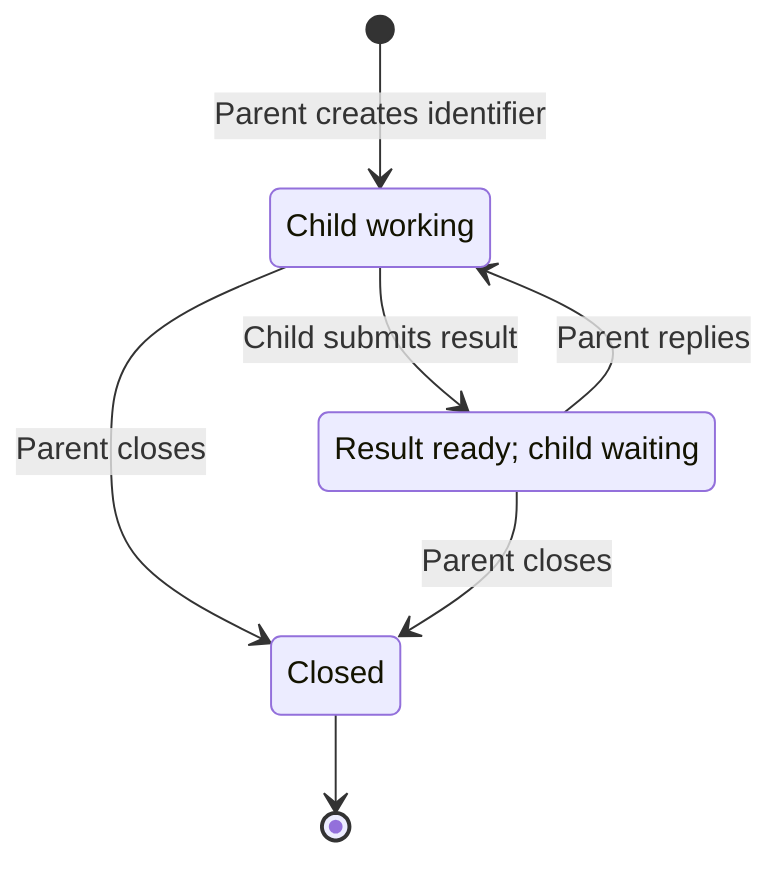

# Sendy

**Status: interface specification. Implementation is a separate change.**

Sendy is an idea for keeping parent-child AI workflows disciplined through a small
local message-passing utility. Agents, especially smaller models, can be
rambunctious: they struggle with complex skills and workflows, make unnecessary
tool calls, and explore beyond their assigned work when they should simply wait.

Sendy establishes clear bounds on how parents and children communicate. A parent
can progressively disclose work, giving each child just its next unit of work.
The child completes it, submits its result, and stays blocked inside that tool
call until the parent provides the next instruction. The parent can collect
results from several children, reply to each without blocking, and then wait for
their next results. Blocking makes waiting part of the mechanism, reducing the
opportunity for unnecessary activity between assignments.

The interface deliberately uses ordinary command arguments, stdin, stdout, and
exit codes. There is very little protocol to learn, so even smaller models can
follow the same simple cycle: do the assigned work, submit it, and wait for what
comes next.

All Sendy design and implementation work belongs in this folder. The planned
implementation is Go with embedded SQLite through `modernc.org/sqlite`. There is
no separate database installation, broker service, or database configuration in
the agent interface.

## Interface at a glance

```text
sendy create COUNT
sendy submit ID < result.txt
sendy submit ID --template NAME [--set KEY=VALUE ...]
sendy reply ID < instruction.txt
sendy reply ID --template NAME [--set KEY=VALUE ...]
sendy wait ID [ID ...] --timeout MINUTES
sendy close ID [ID ...]
sendy template render NAME [--set KEY=VALUE ...]
sendy template validate
```

| Command | Returns when |
| --- | --- |
| `create` | The requested conversations have been created. |
| `submit` | The parent has replied or closed the conversation. There is no timeout. |
| `reply` | The instruction has been recorded for the child. It does not wait for the child. |
| `wait` | Every listed conversation has a result or is closed, or the timeout expires. |
| `close` | The listed conversations have been closed. It does not wait for children to exit. |
| `template render` | The completed template has been printed. It sends no message. |
| `template validate` | All project templates have been checked. It sends no message. |

Each identifier names one parent/child conversation. It is used for every round
of that conversation. Each child receives its own identifier; it needs no sibling
identifiers, sender name, receiver name, or round number. The command determines
the direction: the child submits results, and the parent replies with instructions.

## Message input

By default, `submit` and `reply` read their entire message from stdin through EOF
before changing conversation state. There is no message argument or input envelope.
Messages are UTF-8 text, preserved without trimming or adding a newline. Empty
messages are rejected; invalid UTF-8 is rejected before any message is recorded.

Alternatively, `--template NAME` supplies the message using a project template
and `--set` values. Template mode never reads stdin; do not pipe or redirect a
message into it. Stdin content is not merged with the rendered template. The
completed message has the same text requirements and blocking behavior as stdin
input. Template details and project setup are specified below.

Use an existing file whenever possible:

```bash
sendy submit k7 < result.json
sendy reply k7 < next-task.txt
```

For inline text, use a quoted heredoc:

```bash
sendy submit k7 <<'SENDY_MESSAGE'
{
  "summary": "It's ready",
  "example": "A \"quoted\" value",
  "cost": "$100"
}
SENDY_MESSAGE
```

The shell does not expand the body of this quoted heredoc. Choose a delimiter
that does not appear alone on a line in the message. JSON needs only its own JSON
syntax; the sender performs no additional escaping for Sendy. Sendy treats JSON,
code, and prose alike and does not parse message content.

## Commands

### `sendy create COUNT`

`COUNT` is a positive decimal integer. Create that many conversations and print
their identifiers on one line, separated by single spaces, with a final newline:

```text
k7 m2 p9
```

Identifiers are short lowercase ASCII letters and digits, unique within the
local Sendy store. They may grow as needed; their length is not fixed and they
are not globally unique. An identifier is never reassigned within that store,
including after closure, so a late child cannot address a newer conversation.

Creation returns immediately after recording the conversations. It does not
start children or wait for them. Each new conversation expects a child result;
the parent supplies the initial task through the system that launches the child.

### `sendy submit ID`

Read a result from stdin or render the selected template, record it for the parent,
and block. The result becomes available to `wait` as soon as it is recorded, even
though `submit` is still running.

When the parent replies, print the exact instruction on stdout and exit `0`.
The child performs that instruction and calls `submit` again with the same ID.
When the parent closes, print `sendy: conversation closed` on stderr, leave stdout
empty, and exit `2`. The child should then end its session.

There is no timeout argument, default timeout, or message expiry. A submission
can wait over a weekend or longer for human approval. The child does not choose
how long it waits. During normal operation, only a reply or closure releases it;
process interruption and operational failure are separate error conditions.

Only one child submission may be outstanding per conversation. Reject a second
submission without replacing the existing result or stealing a pending reply.

### `sendy reply ID`

Read an instruction from stdin or render the selected template, record it for the
outstanding submission, and return immediately with no stdout and exit `0`. Do not wait for the child to
receive it, start work, or submit its next result.

A reply is valid only when a child result is ready. Recording the reply retires
that result from future `wait` output and starts the next round. The instruction
remains associated with the particular blocked submission it answers.

The parent can reply to several children in separate calls, then call `wait`.
There is no batch-reply operation and no queue of unsolicited instructions.

### `sendy wait ID [ID ...] --timeout MINUTES`

Wait for all listed conversations. `MINUTES` is a required positive decimal
integer, measured as elapsed time from the start of the wait. There is no default.
Identifiers must be distinct; their order determines the order of output entries.

A conversation is satisfied when its current result is ready or it is closed.
If all are already satisfied, return immediately. Otherwise wait until all are
satisfied or the deadline is reached. At the deadline, return a snapshot of the
current states. If all are satisfied in that snapshot, the status is `ready`;
otherwise it is `timeout`.

Print one JSON object followed by a newline, and exit `0` for either status:

```json
{
  "status": "timeout",
  "results": [
    {"id": "k7", "message": "First result"},
    {"id": "m2", "message": "{\"passed\":true}"}
  ],
  "pending": ["p9"],
  "closed": []
}
```

All four fields are always present. Every requested ID occurs exactly once, in
`results`, `pending`, or `closed`. Each array preserves request order. `status`
is `ready` exactly when `pending` is empty. JSON whitespace is not significant.
Sendy serializes and escapes the messages; senders do not construct this envelope.
Decoding a `message` string recovers the original submitted text.

Waiting does not consume results or change conversation state. Results that
arrive before the wait count. Waiting again returns the same ready results until
the parent replies or closes. After a reply, that child's previous result cannot
satisfy a new wait.

A timeout is a normal wake-up, not a failure or cancellation. It does not terminate
the parent session, expire identifiers, discard results, or release children from
`submit`. The parent can process available results, wait again, check on pending
children through its agent session system, or close conversations it no longer needs.

Sendy does not interrupt a working child to ask for status. A child receives a
Sendy instruction when it is blocked in `submit`. Communication with a child that
has not submitted yet uses the existing agent session system.

### `sendy close ID [ID ...]`

Close the listed conversations, return no stdout, and exit `0`. Identifiers must
be distinct. Validate the whole list before changing anything; an unknown ID
fails the command without closing any conversations. Closing an already closed
conversation succeeds. The closure of a valid list is atomic.

Closure is terminal. It releases outstanding submissions with the closed outcome,
makes `wait` report those IDs as closed, and rejects future submissions and replies.
A previously ready result is no longer returned by `wait` after closure.

Closing does not kill a child process or interrupt work outside Sendy. A working
child discovers closure if it later calls `submit`. Closing is optional cleanup:
an agent session system may simply abandon children instead. Conversations do not
expire automatically because abandoned work and legitimate long waits cannot be
distinguished reliably.

## Templates

Templates let teams write a standard prompt once. An agent supplies its name and
the changing values, and Sendy assembles the full message locally. The sending
model does not have to regenerate the fixed prompt; the receiving model still
reads the completed message. Rendering is an input mechanism and adds no states
to the conversation protocol.

### Project files are the registration

Run template commands and template-based submissions or replies from the project
root. Sendy looks only in `.sendy/templates/` under the current working directory.
It does not search parent directories or fall back to a global template registry.
The shared conversation store remains independent of working directory.

Each direct child file named `NAME.txt` defines template `NAME`. Names contain
lowercase ASCII letters, digits, hyphens, or underscores and start with a letter
or digit. Template names are case-sensitive. Other files and subdirectories are
not templates. There is no separate `template add` or registration command:
checking a file into this directory makes it available to the project.

For example, `.sendy/templates/review.txt` could contain:

```text
You are reviewing {{.filename}}.
Your reviewer name is {{.name}}.

Check correctness, identify missing cases, and explain your findings.
```

Use Go's standard [`text/template`](https://pkg.go.dev/text/template) syntax,
restricted to plain text and simple named substitutions such as `{{.filename}}`.
Whitespace inside the delimiters, as in `{{ .filename }}`, is allowed. Field names
match `[A-Za-z_][A-Za-z0-9_]*` and are case-sensitive. Loops, conditionals, nested
fields, functions, includes, and other template actions are rejected. This keeps
the required fields explicit without a second schema or a new template language.

All fields are required. A field used several times needs only one value. Values
are strings, inserted literally without recursive template evaluation, shell
execution, or automatic JSON escaping. Use stdin with an already serialized file
for arbitrary JSON messages; text templates do not make arbitrary inserted values
JSON-safe.

### Sending with a template

```bash
sendy reply k7 --template review --set filename=server.go --set name=Alice
sendy submit m2 --template completion --set filename=report.md
```

The second example assumes the project also supplies `completion.txt`, with a
`{{.filename}}` field. Template names and their fields belong to the project;
they are not built into Sendy.

`--template` occurs once. `--set` is repeatable and valid only with template mode
or `template render`. Split each `KEY=VALUE` at the first equals sign. Duplicate
keys, malformed assignments, and invalid field names are errors. Empty values
are permitted when explicitly supplied as `--set name=`; omitted fields are not.
There are no automatic fields, including the conversation ID. If a prompt needs
an ID, give it a placeholder and pass the value explicitly.

Use ordinary shell quoting for a value with spaces, for example
`--set 'filename=design notes.md'`. This only quotes the small changing value;
the agent does not reproduce or escape the whole template. Values containing
additional equals signs are preserved after the first one.

Sendy loads one snapshot of the template, validates the fields, and renders the
entire message in memory before recording anything. Subsequent template edits
cannot change a message already submitted or replied. Rendering failures return
immediately; they never enter the blocking part of `submit`.

### Errors that let an agent correct itself

Infer expected fields from the template's placeholders. Compare them with all
supplied keys before rendering and report missing, unexpected, and duplicate
fields together, followed by the complete expected field list. Lists are sorted
and use `(none)` when empty. Do not stop at the first missing field.

For `review` with `--set filenmae=server.go --set name=Alice`:

```text
sendy: template "review" could not be rendered.
Missing fields: filename
Unexpected fields: filenmae
Duplicate fields: (none)
Expected fields: filename, name
No message was sent.
```

Print diagnostics on stderr, leave stdout empty, exit `1`, and leave conversation
state unchanged. The agent can fix its arguments and retry. For `template render`,
the final line instead says `No output was produced.`

An unknown template error names the requested template, the searched directory,
and the available template names. An invalid template error names the file and
the location and reason for the invalid syntax or unsupported action. A missing
template directory error reports the expected path and tells the agent to run
from the project root. These errors likewise occur before any message is sent.

### `sendy template render NAME [--set KEY=VALUE ...]`

Render using the same field validation as `submit` and `reply`, print the exact
completed text on stdout without adding a newline, and exit `0`. This command
does not create or change a conversation and does not wait for any agent.

```bash
sendy template render review --set filename=server.go --set name=Alice > prompt.txt
```

This supports initial child prompts when the launching system accepts a prompt
file or can pass its contents programmatically. If the model must copy the file
back into a launch tool argument, that copying still generates output tokens.
Sendy itself does not launch children.

### `sendy template validate`

Check every project template's name, UTF-8 encoding, nonempty source, and allowed
syntax. Validate names for all direct `.txt` files, including invalid names.
Collect file errors rather than stopping after the first invalid template.
This command takes no field values and does not attempt to send a message.

On success, leave stdout empty and exit `0`. On failure, leave stdout empty,
report diagnostics on stderr, and exit `1`. A missing `.sendy/templates/` directory
is an error; an existing empty directory is valid for projects without templates.
The command does not populate a database registry or change conversations.

## Including Sendy in your project

The project owns the executable version, setup, and templates. Engineers do not
need a global Sendy installation, and skills do not register templates on each
run. Add these files to the consuming project:

| Path | Purpose |
| --- | --- |
| `Makefile` | Provides a `sendy` setup target. |
| `tools/sendy.version` | Pins an exact released Sendy version. |
| `.sendy/templates/*.txt` | Version-controlled prompts, available by filename. |
| `.tools/bin/sendy` | Generated executable; exclude it from Git. |

Projects that keep templates beside their skills can copy them into
`.sendy/templates/` during setup before validation, but keeping the authoritative
files directly in that directory is the simplest arrangement.

### Project setup with Make

The following is the intended Make integration after Sendy is implemented and
released. The command package path is planned, not an available release today.
The implementation change must publish an installable module and document its
release versions. Put a real released version in `tools/sendy.version`; do not use
`latest`. Recipe indentation below uses tabs.

```makefile
SENDY_VERSION := $(strip $(shell cat tools/sendy.version))
SENDY_PACKAGE := github.com/j-tyler/ai-toolbox/ideas/sendy/cmd/sendy

.PHONY: sendy
sendy: .tools/bin/sendy
	./.tools/bin/sendy template validate

.tools/bin/sendy: tools/sendy.version Makefile
	mkdir -p "$(CURDIR)/.tools/bin"
	GOBIN="$(CURDIR)/.tools/bin" go install "$(SENDY_PACKAGE)@$(SENDY_VERSION)"
```

`make sendy` installs the pinned executable if missing or if its version file or
Makefile changed, then validates the current templates. Repeated calls skip the
installation when the executable is current. The lightweight validation runs
each time, so template edits, additions, deletions, and branch switches do not
depend on a stale registration stamp. Template changes require no binary rebuild.
Make's file prerequisites and phony targets support this setup pattern.
[GNU Make documentation](https://www.gnu.org/software/make/manual/make.html)

This source-build path requires Make, a compatible Go toolchain, and access to
download the pinned module and its dependencies when they are not cached. Go's
versioned `go install` can install a command into `GOBIN` independently of the
consuming project's language or `go.mod`.
[Go installation documentation](https://go.dev/ref/mod#go-install)

For teams without Go, a distribution alternative is for the setup target to
download a pinned release binary for the local operating system and architecture,
verify its published checksum, and place it at the same `.tools/bin/sendy` path.
Release binaries and their download recipe belong to the implementation and
distribution change. Skills use the same interface with either installation path.

Templates are thus pre-registered by being project files, and checked during
build/setup. There are no repeated `template add` calls or global registrations.
Pulling or switching branches selects the corresponding templates; different
projects may use the same template names. Setup never clears the shared Sendy
store or changes pending results, replies, or blocked submissions.

### Use from skills and tests

A skill's setup instruction can be:

> From the project root, run `make sendy`. Continue only if it succeeds. Use
> `.tools/bin/sendy` for communication; this project's templates are already
> available. Keep blocking calls in the foreground.

Then its message call can be as short as:

```bash
.tools/bin/sendy reply k7 --template review --set filename=server.go --set name=Alice
```

Have relevant build and test targets depend on `sendy`, for example
`test: sendy`, before running their existing recipes. Use `make sendy` as the
single setup target; `make build sendy` requests two independent targets and
does not establish an ordering dependency between them.

Tests that exercise message passing should create their own conversation IDs
and close them afterward. They must not reset the shared local store. Template
setup and validation alone do not create any conversations.

## Conversation state machine



These are protocol states, not child health indicators. A newly created child,
a running child, and a child that failed before submitting all appear as
`Child working`. `wait`, including a timeout, does not change these states.

| State | `submit` | `reply` | What `wait` sees |
| --- | --- | --- | --- |
| Child working | Record result and block, provided no prior submission is still outstanding. | Error: no result to reply to. | Pending. |
| Result ready; child waiting | Error: submission already outstanding. | Record instruction; move to child working. | Current result. |
| Closed | Return the closed outcome without recording input. | Error: conversation closed. | Closed. |

Internally, a reply must stay bound to the submission and round it answers, even
while the conversation has advanced to `Child working`. A new submission cannot
overtake the prior one while its response is still pending delivery. These are
implementation bookkeeping requirements, not additional agent-visible states.

If reply and close race, a reply already committed for a submission remains that
submission's response; close cannot retract it. The conversation is nevertheless
closed to subsequent work. If close commits first, reply fails and the submission
receives the closed outcome. A committed submission racing with close is likewise
serialized; no result or reply may revive a closed conversation.

## Parent and child workflow

The parent creates three identifiers:

```bash
sendy create 3
```

Suppose the output is `k7 m2 p9`. It launches three children through its existing
agent session system, each with a task and an instruction like this:

> When you finish, submit your result with `sendy submit k7`, reading the result
> from stdin. Keep the tool call in the foreground and wait for it to return.
> Its stdout is your next instruction. Perform that work and submit again using
> the same ID. If it exits with code 2 and reports closure, end your session.

The parent then waits:

```bash
sendy wait k7 m2 p9 --timeout 60
```

Each child independently submits, for example:

```bash
sendy submit k7 < result.json
```

After reviewing the results, the parent gives two children more work and closes
the third conversation:

```bash
sendy reply k7 < follow-up-k7.txt
sendy reply m2 < follow-up-m2.txt
sendy close p9
sendy wait k7 m2 --timeout 60
```

Each reply returns immediately. The children receive instructions as the output
of their existing `submit` calls. The parent's next wait waits for the new results.
If a wait times out, the parent can act on its partial results and pending list;
it is free to run another wait for any needed combination of IDs.

## Errors, interruption, and local execution

Successful commands use exit `0`, including a timed-out `wait`. A closed `submit`
uses exit `2`. Invalid arguments, unknown IDs, invalid state transitions, invalid
input, and operational failures use exit `1`, with a concise explanation on stderr
and no normal output on stdout. Unknown or closed IDs should be detected before
waiting for stdin where possible, with state checked again atomically at commit.
Revalidate after reading input because the parent may close while input is read.

Invalid requests leave existing state unchanged. Operational failures or process
interruption can happen after a message commits; they do not imply rollback. An
interrupted `wait` is safe to repeat because it never consumes messages. Do not
blindly retry an interrupted `submit` or `reply`: its effect may already be recorded.

Transparent reconnection and retry deduplication are outside this first version.
If a child or its blocked submission is lost, the parent can close that
conversation and create a new one for a replacement. Durable messages alone do
not reconnect agent sessions. Process signals retain their ordinary operating
system behavior; Sendy does not make blocked processes unkillable.

All processes for the same local operating-system user share one persistent
Sendy store, independent of working directory. Placement is chosen automatically
by the implementation using a standard per-user application data location. There
are no database paths, transport choices, or storage tuning flags in the protocol.
State transitions are transactional, and waits never hold a database write lock.
The blocked process must observe replies from other processes without a daemon.

One parent coordinates each conversation and one child submits to it. Identifiers
route messages; they are not authentication credentials. Concurrent operations on
different conversations are supported. Competing parent sessions controlling the
same conversation are outside the intended workflow.

## What makes the blocking effective

The agent's tool runner must keep `submit` and `wait` calls in the foreground and
withhold agent continuation until they complete. Background task handles, unrelated
parallel tool calls, or runner deadlines can otherwise return control to the model
while Sendy is still waiting. Long waits require a runner that supports them.

Sendy cannot prevent an agent from doing extra work before `submit`, after `reply`,
or after a timed-out `wait`. Agent instructions must direct the child to submit
when finished and the parent to wait after dispatching work. The deliberate
parent wake-up on timeout provides a chance to inspect or adjust the workflow.

There are no additional queues, subscriptions, unsolicited status messages,
child-controlled timeouts, launch commands, or extensibility mechanisms in this
interface. The first implementation should implement this contract directly.
