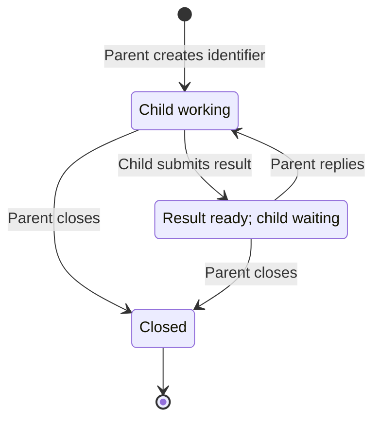

# Sendy

**Status: interface specification. Implementation is a separate change.**

Sendy is a local command-line utility for agents that need to take turns. A child
submits its result and stays inside that tool call until its parent gives it more
work. A parent can collect results from several children, reply to each without
blocking, and then wait for their next results.

The purpose of blocking is to prevent an agent from continuing to act while it
should be waiting. Instructions alone are often insufficient, especially for
smaller models. Sendy uses ordinary command arguments, stdin, stdout, and exit
codes so those models have very little protocol to learn.

All Sendy design and implementation work belongs in this folder. The planned
implementation is Go with embedded SQLite through `modernc.org/sqlite`. There is
no separate database installation, broker service, or database configuration in
the agent interface.

## Interface at a glance

```text
sendy create COUNT
sendy submit ID < result.txt
sendy reply ID < instruction.txt
sendy wait ID [ID ...] --timeout MINUTES
sendy close ID [ID ...]
```

| Command | Returns when |
| --- | --- |
| `create` | The requested conversations have been created. |
| `submit` | The parent has replied or closed the conversation. There is no timeout. |
| `reply` | The instruction has been recorded for the child. It does not wait for the child. |
| `wait` | Every listed conversation has a result or is closed, or the timeout expires. |
| `close` | The listed conversations have been closed. It does not wait for children to exit. |

Each identifier names one parent/child conversation. It is used for every round
of that conversation. Each child receives its own identifier; it needs no sibling
identifiers, sender name, receiver name, or round number. The command determines
the direction: the child submits results, and the parent replies with instructions.

## Message input

`submit` and `reply` read their entire message from stdin through EOF before
changing conversation state. There is no message argument and no input envelope.
Messages are UTF-8 text, preserved without trimming or adding a newline. Empty
messages are rejected; invalid UTF-8 is rejected before any message is recorded.

Use an existing file whenever possible:

```bash
sendy submit k7 < result.json
sendy reply k7 < next-task.txt
```

For inline text, use a quoted heredoc:

```bash
sendy submit k7 <<'SENDY_MESSAGE'
{
  "summary": "It's ready",
  "example": "A \"quoted\" value",
  "cost": "$100"
}
SENDY_MESSAGE
```

The shell does not expand the body of this quoted heredoc. Choose a delimiter
that does not appear alone on a line in the message. JSON needs only its own JSON
syntax; the sender performs no additional escaping for Sendy. Sendy treats JSON,
code, and prose alike and does not parse message content.

## Commands

### `sendy create COUNT`

`COUNT` is a positive decimal integer. Create that many conversations and print
their identifiers on one line, separated by single spaces, with a final newline:

```text
k7 m2 p9
```

Identifiers are short lowercase ASCII letters and digits, unique within the
local Sendy store. They may grow as needed; their length is not fixed and they
are not globally unique. An identifier is never reassigned within that store,
including after closure, so a late child cannot address a newer conversation.

Creation returns immediately after recording the conversations. It does not
start children or wait for them. Each new conversation expects a child result;
the parent supplies the initial task through the system that launches the child.

### `sendy submit ID`

Read a result from stdin, record it for the parent, and block. The result becomes
available to `wait` as soon as it is recorded, even though `submit` is still running.

When the parent replies, print the exact instruction on stdout and exit `0`.
The child performs that instruction and calls `submit` again with the same ID.
When the parent closes, print `sendy: conversation closed` on stderr, leave stdout
empty, and exit `2`. The child should then end its session.

There is no timeout argument, default timeout, or message expiry. A submission
can wait over a weekend or longer for human approval. The child does not choose
how long it waits. During normal operation, only a reply or closure releases it;
process interruption and operational failure are separate error conditions.

Only one child submission may be outstanding per conversation. Reject a second
submission without replacing the existing result or stealing a pending reply.

### `sendy reply ID`

Read an instruction from stdin, record it for the outstanding submission, and
return immediately with no stdout and exit `0`. Do not wait for the child to
receive it, start work, or submit its next result.

A reply is valid only when a child result is ready. Recording the reply retires
that result from future `wait` output and starts the next round. The instruction
remains associated with the particular blocked submission it answers.

The parent can reply to several children in separate calls, then call `wait`.
There is no batch-reply operation and no queue of unsolicited instructions.

### `sendy wait ID [ID ...] --timeout MINUTES`

Wait for all listed conversations. `MINUTES` is a required positive decimal
integer, measured as elapsed time from the start of the wait. There is no default.
Identifiers must be distinct; their order determines the order of output entries.

A conversation is satisfied when its current result is ready or it is closed.
If all are already satisfied, return immediately. Otherwise wait until all are
satisfied or the deadline is reached. At the deadline, return a snapshot of the
current states. If all are satisfied in that snapshot, the status is `ready`;
otherwise it is `timeout`.

Print one JSON object followed by a newline, and exit `0` for either status:

```json
{
  "status": "timeout",
  "results": [
    {"id": "k7", "message": "First result"},
    {"id": "m2", "message": "{\"passed\":true}"}
  ],
  "pending": ["p9"],
  "closed": []
}
```

All four fields are always present. Every requested ID occurs exactly once, in
`results`, `pending`, or `closed`. Each array preserves request order. `status`
is `ready` exactly when `pending` is empty. JSON whitespace is not significant.
Sendy serializes and escapes the messages; senders do not construct this envelope.
Decoding a `message` string recovers the original submitted text.

Waiting does not consume results or change conversation state. Results that
arrive before the wait count. Waiting again returns the same ready results until
the parent replies or closes. After a reply, that child's previous result cannot
satisfy a new wait.

A timeout is a normal wake-up, not a failure or cancellation. It does not terminate
the parent session, expire identifiers, discard results, or release children from
`submit`. The parent can process available results, wait again, check on pending
children through its agent session system, or close conversations it no longer needs.

Sendy does not interrupt a working child to ask for status. A child receives a
Sendy instruction when it is blocked in `submit`. Communication with a child that
has not submitted yet uses the existing agent session system.

### `sendy close ID [ID ...]`

Close the listed conversations, return no stdout, and exit `0`. Identifiers must
be distinct. Validate the whole list before changing anything; an unknown ID
fails the command without closing any conversations. Closing an already closed
conversation succeeds. The closure of a valid list is atomic.

Closure is terminal. It releases outstanding submissions with the closed outcome,
makes `wait` report those IDs as closed, and rejects future submissions and replies.
A previously ready result is no longer returned by `wait` after closure.

Closing does not kill a child process or interrupt work outside Sendy. A working
child discovers closure if it later calls `submit`. Closing is optional cleanup:
an agent session system may simply abandon children instead. Conversations do not
expire automatically because abandoned work and legitimate long waits cannot be
distinguished reliably.

## Conversation state machine



These are protocol states, not child health indicators. A newly created child,
a running child, and a child that failed before submitting all appear as
`Child working`. `wait`, including a timeout, does not change these states.

| State | `submit` | `reply` | What `wait` sees |
| --- | --- | --- | --- |
| Child working | Record result and block, provided no prior submission is still outstanding. | Error: no result to reply to. | Pending. |
| Result ready; child waiting | Error: submission already outstanding. | Record instruction; move to child working. | Current result. |
| Closed | Return the closed outcome without recording input. | Error: conversation closed. | Closed. |

Internally, a reply must stay bound to the submission and round it answers, even
while the conversation has advanced to `Child working`. A new submission cannot
overtake the prior one while its response is still pending delivery. These are
implementation bookkeeping requirements, not additional agent-visible states.

If reply and close race, a reply already committed for a submission remains that
submission's response; close cannot retract it. The conversation is nevertheless
closed to subsequent work. If close commits first, reply fails and the submission
receives the closed outcome. A committed submission racing with close is likewise
serialized; no result or reply may revive a closed conversation.

## Parent and child workflow

The parent creates three identifiers:

```bash
sendy create 3
```

Suppose the output is `k7 m2 p9`. It launches three children through its existing
agent session system, each with a task and an instruction like this:

> When you finish, submit your result with `sendy submit k7`, reading the result
> from stdin. Keep the tool call in the foreground and wait for it to return.
> Its stdout is your next instruction. Perform that work and submit again using
> the same ID. If it exits with code 2 and reports closure, end your session.

The parent then waits:

```bash
sendy wait k7 m2 p9 --timeout 60
```

Each child independently submits, for example:

```bash
sendy submit k7 < result.json
```

After reviewing the results, the parent gives two children more work and closes
the third conversation:

```bash
sendy reply k7 < follow-up-k7.txt
sendy reply m2 < follow-up-m2.txt
sendy close p9
sendy wait k7 m2 --timeout 60
```

Each reply returns immediately. The children receive instructions as the output
of their existing `submit` calls. The parent's next wait waits for the new results.
If a wait times out, the parent can act on its partial results and pending list;
it is free to run another wait for any needed combination of IDs.

## Errors, interruption, and local execution

Successful commands use exit `0`, including a timed-out `wait`. A closed `submit`
uses exit `2`. Invalid arguments, unknown IDs, invalid state transitions, invalid
input, and operational failures use exit `1`, with a concise explanation on stderr
and no normal output on stdout. Unknown or closed IDs should be detected before
waiting for stdin where possible, with state checked again atomically at commit.
Revalidate after reading input because the parent may close while input is read.

Invalid requests leave existing state unchanged. Operational failures or process
interruption can happen after a message commits; they do not imply rollback. An
interrupted `wait` is safe to repeat because it never consumes messages. Do not
blindly retry an interrupted `submit` or `reply`: its effect may already be recorded.

Transparent reconnection and retry deduplication are outside this first version.
If a child or its blocked submission is lost, the parent can close that
conversation and create a new one for a replacement. Durable messages alone do
not reconnect agent sessions. Process signals retain their ordinary operating
system behavior; Sendy does not make blocked processes unkillable.

All processes for the same local operating-system user share one persistent
Sendy store, independent of working directory. Placement is chosen automatically
by the implementation using a standard per-user application data location. There
are no database paths, transport choices, or storage tuning flags in the protocol.
State transitions are transactional, and waits never hold a database write lock.
The blocked process must observe replies from other processes without a daemon.

One parent coordinates each conversation and one child submits to it. Identifiers
route messages; they are not authentication credentials. Concurrent operations on
different conversations are supported. Competing parent sessions controlling the
same conversation are outside the intended workflow.

## What makes the blocking effective

The agent's tool runner must keep `submit` and `wait` calls in the foreground and
withhold agent continuation until they complete. Background task handles, unrelated
parallel tool calls, or runner deadlines can otherwise return control to the model
while Sendy is still waiting. Long waits require a runner that supports them.

Sendy cannot prevent an agent from doing extra work before `submit`, after `reply`,
or after a timed-out `wait`. Agent instructions must direct the child to submit
when finished and the parent to wait after dispatching work. The deliberate
parent wake-up on timeout provides a chance to inspect or adjust the workflow.

There are no additional queues, subscriptions, unsolicited status messages,
child-controlled timeouts, launch commands, or extensibility mechanisms in this
interface. The first implementation should implement this contract directly.
