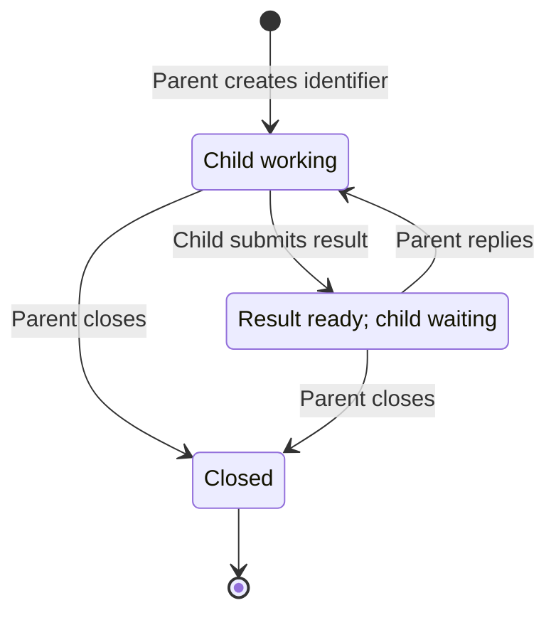

# Sendy

**Status: implemented; source distribution available in this directory.**

## What Sendy is

Sendy is a small local command-line message-passing utility for parent-child AI
workflows. It establishes a simple communication boundary: a child completes its
assigned work, submits its result, and intentionally stays blocked inside that
command until its parent replies with the next instruction or closes the
conversation. A parent can collect results from several children, reply to each
without blocking, and then wait for their next results.

## Why we are building it

Agents, especially smaller models, can be rambunctious. They may struggle with
complex skills and workflows, make unnecessary tool calls, or keep exploring when
all they should do is wait for the next portion of their work. Sendy lets a parent
progressively disclose one unit of work at a time and makes waiting part of the
communication mechanism. The child follows a small cycle: do the assigned work,
submit it, and wait for what comes next.

Sendy also gives skills a harness-agnostic communication protocol. A skill should
not have to depend on each harness's particular agent-messaging API, coordination
conventions, or how well those mechanisms enforce waiting. Instead, parents and
children communicate through the same local commands. Sendy's intentional blocking
is central to that contract: submitting a result also waits for the next instruction,
so the skill does not need a harness-specific exchange of send and receive calls.

Ordinary command arguments, stdin, stdout, and exit codes keep this protocol easy
for smaller models to use. The same communication instructions can be reused
across harnesses that support local commands and honor blocking tool calls. That
last requirement is essential to achieving the intended behavior.

## What makes the blocking effective

Your harness must support local commands and keep the agent waiting while
`submit` or `wait` runs. Run these calls in the foreground. A harness that
backgrounds the command or returns control to the model early defeats the intended
blocking behavior. Long waits require a harness that supports them.

The harness still launches children. Sendy supplies their message exchange and
waiting behavior. Skills should direct children to submit when finished and
parents to wait after assigning work.

## Interface at a glance

Examples use the project-local executable from the project root after
[project setup](#including-sendy-in-your-project).

```text
.tools/bin/sendy create COUNT
.tools/bin/sendy submit ID < result.txt
.tools/bin/sendy submit ID --template NAME [--set KEY=VALUE ...]
.tools/bin/sendy reply ID < instruction.txt
.tools/bin/sendy reply ID --template NAME [--set KEY=VALUE ...]
.tools/bin/sendy wait ID [ID ...] --timeout MINUTES
.tools/bin/sendy close ID [ID ...]
.tools/bin/sendy template render NAME [--set KEY=VALUE ...]
.tools/bin/sendy template fields NAME
.tools/bin/sendy template validate
```

| Command | Returns when |
| --- | --- |
| `create` | The requested conversations have been created. |
| `submit` | The parent has replied or closed the conversation. There is no timeout. |
| `reply` | The instruction has been recorded for the child. It does not wait for the child. |
| `wait` | Every listed conversation has a result or is closed, or the timeout expires. |
| `close` | The listed conversations have been closed. It does not wait for children to exit. |
| `template render` | The completed template has been printed. It sends no message. |
| `template fields` | The template's required field names have been printed as a JSON array. |
| `template validate` | All project templates have been checked. It sends no message. |

Each identifier names one parent/child conversation. It is used for every round
of that conversation. Each child receives its own identifier; it needs no sibling
identifiers, sender name, receiver name, or round number. The command determines
the direction: the child submits results, and the parent replies with instructions.

## A simple example

With Sendy already available in the project, the parent creates a conversation:

```bash
.tools/bin/sendy create 1
```

Suppose the returned ID is `k07`. The parent starts a child session through its
harness with this prompt:

> Review the staged files. Submit your review using `.tools/bin/sendy submit k07`,
> with the review text on stdin.

The parent waits for the result:

```bash
.tools/bin/sendy wait k07 --timeout 60
```

When the child submits its review, the parent receives it and the child's
`submit` call stays blocked. The parent can review the answer and send a follow-up
through `reply`; that instruction becomes the output of the child's waiting call.
The child needs only its task and the command for submitting its result.

## Message input

By default, `submit` and `reply` read their entire message from stdin through EOF
before changing conversation state. There is no message argument or input envelope.
Messages are UTF-8 text, preserved without trimming or adding a newline. Empty
messages are rejected; invalid UTF-8 is rejected before any message is recorded.

Alternatively, `--template NAME` supplies the message using a project template
and `--set` values. Template mode never reads stdin; do not pipe or redirect a
message into it. Stdin content is not merged with the rendered template. The
completed message has the same text requirements and blocking behavior as stdin
input. Template details and project setup are specified below.

Use an existing file whenever possible:

```bash
.tools/bin/sendy submit k07 < result.json
.tools/bin/sendy reply k07 < next-task.txt
```

For inline text, use a quoted heredoc:

```bash
.tools/bin/sendy submit k07 <<'SENDY_MESSAGE'
{
  "summary": "It's ready",
  "example": "A \"quoted\" value",
  "cost": "$100"
}
SENDY_MESSAGE
```

The shell does not expand the body of this quoted heredoc. Choose a delimiter
that does not appear alone on a line in the message. JSON needs only its own JSON
syntax; the sender performs no additional escaping for Sendy. Sendy treats JSON,
code, and prose alike and does not parse message content.

## Commands

### `.tools/bin/sendy create COUNT`

`COUNT` is a positive decimal integer. Create that many conversations and print
their identifiers on one line, separated by single spaces, with a final newline:

```text
k07 m02 p09
```

Identifiers are one lowercase ASCII letter followed by exactly two digits,
such as `k07`, `m02`, or `p09`. Leading zeros are part of the ID. This consistent
shape makes IDs easy to recognize in prompts and responses. IDs are unique locally;
keep using the same ID for successive assignments to a child. Closed IDs cannot
be reused for new conversations.

This format provides 2,600 possible IDs. If there are not enough unused IDs for
the requested count, `create` returns an error without creating conversations.

Creation returns immediately after recording the conversations. It does not
start children or wait for them. Each new conversation expects a child result;
the parent supplies the initial task through the system that launches the child.

### `.tools/bin/sendy submit ID`

Read a result from stdin or render the selected template, record it for the parent,
and block. The result becomes available to `wait` as soon as it is recorded, even
though `submit` is still running.

When the parent replies, print the exact instruction on stdout and exit `0`.
The child performs that instruction and calls `submit` again with the same ID.
If the conversation closes before a reply is accepted, `submit` prints
`sendy: conversation closed` on stderr, leaves stdout empty, and exits `2`.
Calling `submit` on an already closed conversation also returns exit `2`.
The child should then end its session.

There is no timeout argument, default timeout, or message expiry. A submission
can wait over a weekend or longer for human approval. The child does not choose
how long it waits. During normal operation, only a reply or closure releases it;
process interruption and operational failure are separate error conditions.

Only one child submission may be outstanding per conversation. A second
submission returns an error and leaves the first one untouched.

### `.tools/bin/sendy reply ID`

Read an instruction from stdin or render the selected template, record it for the
outstanding submission, and return immediately with no stdout and exit `0`.
It does not wait for the child to receive it or finish the next task.

A reply is valid only when a child result is ready. Recording the reply retires
that result from future `wait` output and starts the next round. The instruction
remains associated with the particular blocked submission it answers.

The parent can reply to several children in separate calls, then call `wait`.
There is no batch-reply operation and no queue of unsolicited instructions.

### `.tools/bin/sendy wait ID [ID ...] --timeout MINUTES`

Wait for all listed conversations. `MINUTES` is a required positive decimal
integer, measured as elapsed time from the start of the wait. There is no default.
Identifiers must be distinct; their order determines the order of output entries.

A conversation is satisfied when its current result is ready or it is closed.
If all are already satisfied, return immediately. Otherwise wait until all are
satisfied or the deadline is reached. At the deadline, return a snapshot of the
current states. If all are satisfied in that snapshot, the status is `ready`;
otherwise it is `timeout`.

Print one JSON object followed by a newline, and exit `0` for either status:

```json
{
  "status": "timeout",
  "results": [
    {"id": "k07", "message": "First result"},
    {"id": "m02", "message": "{\"passed\":true}"}
  ],
  "pending": ["p09"],
  "closed": []
}
```

All four fields are always present. Every requested ID occurs exactly once, in
`results`, `pending`, or `closed`. Each array preserves request order. `status`
is `ready` exactly when `pending` is empty. JSON whitespace is not significant.
Sendy serializes and escapes the messages; senders do not construct this envelope.
Decoding a `message` string recovers the original submitted text.

Waiting does not consume results or change conversation state. Results that
arrive before the wait count. Waiting again returns the same ready results until
the parent replies or closes. After a reply, that child's previous result cannot
satisfy a new wait.

A timeout is a normal wake-up, not a failure or cancellation. It does not terminate
the parent session, expire identifiers, discard results, or release children from
`submit`. The parent can process available results, wait again, check on pending
children through its agent session system, or close conversations it no longer needs.

Sendy does not interrupt a working child to ask for status. A child receives a
Sendy instruction when it is blocked in `submit`. Communication with a child that
has not submitted yet uses the existing agent session system.

### `.tools/bin/sendy close ID [ID ...]`

Close the listed conversations, return no stdout, and exit `0`. Identifiers must
be distinct. An unknown ID fails the command without closing any conversations.
Closing an already closed conversation succeeds.

Closing releases a waiting child with exit `2`, unless Sendy has already accepted
a reply for that submission. Closing cannot retract an accepted reply; the child
still receives it. Subsequent `submit` calls return exit `2`, and subsequent
`reply` calls fail with exit `1`. `wait` reports the ID as closed instead of
returning its previous result.

Closing does not kill a child process or interrupt work outside Sendy. A working
child discovers closure if it later calls `submit`. Closing is optional cleanup:
an agent session system may simply abandon children instead. Conversations do not
expire automatically because abandoned work and legitimate long waits cannot be
distinguished reliably.

## How a conversation progresses



Waiting, including a timeout, does not change the conversation. A pending result
means the child has not submitted yet; it does not tell you whether the child is
healthy or making progress.

## Templates

Templates let teams write a standard prompt once. An agent supplies its name and
the changing values, and Sendy assembles the full message locally. The sending
model does not have to regenerate the fixed prompt; the receiving model still
reads the completed message. Using a template does not change when a command
blocks or returns.

### Project files are the registration

Run template commands and template-based submissions or replies from the project
root. Sendy looks only in `.sendy/templates/` under the current working directory.
It does not search parent directories or fall back to a global template registry.
The shared conversation store remains independent of working directory.

Each direct child regular file named `NAME.txt` defines template `NAME` (symlinks
to regular files are allowed). Special files such as FIFOs produce an error.
Names contain lowercase ASCII letters, digits, hyphens, or underscores and start with a letter
or digit. Template names are case-sensitive. Other files and subdirectories are
not templates. There is no separate `template add` or registration command:
checking a file into this directory makes it available to the project.

For example, `.sendy/templates/review.txt` could contain:

```text
You are reviewing {{.filename}}.
Your reviewer name is {{.name}}.

Check correctness, identify missing cases, and explain your findings.
```

Use Go's standard [`text/template`](https://pkg.go.dev/text/template) syntax,
restricted to plain text and simple named substitutions such as `{{.filename}}`.
Whitespace inside the delimiters, as in `{{ .filename }}`, is allowed. Field names
match `[A-Za-z_][A-Za-z0-9_]*` and are case-sensitive. Loops, conditionals, nested
fields, functions, includes, and other template actions are rejected. This keeps
the required fields explicit without a second schema or a new template language.

Templates may also contain only fixed text, with no placeholders or arguments.
For example, the supplied `staged-review` template can be used without `--set`:

```bash
.tools/bin/sendy template render staged-review
.tools/bin/sendy reply k07 --template staged-review
```

When a template has fields, all are required. A field used several times needs
only one value. Values are strings, inserted literally without recursive template
evaluation, shell execution, or automatic JSON escaping. Use stdin with an already serialized file
for arbitrary JSON messages; text templates do not make arbitrary inserted values
JSON-safe.

### Sending with a template

```bash
.tools/bin/sendy reply k07 --template review --set filename=server.go --set name=Alice
.tools/bin/sendy submit m02 --template completion --set filename=report.md
```

The second example assumes the project also supplies `completion.txt`, with a
`{{.filename}}` field. Template names and their fields belong to the project;
they are not built into Sendy.

`--template` occurs once. `--set` is repeatable and valid only with template mode
or `template render`. Split each `KEY=VALUE` at the first equals sign. Duplicate
keys, malformed assignments, and invalid field names are errors. Empty values
are permitted when explicitly supplied as `--set name=`; omitted fields are not.
There are no automatic fields, including the conversation ID. If a prompt needs
an ID, give it a placeholder and pass the value explicitly.

Use ordinary shell quoting for a value with spaces, for example
`--set 'filename=design notes.md'`. This only quotes the small changing value;
the agent does not reproduce or escape the whole template. Values containing
additional equals signs are preserved after the first one.

Template errors return immediately, before any message is sent or `submit` begins
waiting. Editing a template does not change messages already sent.

### Errors that let an agent correct itself

Sendy reports all missing, unexpected, and duplicate fields together, followed by
the fields the template expects. Template authors do not maintain a separate
field definition.

For `review` with `--set filenmae=server.go --set name=Alice`:

```text
sendy: template "review" could not be rendered.
Missing fields: filename
Unexpected fields: filenmae
Duplicate fields: (none)
Expected fields: filename, name
No message was sent.
```

Print diagnostics on stderr, leave stdout empty, exit `1`, and leave conversation
state unchanged. The agent can fix its arguments and retry. For `template render`
or `template fields`, the final line instead says `No output was produced.`

An unknown template error names the requested template, the searched directory,
and the available template names. An invalid template error names the file and
the location and reason for the invalid syntax or unsupported action. A missing
template directory error reports the expected path and tells the agent to run
from the project root. These errors likewise occur before any message is sent.

### `.tools/bin/sendy template render NAME [--set KEY=VALUE ...]`

Render using the same field validation as `submit` and `reply`, print the exact
completed text on stdout without adding a newline, and exit `0`. This command
does not create or change a conversation and does not wait for any agent.

```bash
.tools/bin/sendy template render review --set filename=server.go --set name=Alice > prompt.txt
```

This supports initial child prompts when the launching system accepts a prompt
file or can pass its contents programmatically. If the model must copy the file
back into a launch tool argument, that copying still generates output tokens.
Sendy itself does not launch children.

### `.tools/bin/sendy template fields NAME`

Find the values a template requires before rendering or sending it:

```bash
.tools/bin/sendy template fields review
```

Print the unique field names in alphabetical order as a JSON array followed by a
newline, and exit `0`. For the `review` example, the output is
`["filename","name"]`. A fixed-text template such as `staged-review` returns `[]`.
Field names keep their original case; uppercase letters sort before lowercase letters.

This command takes no options, reads no stdin, and does not create or change a
conversation. Run it from the project root, like other template commands. A
missing or invalid template produces the same template diagnostics on stderr as
`template render`, leaves stdout empty, and exits `1`.

### `.tools/bin/sendy template validate`

Check project templates for valid names and syntax and nonempty UTF-8 text.
Report all invalid files so you can correct them together. This command takes
no field values and sends no messages.

On success, leave stdout empty and exit `0`. On failure, leave stdout empty,
report diagnostics on stderr, and exit `1`. A missing `.sendy/templates/` directory
is an error; an existing empty directory is valid for projects without templates.
Normal project setup creates this directory when it is missing.

## Including Sendy in your project

The source distribution includes a setup helper, a version pin, example templates,
and a Makefile. From this directory, run `make sendy` to build the project-local
executable and validate the supplied templates, including the argument-free
`staged-review` prompt.

This initial version is `v0.1.0-dev`; no published release or prebuilt binary is
provided yet. Setup requires Go 1.25.8 or newer, `make`, `flock`, and `sha256sum`
(the helper currently targets Linux). Dependency downloads require network access
when they are not cached.

Setup builds with `CGO_ENABLED=0`, producing a Linux executable without a system
glibc dependency. It does not change an existing installation. For a manual build,
use `CGO_ENABLED=0 go build`. Race-detector tests still require cgo and a C compiler;
this test requirement does not enable cgo in the installed executable.

The project owns the Sendy version and templates. Engineers do not need a global
Sendy installation. Add these files to the consuming project:

| Path | Purpose |
| --- | --- |
| `Makefile` | Provides the `sendy` setup target below. |
| `tools/ensure-sendy` | Setup helper supplied with Sendy. |
| `tools/sendy.version` | Pins the exact Sendy source version. |
| `.sendy/templates/*.txt` | Version-controlled prompts, available by filename. |
| `.tools/bin/sendy` | Generated local executable; exclude it from Git. |

To set up another project with this source distribution, copy `tools/ensure-sendy`
and `tools/sendy.version` into its `tools/` directory and add the Makefile target
below. Copy or author the project's `.sendy/templates/*.txt` files, then run from
that project's root:

```bash
SENDY_SOURCE=/absolute/path/to/ai-toolbox/ideas/sendy make sendy
```

`SENDY_SOURCE` selects the source checkout only for the first build. Its version
must match the project pin. Subsequent setup calls reuse the verified installation
without needing that checkout or Go. Keep `.tools/` out of version control.
For a future published release, pin its exact version, never `latest`; the helper
can install the matching Go module when `SENDY_SOURCE` is omitted.

Recipe indentation in this Makefile uses tabs:

```makefile
.PHONY: sendy
sendy:
	./tools/ensure-sendy
```

`make sendy` ensures Sendy is available and checks templates. It reuses an existing
installation of the pinned version without rebuilding or replacing it. It is safe
for multiple sessions to run setup concurrently, including the first installation.
Setup and validation never reset conversations or disturb blocked submissions.

A version mismatch or damaged installation produces an error requiring separate
maintenance; ordinary skill runs do not upgrade or repair an existing executable.
Changing the Makefile or templates does not trigger a binary rebuild.

The helper creates `.sendy/templates/` when missing, supporting projects with no
templates and fresh checkouts where an empty directory would otherwise be missing.
Existing templates are left untouched. Template files are the registration: setup validates them, and skills
can immediately use their names. There is no per-run registration or global
registry to synchronize. Pulling a project or switching branches selects its
current templates.

Relevant build and test targets can depend on `sendy`, for example `test: sendy`,
before running their existing recipes. Use `make sendy` as the single setup target.
Tests should create their own conversation IDs and close them afterward, without
resetting state used by other sessions.

## Packaging and redistribution

Sendy's original source is covered by the repository's [CC0 dedication](../../LICENSE).
Third-party dependencies retain their own licenses; a compiled Sendy binary is
not entirely CC0. Building and using Sendy locally does not require a credit
banner or a separate notice file beside the executable.

If you distribute a binary, include the applicable third-party copyright notices,
license conditions, and disclaimers for that build. This includes the Go runtime
and standard library, the SQLite driver and its dependencies, and separately
licensed code bundled within them. Use the actual upstream texts, not just license
names or links. One `THIRD_PARTY_NOTICES.txt` shipped alongside the executable or
in the package's documentation can hold them; no particular filename is required.
See the [MIT](https://opensource.org/license/mit),
[BSD-3-Clause](https://opensource.org/license/bsd-3-clause), and
[Go](https://go.dev/LICENSE) terms. The setup helper does not assemble these notices.

Linux builds with cgo enabled may also link to the system's glibc. For such a
binary, clearly state in the accompanying notices that glibc is used under
LGPL-2.1-or-later, include the LGPL-2.1 text, and preserve users' ability to use a
compatible replacement shared library. Permit modification for users' own use and
reverse engineering to debug those modifications. This uses the shared-library route in
[LGPL section 6(b)](https://opensource.org/license/lgpl-2-1). Bundling glibc itself
or linking it statically requires a separate assessment of the applicable terms.
Check the actual build; requirements depend on its dependencies and linking mode.

If you redistribute dependency source, preserve its applicable license files and
source notices, including separately licensed material inside `modernc.org/libc`.
Merely listing a dependency in `go.mod` does not require shipping its license text.

## Exit codes and local use

| Exit code | Meaning |
| --- | --- |
| `0` | Success, including a `wait` that wakes on timeout. For `submit`, stdout is the next instruction. |
| `1` | Error; read stderr and follow the recovery guidance below. |
| `2` | `submit` returned because the conversation is closed; end the child session. |

Sendy uses one persistent local store per operating-system user, independent of
working directory. No database setup or configuration is required. Each
conversation has one parent and one child; independent conversations can run
concurrently. Template lookup is project-local, so run template commands from
the project root.

### If a call fails

Errors appear on stderr. Correct explicit pre-send validation errors, such as a
missing template field, and retry. An interrupted `wait` is also safe to repeat.
An interrupted or failed `submit` or `reply` may already have sent its message:
if the outcome is uncertain, do not blindly retry it. The parent can close the
conversation and create a new one for a replacement child; automatic reconnection
is not provided. Setup errors are not instructions to delete the binary or reset
Sendy state.
